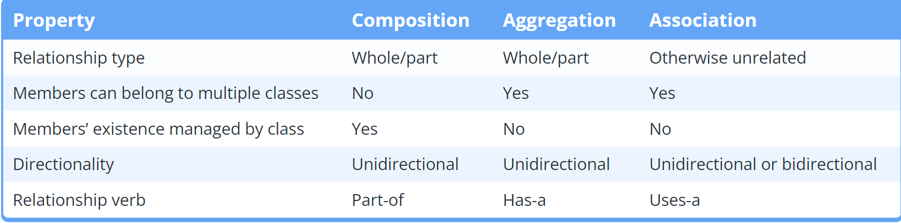
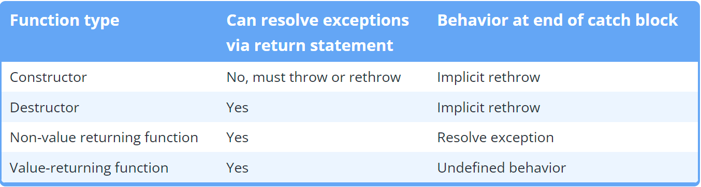

```

```

# 基本

## 注释

> 好的注释解释代码为什么这么做而不是这段代码是什么

Bad comment:

```cpp
// Calculate the cost of the items
cost = quantity * 2 * storePrice;
```

Reason: We can see that this is a cost calculation, but why is quantity multiplied by 2?

Good comment:

```cpp
// We need to multiply quantity by 2 here because they are bought in pairs
cost = quantity * 2 * storePrice;
```

## --a和a--

a++ 和++a 都是将a 加1，但是a++ 返回值为a，而++a 返回值为a+1。如果只是希望增加a 的值，而不需要返回值，则推荐使用++a，其运行速度会略快一些。

**因为先加1再输出的方式是对自身起作用，而后加需要返回初始值，因此会创建一个新的copy来储存计算后的值**

**省去了对a复制一个新的copy，以及之后删除这个临时copy的时间和空间**


## main参数

> int argc:          英文名为arguments count(参数计数)
> char \*\* argv:    英文名为arguments value/vector(参数值)，同char\* argv[]一样
> argv[0] 指向程序运行时的全路径名
> argv[i] 指向程序在DOS命令中执行程序名后的第i个字符串
> argv[argc]数组越界.

```c++
int main(int argc,char* argv[])
{
....
return 0; // 可以不写这句话，在main中若不写return则默认有return 0;
}
```

+ 转换命令行参数到int类型

```cpp
#include <sstream> // for std::stringstream

std::stringstream convert{ argv[1] }; // set up a stringstream variable named convert, initialized with the input from argv[1]

int myint{};
if (!(convert >> myint)) // do the conversion
    myint = 0; // if conversion fails, set myint to a default value

std::cout << "Got integer: " << myint << '\n';
```

## 暂停程序

```c++
// 程序暂停一下，按任意键继续
system("pause");
```

# 变量

## 初始化

+ Brace initialization，也叫**uniform initialization**或**list initialization**
+ **Copy initialization**
+ 前者不允许narrowing conversions，例如从float转为int
+ 更倾向使用前者

```c++
int main()
{
// 三种方式
int x = 123;   // Copy initialization
int y{ 123 };  // Brace initialization
int z = { };   // 初始化为0

// 初始化多个变量
int a, b = 5; // wrong (a is not initialized!)
int a = 5, b = 5; // correct
int a, b( 5 );
int c, d{ 5 };
}
```

## 基本类型

> \_t代表这是一个类型，但是很多类型没有\_t
>
> C++ only guarantees that integers will have a certain minimum size, not that they will have a specific size.


```c++
char c = 'a';
int y = -256;
unsigned int u { 5u }; // 5u means the number 5 as an unsigned int
double d = 3.14;  // 浮点数默认是double类型
float e = 3.14f;  // 加上f以指定为float类型
float e = 3.14;  // 不加上f会导致3.14转为double再转为float，由此降低精度
std::string s = "123";
//常量，定义时必须先初始化
const int x =10
// 常量，在编译时初始化（也就是最开始）
constexpr int z = 20
constexpr int z1 = z
constexpr int z2 = y // 错误，编译时还不知道y的值
```

### NaN and Inf

+ Inf可正可负

```cpp
#include <iostream>

int main()
{
    double zero {0.0};
    double posinf { 5.0 / zero }; // positive infinity
    std::cout << posinf << '\n';

    double neginf { -5.0 / zero }; // negative infinity
    std::cout << neginf << '\n';

    double nan { zero / zero }; // not a number (mathematically invalid)
    std::cout << nan << '\n';

    return 0;
}
```

```
1.#INF
-1.#INF
1.#IND
```

### 常量

+ 分为运行时常量和编译时常量，运行时常量的值只在运行时才知道，而编译时常量在编译时就知道，因此编译时常量更节省时间。
+ constexpr常量表达式，只能赋予给编译时常量（代替const），否则报错。
+ ==全局常量必须初始化==（在函数之外无法对其赋值）

```cpp
#include <iostream>

int five()
{
    return 5;
}

int main()
{
    constexpr double gravity { 9.8 }; // ok: 9.8 is a constant expression
    constexpr int sum { 4 + 5 };      // ok: 4 + 5 is a constant expression
    constexpr int something { sum };  // ok: sum is a constant expression

    std::cout << "Enter your age: ";
    int age{};
    std::cin >> age;

    constexpr int myAge { age };      // compile error: age is not a constant expression
    constexpr int f { five() };       // compile error: return value of five() is not a constant expression

    return 0;
}
```


### 字面符

**Literals** are unnamed values inserted directly into the code. 

```cpp
return 5;                   // 5 is an integer literal
bool myNameIsAlex { true }; // true is a boolean literal
std::cout << 3.4;           // 3.4 is a double literal
```

通过后缀来指定字面符类型


### 自动类型推断

+ 使用常量赋值会丢掉topconst
+ 使用const auto来将推断的类型作为常量
+ 同const一样，引用赋值会丢掉引用，在前面加上&即可
+ 指针不会丢掉

```c++
auto c = 'a'
auto d = 1
auto& y = c
const int x { 5 }; // x has type const int
auto y { x };      // y will be type int (const is dropped)
const auto y { x };

auto ref1 { getRef() };  // std::string (reference dropped)
auto& ref2 { getRef() }; // std::string& (reference reapplied)

auto ptr1{ getPtr() }; // std::string*
auto* ptr1{ getPtr() }; // 带星号和上面的相同
```

+ 使用auto作为函数类型定义时，return的类型只能有一个。但是缺点是前向定义不会被编译器认可（需要有类型），因此只能在单文件中使用。

```cpp
auto someFcn(bool b)
{
    if (b)
        return 5; // return type int
    else
        return 6.7; // return type double
}
```

+ 用auto作为类型写在箭头后的标志：

```cpp
auto add(int x, int y) -> int
{
  return (x + y);
}
```

### implicit转换

```c++
int main()
{
    char mychar = 64;
    int myint = 123;
    double mydouble = 456.789;
    bool myboolean = true;
    myint = mychar;
    mydouble = myint;
    mychar = myboolean;
	
    // 可以字符相加
    char c1 = 10;
    char c2 = 20;
    auto result = c1 + c2; // result is of type int
    
    // 将一个指针转换为空指针
    int x = 123;
    int* pint = &x;
    void* pvoid = pint;
    
    // 将数组转为对第一个元素的指针
    int arr[5] = { 1, 2, 3, 4, 5 };
    int* p = arr; // pointer to the first array element
    std::cout << *p;
    
    // 函数中的数组传递的是第一个元素的指针
    // prefer std:vector and std::array containers to raw arrays and pointers.
    int arr[] = {1,1,1};
    arrfunc(arr);
    /* void arrfunc(const int arr[]){
    std::cout << *arr;
	}  */
}
```

### explicit转换

1. 使用函数`static_cast<type_to_convert_to>(value_to_convert_from)`
2. 更倾向于使用直接转换
3. c-style转换（最好不用）：`(double)x`

### typeid显示类型

```cpp
#include <iostream>
#include <typeinfo> // for typeid()

int main()
{
    int i{ 2 };
    double d{ 3.5 };
    std::cout << typeid(i + d).name() << ' ' << i + d << '\n'; // show us the type of i + d

    return 0;
}
```

## 类型别名

### using

+ In C++, **using** is a keyword that creates an alias for an existing data type.
+ 建议使用using而不是typedef

```cpp
#include <iostream>

int main()
{
    using Distance = double; // define Distance as an alias for type double

    Distance milesToDestination{ 3.4 }; // defines a variable of type double

    std::cout << milesToDestination << '\n'; // prints a double value

    return 0;
}
```

### typedef

```cpp
// The following aliases are identical
typedef long Miles;
using Miles = long;
```

## 类型转换

标准转换：C++标准的基本类型之间的转换，包括：

- Numeric promotions 
- Numeric conversions 
- Arithmetic conversions
- Other conversions

### numeric promotion

+ A **numeric promotion** is the type conversion of a narrower numeric type (such as a `char`) to a wider numeric type (typically `int` or `double`) that can be processed efficiently and is less likely to have a result that overflows.

+ Because such promotions are **safe**, the compiler will freely use numeric promotion as needed, and will not issue a warning when doing so.

### Numeric conversions 

+ C++ supports another category of numeric type conversions, called **numeric conversions**, that cover additional type conversions not covered by the numeric promotion rules.
+ In C++, a **narrowing conversion** is a numeric conversion that may result in the loss of data. Such narrowing conversions include:
  + From a floating point type to an integral type.
  + From a wider floating point type to a narrower floating point type, unless the value being converted is constexpr and is in range of the destination type (even if the narrower type doesn’t have the precision to store the whole number).
  + From an integral to a floating point type, unless the value being converted is constexpr and is in range of the destination type and can be converted back into the original type without data loss.
  + From a wider integral type to a narrower integral type, unless the value being converted is constexpr and after integral promotion will fit into the destination type.

### Arithmetic conversions

The following operators require their operands to be of the same type:

- The binary arithmetic operators: +, -, *, /, %
- The binary relational operators: <, >, <=, >=, ==, !=
- The binary bitwise arithmetic operators: &, ^, |
- The conditional operator ?: (excluding the condition, which is expected to be of type `bool`)

## utils

### sizeof

获取一个数据占用的字节数：

```cpp
std::cout << "char32_t:\t" << sizeof(char32_t) << " bytes\n";
```

### size_t

**std::size_t** is defined as an unsigned integral type, and it is typically used to represent the size or length of objects.

```
for(size_t i=0;i<10;i++){...}
```


## 数组

1. 基本

   + 常数数组的元素不能被引用

```c++
#include <iterator> // for std::size

// 初始化并赋值
int arr[5] = {1,2,3,4};
std::cout << arr[1];

// 获取一个数组的长度
int a[5] ={1,2,3,4,5};
std::cout << sizeof a/sizeof a[0];
// c++17的长度获取方式
int array[]{ 1, 1, 2, 3, 5, 8, 13, 21 };
std::cout << "The array has: " << std::size(array) << " elements\n";

int main()
{
    const int arr[5] = {1,2,3,4};
    int* ptr = &arr[2];  // 错误，常数数组的元素不能被引用
}
```

2. 函数传递的数组实际上是数组第一个元素的指针，因此在函数中修改和遍历数组有影响，且函数中不能使用`std::size(array)`

   **但在结构体或class中的数组不会自动转换(decay)！！！**
   
   对数组指针用下标也能获取到值

> 在函数参数中，`int array[]`会自动转换为`int* array`，为了更易懂，最好在参数中直接写后者

```cpp
void passArray(int prime[5]) // prime is the actual array
// void passArray(const int prime[5]) 加上const解决
{
    prime[0] = 11; // so changing it here will change the original argument!
    prime[1] = 7;
    prime[2] = 5;
    prime[3] = 3;
    prime[4] = 2;
}
```

3. 多维数组

```cpp
int array[3][5]
{
  { 1, 2 }, // row 0 = 1, 2, 0, 0, 0
  { 6, 7, 8 }, // row 1 = 6, 7, 8, 0, 0
  { 11, 12, 13, 14 } // row 2 = 11, 12, 13, 14, 0
};
```

4. 动态分配数组的大小，删除数组时需要用`delete[]`

```cpp
#include <iostream>

int main()
{
    std::cout << "Enter a positive integer: ";
    int length{};
    std::cin >> length;

    int* array{ new int[length]{} }; // use array new.  Note that length does not need to be constant!

    std::cout << "I just allocated an array of integers of length " << length << '\n';

    array[0] = 5; // set element 0 to value 5

    delete[] array; // use array delete to deallocate array

    // we don't need to set array to nullptr/0 here because it's going out of scope immediately after this anyway

    return 0;
}
```

## 字符串

+ `std::string`的变量赋值会产生一个新的copy，开销很大，更倾向于使用`std::string_view`

```c++
std::string s= "asddasdad";

// 获取字符串长度
std::cout << s.length();  // 返回unsigned int
std::cout << std::ssize(s);  // In C++20

// 获取字符子串，从2开始的3个字符
std::cout << s.substr(2,3);

// 搜索一个子串
std::string s= "asddasdad";
// size_type是这个函数类型，若没找到就返回一个npos类型
std::string::size_type found = s.find("das1");
if (found != std::string::npos)
{
    std::cout << "Substring found at position: " << found;
}
else
{
    std::cout << "The substring is not found.";
}
```

### 字面符

使用std::string的字面符必须加上`using namespace std::literals;`

```cpp
#include <iostream>
#include <string>      // for std::string
#include <string_view> // for std::string_view

int main()
{
    using namespace std::literals; // easiest way to access the s and sv suffixes
	constexpr std::string name{ "Alex"s }; // compile error，只在C++20支持
	constexpr std::string_view name{ "Alex"s }; // 可用
    std::cout << "foo\n";   // no suffix is a C-style string literal
    std::cout << "goo\n"s;  // s suffix is a std::string literal
    std::cout << "moo\n"sv; // sv suffix is a std::string_view literal

    return 0;
};
```

### string_view

+ C++17支持
+ 只提供可读权限，不会产生新的copy，所以在字符串不需要修改时倾向于使用string_view
+ **Do not return a std::string_view**

```cpp
#include <iostream>
#include <string>
#include <string_view>

void printString(std::string str)
{
    std::cout << str << '\n';
}

int main()
{
  std::string_view sv{ "balloon" };

  std::string str{ sv }; // okay, we can create std::string using std::string_view initializer

  // printString(sv);   // compile error: won't implicitly convert std::string_view to a std::string

  printString(static_cast<std::string>(sv)); // okay, we can explicitly cast a std::string_view to a std::string

  return 0;
}
```


### 读取空格划分的字符串

```c++
#include <iostream>
#include <fstream>
#include <string>
#include <sstream>
#include <vector>

 	std::fstream fs{ argv[1] };
    std::string s;
    while (fs)
    {
        std::getline(fs, s);
        std::istringstream ss(s);
        std::string point;
        std::vector<std::string> points;
        // 读取每个空格分割字符串，放入列表
        while(ss >> point) {
            points.push_back(point);
        }
        // stod将字符转为double类型
        temp_point = {stof(points[0]),stof(points[1]),stof(points[2])};
        cloud->push_back(temp_point);//从点云最后面插入一点
    }
```


### 类型转换

```c++
// 将字符串转为float类型
stof("0.2121")
// 将字符串转为double类型
stod("0.2121")
// 将字符串转换为长整型整数long int
atoll("21")
// 将字符串转换为长整数long long int
atol("21")
```


## 指针

> 指针类型<type>\*，例如int* p
>
> 引用类型<type>&, 例如int& p
>
> 使用&获取一个变量的指针
>
> 使用\*获取一个指针指向的变量

+ 若一个变量名为x，则命名其指针为xptr
+ 指针的大小：The size of a pointer is dependent upon the architecture the executable is compiled for -- a 32-bit executable uses 32-bit memory addresses -- consequently, a pointer on a 32-bit machine is 32 bits (4 bytes). With a 64-bit executable, a pointer would be 64 bits (8 bytes).

```c++
int x = 123;
int* p = &x;
std::cout << *p;

// 改变指针的对象
*p = 456
    
// 初始化空指针
int* ptr1, ptr2;   // incorrect: ptr1 is a pointer to an int, but ptr2 is just a plain int!
int* ptr3, * ptr4; // correct: ptr3 and p4 are both pointers to an int
char* p{nullptr};
char* p{};  // 和上面效果一样
char* p{&x};
    
int x;
int * p1 = &x; // 指针可以被修改，值也可以被修改
const int * p2 = &x; // 指针可以被修改，值不可以被修改（const int）
int * const p3 = &x; // 指针不可以被修改（* const），值可以被修改
const int * const p4 = &x; // 指针不可以被修改，值也不可以被修改

// 使用逗号在一行赋值的时候，第一个以后的指针要加上*号
ListNode* slow = head , *fast = head;

// 指针可以转换为布尔值，空指针为0
if (ptr) // implicit conversion to Boolean
    std::cout << "ptr is non-null\n";
else
    std::cout << "ptr is null\n";
```

### 常数指针

#### 指向常数的指针(low-level)

+ 其指向的object值不能修改
+ 这个指针能修改（指向其他object）
+ 能够指向非常数，但是还是不能改变值

```cpp
int main()
{
    const int x{ 5 };
    const int* ptr { &x }; // ptr points to const int x

    const int y{ 6 };
    ptr = &y; // okay: ptr now points at const int y

    return 0;
}
```

#### 自身是常数的指针(high-level)

+ 指针的地址之后不能被修改，但其地址所指向的值可以更改
+ 同常数一样，必须在一开始初始化

```cpp
int main()
{
    int x{ 5 };
    int y{ 6 };

    int* const ptr { &x }; // okay: the const pointer is initialized to the address of x
    ptr = &y; // error: once initialized, a const pointer can not be changed.

    return 0;
}
```

#### 指向常数的常数指针(both)

```cpp
int main()
{
    int value { 5 };
    const int* const ptr { &value }; // a const pointer to a const value

    return 0;
}
```

### Smart pointer

> Smart pointers are pointers that own the object they point to and automatically destroy
> the object they point to and deallocate the memory once the pointers go out of scope.

#### unique指针

> A unique pointer called std::unique_ptr is a pointer that owns an object it points to. 

+ `std::unique_ptr`设计为使用`move semantics`，因此不能使用`copy initialization`和`copy assignment`，因此**只能使用std::move来移动值**
+ Unique pointer deletes the object and deallocates memory for it, once it goes out of scope.
+ Unique pointer可以被转换成布尔值来判断该指针是否存在指向的对象
+ 可以直接通过值返回unique指针：`return std::make_unique<Resource>();`

 In C++14 or earlier, move semantics will be employed to transfer the Resource from the return value to the object assigned to (in the above example, ptr), and **in C++17 or newer, the return will be elided.(不懂)** 

+ 使用get()获取对象的原始指针：`ptr.get()`

+ 作为函数参数最好用引用或者指针，因为move会丢失控制

+ :skull:不要用多个unique指针管理相同object：

  ```cpp
  Resource* res{ new Resource() };
  std::unique_ptr<Resource> res1{ res };
  std::unique_ptr<Resource> res2{ res };
  ```

+ :skull:不要手动删除unique指针管理的对象：

```cpp
Resource* res{ new Resource() };
std::unique_ptr<Resource> res1{ res };
delete res;
```

使用方式：

```c++
#include <iostream>
#include <memory>    // 需要用到memory
int main()
{
	std::unique_ptr<int> p(new int{ 123 });
	if (p) // use implicit cast to bool to ensure res contains a Resource
		std::cout << *p << '\n'; // print the Resource that res is owning
}
```

更好的初始化方式：

==The std::make_unique function was introduced in the C++14 standard. Make sure to compile with the` -std=c++14` flag to be able to use this function.==

```c++
#include <iostream>
#include <memory>
int main()
{
std::unique_ptr<int> p = std::make_unique<int>(123);
std::cout << *p;
}
```

使用类的属性

```c++
#include <iostream>
#include <memory>
class MyClass
{
public:
void printmessage()
{
std::cout << "Hello from a class.";
}
};
int main()
{
std::unique_ptr<MyClass> p = std::make_unique<MyClass>();
p->printmessage();
}
```


#### 共享指针

> 共享指针能够复制！
>
> 多个指针指向同一个对象，只有最后一个指针的scope结束时，才会在内存中删除对象

+ C++14中引入std::make_shared() ，同std::make_unique()一致

```cpp
std::make_shared<Resource>(a, b, c)
```

+ 初始化共享指针并复制（必须是复制共享指针而不是原始指针）

```c++
#include <iostream>
#include <memory>
int main()
{
std::shared_ptr<int> p1 = std::make_shared<int>(123);
std::shared_ptr<int> p2 = p1;
std::shared_ptr<int> p3 = p1;
}
```

+ 多个共享指针以相同原始指针初始化会崩溃：

```cpp
#include <iostream>
#include <memory> // for std::shared_ptr

class Resource
{
public:
	Resource() { std::cout << "Resource acquired\n"; }
	~Resource() { std::cout << "Resource destroyed\n"; }
};

int main()
{
	Resource* res { new Resource };
	std::shared_ptr<Resource> ptr1 { res };
	{
		std::shared_ptr<Resource> ptr2 { res }; // create ptr2 directly from res (instead of ptr1)

		std::cout << "Killing one shared pointer\n";
	} // ptr2 goes out of scope here, and the allocated Resource is destroyed

	std::cout << "Killing another shared pointer\n";

	return 0;
} // ptr1 goes out of scope here, and the allocated Resource is destroyed again
```

#### **std::weak_ptr**

+ 用来解决循环引用的问题：weak指针只能够获取到object，但并不能控制object的scope。因此共享指针的scope不会考虑weak指针，在所有共享指针都out of scope后object会正确的销毁。

```cpp
#include <iostream>
#include <memory> // for std::shared_ptr and std::weak_ptr
#include <string>

class Person
{
	std::string m_name;
	std::weak_ptr<Person> m_partner; // note: This is now a std::weak_ptr

public:

	Person(const std::string &name): m_name(name)
	{
		std::cout << m_name << " created\n";
	}
	~Person()
	{
		std::cout << m_name << " destroyed\n";
	}

	friend bool partnerUp(std::shared_ptr<Person> &p1, std::shared_ptr<Person> &p2)
	{
		if (!p1 || !p2)
			return false;

		p1->m_partner = p2;
		p2->m_partner = p1;

		std::cout << p1->m_name << " is now partnered with " << p2->m_name << '\n';

		return true;
	}
};

int main()
{
	auto lucy { std::make_shared<Person>("Lucy") };
	auto ricky { std::make_shared<Person>("Ricky") };

	partnerUp(lucy, ricky);

	return 0;
}
```

+ weak指针不能直接使用(they have no operator->)，因此需要首先将其转化为`std::shared_ptr`
+ To convert a std::weak_ptr into a std::shared_ptr, you can use the lock() member function. 


### 修改函数参数中的指针

+ 函数参数中的指针是地址的一个copy，不能够修改到实际的指针变量
+ 因此需要传递引用`int*& refptr`

```cpp
#include <iostream>

void nullify(int*& refptr) // refptr is now a reference to a pointer
{
    refptr = nullptr; // Make the function parameter a null pointer
}

int main()
{
    int x{ 5 };
    int* ptr{ &x }; // ptr points to x

    std::cout << "ptr is " << (ptr ? "non-null\n" : "null\n");

    nullify(ptr);

    std::cout << "ptr is " << (ptr ? "non-null\n" : "null\n");
    return 0;
}
```

### 指针算术

1. 指针+1等于其指向的地址加上其类型所占据的空间

```cpp
#include <iostream>

int main()
{
    int value{ 7 };
    int* ptr{ &value };

    std::cout << ptr << '\n';
    std::cout << ptr+1 << '\n';
    std::cout << ptr+2 << '\n';
    std::cout << ptr+3 << '\n';

    return 0;
}
#0012FF7C
0012FF80
0012FF84
0012FF88
```

### void指针

1. 能够指向任何类型的指针，但不能直接dereference，需要先转换成对应类型

```cpp
int value{ 5 };
void* voidPtr{ &value };

// std::cout << *voidPtr << '\n'; // illegal: dereference of void pointer

int* intPtr{ static_cast<int*>(voidPtr) }; // however, if we cast our void pointer to an int pointer...

std::cout << *intPtr << '\n'; // then we can dereference the result
```


## 生命周期

> Normal variables are allocated from limited memory called the **stack**. Dynamically allocated variables are allocated from a general pool of memory called the **heap**.

1. 自动存储期间

所有local变量均以栈存储

2. 动态存储期间

堆存储，手动指定

3. 静态存储期间

以`static`开头的变量，生命周期是整个程序运行期间

### new和delete

1. new会从操作系统索取内存，delete将内存返还给操作系统，而非删除

2. 删除指针后最好将其设为`nullptr`
3. 使用`new`时避免多个指针指向同一个`Object`，因为删除时所有指针均需要改为`nullptr`
4. 使用new获取内存时可能会失败（例如当内存不足时），用`int* value { new (std::nothrow) int }`当失败时赋予空指针

```c++
#include <iostream>
int main()
{
int* p = new int;
int* ptr1{ new int (5) }; // use direct initialization
int* ptr2{ new int { 6 } }; // use uniform initialization
    
*p = 123;
std::cout << "The pointed-to value is: " << *p;
delete p;
    
}

// 对于数组变量
#include <iostream>
int main()
{
int* p = new int[3];
p[0] = 1;
p[1] = 2;
p[2] = 3;
std::cout << "The values are: " << p[0] << ' ' << p[1] << ' ' << p[2];
delete[] p;
}
```

5. 删除空指针没有影响，因此不需要判断是否为空指针：`delete ptr;`
6. 在给指针变量重新指定内存地址时，先`delete`以免内存泄漏

### 内存泄漏

> 一个变量的生命周期结束了但是没有将内存返还给操作系统

Consider the following function:

```cpp
void doSomething()
{
    int* ptr{ new int{} };
}
```

This function allocates an integer dynamically, but never frees it using delete. Because pointers variables are just normal variables, when the function ends, ptr will go out of scope. And because ptr is the only variable holding the address of the dynamically allocated integer, when ptr is destroyed there are no more references to the dynamically allocated memory. This means the program has now “lost” the address of the dynamically allocated memory. As a result, this dynamically allocated integer can not be deleted.

This is called a **memory leak**. Memory leaks happen when your program loses the address of some bit of dynamically allocated memory before giving it back to the operating system. When this happens, your program can’t delete the dynamically allocated memory, because it no longer knows where it is. The operating system also can’t use this memory, because that memory is considered to be still in use by your program.

### 临时变量

```c++
// name使用过后就会被删除
explicit Person(std::string name):name{std::move(name)}{}
```


## 静态变量

1. 静态变量只会进行一次初始化，后面的初始化会跳过（注意：跳过的是初始化而不是赋值！！）

```c++
#include <iostream>

void myfunction()
{
    static int x = 0; // defined only the first time, skipped every other time
    x++;
    std::cout << x << '\n';
}

int main()
{
    myfunction(); // x == 1
    myfunction(); // x == 2
    myfunction(); // x == 3
}
```

使用静态变量作为类的字段

```c++
#include <iostream>
class MyClass
{
public:
    static int x; // declare a static data member
};
int MyClass::x = 123; // define a static data member
int main()
{
    MyClass::x = 456; // access a static data member
    std::cout << "Static data member value is: " << MyClass::x;
}
```

静态类方法

```c++
#include <iostream>
class MyClass
{
public:
    static void myfunction(); // declare a static member function
};

// 类里声明的时候已经有static，所以这里不需要写
void MyClass::myfunction()
{
    std::cout << "Hello World from a static member function.";
}
int main()
{
    MyClass::myfunction(); // call a static member function
}
```


# 复合类型

## Lvalue and rvalue

| L-value reference       | Can be initialized with | Can modify |
| :---------------------- | :---------------------- | :--------- |
| Modifiable l-values     | Yes                     | Yes        |
| Non-modifiable l-values | No                      | No         |
| R-values                | No                      | No         |

1. lvalues expressions are those that evaluate to variables or other identifiable objects that persist beyond the end of the expression.
2. rvalues expressions are those that evaluate to **literals** or the returned value of functions and operators that are discarded at the end of the expression.

3. rvalue可理解为临时变量

```cpp
int main()
{
    int x{};

    // Assignment requires the left operand to be a modifiable lvalue expression and the right operand to be an rvalue expression
    x = 5; // valid: x is a modifiable lvalue expression and 5 is an rvalue expression
    5 = x; // error: 5 is an rvalue expression and x is a modifiable lvalue expression

    return 0;
}
```

### lvalue引用

> <type>\&表示引用类型，一般紧跟在类型之后，但放在变量名之前也可

+ 所有的引用都必须初始化
+ 引用类型必须和被引用的类型一致
+ 引用类型不能重新指向其他lvalue
+ **临时变量是rvalue，执行后就被丢弃了**

```c++
int x = 123;
int& p1 = x;
int p2 = x;
// 引用和原变量的指针相同，直接赋值指针不同
std::cout << &x <<"\n" << &p1 << "\n" << &p2;

const int y { 5 };
int& invalidRef { y };  // invalid: can't bind to a non-modifiable lvalue
int& invalidRef2 { 0 }; // invalid: can't bind to an r-value
```

+ 使用常量引用 非常量lvalue时，起常量引用不能修改值

### 常量左值引用

+ 可以用来接受字面量（作为函数参数）
+ **引用常量，字面量或者临时变量必须在类型前加上const**  `const int& ref { x };`
+ 常量引用可以通过rvalue初始化 `const int& ref { 5 }; // okay: 5 is an rvalue`

| L-value reference to const | Can be initialized with | Can modify |
| :------------------------- | :---------------------- | :--------- |
| Modifiable l-values        | Yes                     | No         |
| Non-modifiable l-values    | Yes                     | No         |
| R-values                   | Yes                     | No         |

### rvalue引用

| R-value reference       | Can be initialized with | Can modify |
| :---------------------- | :---------------------- | :--------- |
| Modifiable l-values     | No                      | No         |
| Non-modifiable l-values | No                      | No         |
| R-values                | Yes                     | Yes        |

| R-value reference to const | Can be initialized with | Can modify |
| :------------------------- | :---------------------- | :--------- |
| Modifiable l-values        | No                      | No         |
| Non-modifiable l-values    | No                      | No         |
| R-values                   | Yes                     | No         |

+ 使用两个&&表明右值引用

```cpp
#include <iostream>

class Fraction
{
private:
	int m_numerator;
	int m_denominator;

public:
	Fraction(int numerator = 0, int denominator = 1) :
		m_numerator{ numerator }, m_denominator{ denominator }
	{
	}

	friend std::ostream& operator<<(std::ostream& out, const Fraction &f1)
	{
		out << f1.m_numerator << '/' << f1.m_denominator;
		return out;
	}
};

int main()
{
	auto &&rref{ Fraction{ 3, 5 } }; // r-value reference to temporary Fraction

	// f1 of operator<< binds to the temporary, no copies are created.
	std::cout << rref << '\n';

	return 0;
} // rref (and the temporary Fraction) goes out of scope here
```

+ rvalue常作为函数参数来定义对于lvalue和rvalue的不同处理方式

```cpp
#include <iostream>

void fun(const int &lref) // l-value arguments will select this function
{
	std::cout << "l-value reference to const\n";
}

void fun(int &&rref) // r-value arguments will select this function
{
	std::cout << "r-value reference\n";
}

int main()
{
	int x{ 5 };
	fun(x); // l-value argument calls l-value version of function
	fun(5); // r-value argument calls r-value version of function
    // 有名字的Object会被认为时lvalue，因此调用fun(const int &lref)
    int &&ref{ 5 };
    fun(ref);
	return 0;
}
```

## 类型定义

+ 使用程序定义的类型时，该文件中必须有该文件的完整定义
+ 因此一般在头文件中直接写好类型的完整定义，然后传入需要使用的文件（这里允许有多个定义）

## 枚举Enum

1. 是program-defined types，必须先定义

### unscoped

1. unscoped enumeration使用`enum`关键字定义
2. 可以通过其所在的scope获取enum变量，也可以通过命名空间获取：`Color::red`

```cpp
// Define a new unscoped enumeration named Color
enum Color
{
    // Here are the enumerators
    // These symbolic constants define all the possible values this type can hold
    // Each enumerator is separated by a comma, not a semicolon
    red,
    green,
    blue, // trailing comma optional but recommended
    max_num,  // 经常在最后加上以便获取整个枚举的数量
}; // the enum definition must end with a semicolon

int main()
{
    // Define a few variables of enumerated type Color
    Color apple { red };   // my apple is red
    Color shirt { green }; // my shirt is green
    Color cup { blue };    // my cup is blue

    Color socks { white }; // error: white is not an enumerator of Color
    Color hat { 2 };       // error: 2 is not an enumerator of Color

    return 0;
}
```

3. 在相同scope下的 enumerator name不能重复
4. 由于枚举会污染命名空间，一般将其放入namespace或者class中

```cpp
enum Color
{
    red,
    green,
    blue, // blue is put into the global namespace
};

enum Feeling
{
    happy,
    tired,
    blue, // error: naming collision with the above blue
};

int main()
{
    Color apple { red }; // my apple is red
    Feeling me { happy }; // I'm happy right now (even though my program doesn't compile)

    return 0;
}
```

5. 枚举实际以整型存储，会隐式转换为整型值，整型值不会隐式转换为枚举
6. 一半的存储类型时标准int，但可以指定类型

```cpp
// Use an 8-bit unsigned integer as the enum base
enum Color : std::uint8_t
{
    black,
    red,
    blue,
};
```

### scoped

+ 也叫枚举类(enum class)

+ strongly typed (they won’t implicitly convert to integers) 
+ strongly scoped (the enumerators are only placed into the scope region of the enumeration). 自带命名空间，以`Color::red`使用
+ 使用关键字`enum class`，用法和`enum`相同

```cpp
#include <iostream>
int main()
{
    enum class Color
    {
        red,
        blue,
    };

    Color color { Color::blue };

    std::cout << color << '\n'; // won't work, because there's no implicit conversion to int
    std::cout << static_cast<int>(color) << '\n'; // will print 1

    return 0;
}
```

## 结构体

1. 聚合数据类型及其初始化

>  结构体只有data member是聚合数据类型，array，class等也是聚合数据类型
>
> 结构体初始化是逐个成员进行的(memberwise)

```cpp
struct Employee
{
    int id;  // 无初始值，bad
    int age {2};
    double wage {};  // 有默认值
};

int main()
{
    Employee foo = {}  // 第一个id有值初始化
    Employee foo1 = {}  // 第一个id有值初始化，但更安全，会保证一定初始化
    Employee frank = { 1, 32, 60000.0 }; // copy-list initialization using braced list
    Employee robert ( 3, 45, 62500.0 );  // direct initialization using parenthesized list (C++20)
    Employee joe { 2, 28, 45000.0 };     // list initialization using braced list (preferred)
    // 可以使用常量
	const Employee frank;  
    // 修改值
    frank.id = 4;
    // 以brace修改值
    frank = { 1, 34, 60000.0 };
    // 使用箭头符号获取指针指向对象的值
    Employee* ptr_frank{&frank};
    ptr_frank->id=4;
    return 0;
}
```

2. 返回结构体

```cpp
Point3d getZeroPoint()
{
    // We already specified the type at the function declaration
    // so we don't need to do so here again
    return { 0.0, 0.0, 0.0 }; // return an unnamed Point3d
    return { }; // 使用值初始化
}
```


## 类型模板

1. 因为`struct Pair`的使用很广泛，所以有`<utility>`中的`std::pair`来简化
2. `std::pair`中实际上也是first和second

```cpp
#include <iostream>

template <typename T, typename U>
struct Pair
{
    T first{};
    U second{};
};

template <typename T, typename U>
void print(Pair<T, U> p)
{
    std::cout << '[' << p.first << ", " << p.second << ']';
}

int main()
{
    Pair<int, double> p1{ 1, 2.3 }; // a pair holding an int and a double
    Pair<double, int> p2{ 4.5, 6 }; // a pair holding a double and an int
    Pair<int, int> p3{ 7, 8 };      // a pair holding two ints

    print(p2);

    return 0;
}
```


```cpp
#include <iostream>
#include <utility>

template <typename T, typename U>
void print(std::pair<T, U> p)
{
    std::cout << '[' << p.first << ", " << p.second << ']';
}

int main()
{
    std::pair<int, double> p1{ 1, 2.3 }; // a pair holding an int and a double
    std::pair<double, int> p2{ 4.5, 6 }; // a pair holding a double and an int
    std::pair<int, int> p3{ 7, 8 };      // a pair holding two ints

    print(p2);

    return 0;
}
```

# 流程控制

+ 循环变量应该始终是signed（因为unsigned在等于0时再减一等于其上限值）

## 条件操作符


```cpp
larger = (x > y) ? x : y;

std::cout << (x > y) ? x : y << '\n';  // 可能出错
std::cout << ((x > y) ? x : y) << '\n';  //应该始终用括号包括条件操作符
```


## if

> 逻辑运算符：&&，||，!，^(异或操作)

> 条件表达式：`condition ? exp1 : exp2` 若条件符合则exp1，反之

```c++
std::string::size_type found = s.find("das1");
if (found != std::string::npos)
{
    std::cout << "Substring found at position: " << found;
}
else
{
    std::cout << "The substring is not found.";
}
```

在if else中定义的变量会在判断语句结束后销毁，因此以下代码编译失败。

```cpp
#include <iostream>

int main()
{
    constexpr bool inBigClassroom { false };

    if (inBigClassroom)
        constexpr int classSize { 30 };
    else
        constexpr int classSize { 20 };

    std::cout << "The class size is: " << classSize << '\n';

    return 0;
}
```

## switch

+ 条件变量必须是整型或者enumerated类型

```c++
    switch (animal)
    {
        case Animal::chicken:
        case Animal::duck:
            std::cout << 2;
            break;

        case Animal::pig:
        case Animal::goat:
        case Animal::cat:
        case Animal::dog:
            std::cout << 4;
            break;

        default:
            std::cout << "???";
            break;
    }
```

+ 若没有break或者return则匹配后会一直执行

```cpp
#include <iostream>

int main()
{
    switch (2)
    {
    case 1: // Does not match
        std::cout << 1 << '\n'; // Skipped
    case 2: // Match!
        std::cout << 2 << '\n'; // Execution begins here
    case 3:
        std::cout << 3 << '\n'; // This is also executed
    case 4:
        std::cout << 4 << '\n'; // This is also executed
    default:
        std::cout << 5 << '\n'; // This is also executed
    }

    return 0;
}
```

+ 在switch中声明变量

```cpp
switch (1)
{
    int a; // okay: definition is allowed before the case labels
    int b{ 5 }; // illegal: initialization is not allowed before the case labels

    case 1:
        int y; // okay but bad practice: definition is allowed within a case
        y = 4; // okay: assignment is allowed
        break;

    case 2:
        int z{ 4 }; // illegal: initialization is not allowed if subsequent cases exist
        y = 5; // okay: y was declared above, so we can use it here too
        break;

    case 3:
        break;
}
```

## for

```c++
    for (int i=0;i<10;i++) {
        std::cout << i<<"\n";
    }
```

在循环中使用多个计数变量

```cpp
#include <iostream>

int main()
{
    for (int x{ 0 }, y{ 9 }; x < 10; ++x, --y)
        std::cout << x << ' ' << y << '\n';

    return 0;
}
```

## foreach循环

1. 可以循环迭代 container/range的内容：`for (some_type element_name : container_name)`

2. ==element_name 实际上是元素的复制，若想使用实际元素，可以用引用类型==：

   ```c++
   #include <iostream>
   #include <vector>
   int main()
   {
       std::vector<int> v = { 1, 2, 3, 4, 5 };
       v.push_back(10);
       for (int& el : v)
       {
           el = 2;
       }
       for (int el : v)
       {
           std::cout << el;
       }
   }
   ```

   

## do... while

```cpp
#include <iostream>

int main()
{
    // selection must be declared outside of the do-while so we can use it later
    int selection{};

    do
    {
        std::cout << "Please make a selection: \n";
        std::cout << "1) Addition\n";
        std::cout << "2) Subtraction\n";
        std::cout << "3) Multiplication\n";
        std::cout << "4) Division\n";
        std::cin >> selection;
    }
    while (selection != 1 && selection != 2 &&
        selection != 3 && selection != 4);

    // do something with selection here
    // such as a switch statement

    std::cout << "You selected option #" << selection << '\n';

    return 0;
}
```

# 函数

1. 最好先声明，再定义后再使用

```c++
// 声明一个无返回值的函数
void myvoidfunction();

// 只声明函数的时候，可以忽略变量名
int mysum(int, int);

// 定义函数
int mysquarednumber(int x) {
return x * x;
}

// 传递变量的引用（最好避免传递引用，使用常量引用）
#include <iostream>
void myfunction(int& byreference)
{
byreference++; // we can modify the value of the argument
std::cout << "Argument passed by reference: " << byreference;
}
int main()
{
int x = 123;
myfunction(x);
}

// 使用常量引用
#include <iostream>
#include <string>
void myfunction(const std::string& byconstreference)
{
std::cout << "Arguments passed by const reference: " <<
byconstreference;
}
int main()
{
std::string s = "Hello World!";
myfunction(s);
}
```

2. 非常量引用的参数只能是非常量的lvalue

```cpp
#include <iostream>
#include <string>

void printValue(int& y) // y only accepts modifiable lvalues
{
    std::cout << y << '\n';
}

int main()
{
    int x { 5 };
    printValue(x); // ok: x is a modifiable lvalue

    const int z { 5 };
    printValue(z); // error: z is a non-modifiable lvalue

    printValue(5); // error: 5 is an rvalue

    return 0;
}
```

## 默认参数

1. 只能用等号声明，不能用括号初始化

```cpp
void foo(int x = 5);   // ok
void goo(int x ( 5 )); // compile error
void boo(int x { 5 }); // compile error
```

2. 默认参数只能放在最右边
3. 若一个函数有前向声明（在头文件中），最好在声明中定义默认参数

## 函数重载

> 在编译时实质上将重载的函数变成了不同的名字

1. 参数类型不一样即可，返回类型可以不一样

```c++
void myprint(char param);
void myprint(int param);
void myprint(double param);
```

2. 类型不一样的情况不包括typedefs, type aliases, and const qualifier on value parameters. 包括ellipses.

```cpp
void print(int);
void print(const int); // not differentiated from print(int)

void foo(int x, int y);
void foo(int x, ...); // differentiated from foo(int, int)
```


## 函数声明

> 函数声明用来表示函数存在，同时声明其类型

> 可以解决函数在编译时候的顺序问题，如下所示，add的定义在main之后，但是前面声明过，所以能找到。

```c++
#include <iostream>

int add(int x, int y); // forward declaration of add() (using a function declaration)

int main()
{
    std::cout << "The sum of 3 and 4 is: " << add(3, 4) << '\n'; // this works because we forward declared add() above
    return 0;
}

int add(int x, int y) // even though the body of add() isn't defined until here
{
    return x + y;
}
```

## 内联函数

+ 一般用在只有头文件的库
+ 与引入一个头文件类似，内联函数在编译时会将其调用换成实际的函数代码

```cpp
#include <iostream>

int main()
{
    std::cout << ((5 < 6) ? 5 : 6) << '\n';
    std::cout << ((3 < 2) ? 3 : 2) << '\n';
    return 0;
}
```

+ Some types of functions are implicitly treated as inline functions. These include:

  - Functions defined inside a class, struct, or union type definition.

  - Constexpr / consteval functions ([6.14 -- Constexpr and consteval functions](https://www.learncpp.com/cpp-tutorial/constexpr-and-consteval-functions/))

## 常量函数

+ consteval的函数必须在编译时evaluate(c++20)
+ consteval函数只在返回值是constexpr时起作用

```cpp
#include <iostream>

constexpr int greater(int x, int y)
{
    return (x > y ? x : y);
}

int main()
{
    constexpr int g { greater(5, 6) };            // case 1: evaluated at compile-time
    std::cout << g << " is greater!\n";

    int x{ 5 }; // not constexpr
    std::cout << greater(x, 6) << " is greater!\n"; // case 2: evaluated at runtime

    std::cout << greater(5, 6) << " is greater!\n"; // case 3: may be evaluated at either runtime or compile-time

    return 0;
}
```

+ 常量函数的返回值会在编译时就计算得出并且替换到调用函数的语句中
+ 常量函数经常在头文件中定义
+ 属于内联函数

```cpp
#include <iostream>

constexpr int greater(int x, int y) // now a constexpr function
{
    return (x > y ? x : y);
}

int main()
{
    constexpr int x{ 5 };
    constexpr int y{ 6 };

    // We'll explain why we use variable g here later in the lesson
    constexpr int g { greater(x, y) }; // will be evaluated at compile-time

    std::cout << g << " is greater!\n";

    return 0;
}
```

## 通过指针或引用返回

+ 被引用的object必须在函数在外时是有效的（其scope不能仅限于函数内），否则会出错
+ 只要指针指向的object在scope下live，则可以返回指针
+ 返回指针可以返回`nullptr`

```cpp
#include <iostream>
#include <string>

const std::string& getProgramName()
{
    const std::string programName { "Calculator" }; // now a local variable, destroyed when function ends

    return programName;
}

int main()
{
    std::cout << "This program is named " << getProgramName();

    return 0;
}
```

+ Avoid returning references to non-const local static variables.

```cpp
#include <iostream>
#include <string>

const int& getNextId()
{
    static int s_x{ 0 }; // note: variable is non-const
    ++s_x; // generate the next id
    return s_x; // and return a reference to it
}

int main()
{
    const int& id1 { getNextId() }; // id1 is a reference
    const int& id2 { getNextId() }; // id2 is a reference

    std::cout << id1 << id2 << '\n';

    return 0;
}
```

## 函数模板

1. 首先需要声明模板类型

2. 使用T, U, V等大写字母作为模板类型名
3. 通过`max<actual_type>(arg1, arg2)`进行**函数模板实例化**
4. 相同类型的函数实例化只会进行一次
5. 通常写在头文件中

```cpp
#include <iostream>

// a declaration for our function template (we don't need the definition any more)
template <typename T>
T max(T x, T y);

template<>
int max<int>(int x, int y) // the generated function max<int>(int, int)
{
    return (x > y) ? x : y;
}

template<>
double max<double>(double x, double y) // the generated function max<double>(double, double)
{
    return (x > y) ? x : y;
}

int main()
{
    std::cout << max<int>(1, 2) << '\n';    // instantiates and calls function max<int>(int, int)
    std::cout << max<int>(4, 3) << '\n';    // calls already instantiated function max<int>(int, int)
    std::cout << max<double>(1, 2) << '\n'; // instantiates and calls function max<double>(double, double)

    return 0;
}
```

6. 对于同一个类型的模板参数，其模板实例化时的参数类型必须一致（不加\<type\>时）

```cpp
#include <iostream>

template <typename T>
T max(T x, T y)
{
    return (x > y) ? x : y;
}

int main()
{
    std::cout << max(2, 3.5) << '\n';  // 编译失败，不是相同类型
    std::cout << max<double>(2, 3.5) << '\n'; // we've provided actual type double, so the compiler won't use template argument deduction

    return 0;
}
```

### 多模板参数

下面代码会出现类型narrow，即返回类型是int，而三目表达式返回的double类型。

**可以通过使用auto返回类型解决**

```cpp
#include <iostream>

template <typename T, typename U> // We're using two template type parameters named T and U
T max(T x, U y) // x can resolve to type T, and y can resolve to type U
{
    return (x > y) ? x : y; // uh oh, we have a narrowing conversion problem here
}

int main()
{
    std::cout << max(2, 3.5) << '\n';

    return 0;
}
```


```cpp
#include <iostream>

template <typename T, typename U>
auto max(T x, U y)
{
    return (x > y) ? x : y;
}

int main()
{
    std::cout << max(2, 3.5) << '\n';

    return 0;
}
```

## 函数指针

1. 定义

```cpp
// fcnPtr is a pointer to a function that takes no arguments and returns an integer
int (*fcnPtr)();
// 函数指针是const
int (*const fcnPtr)();
// 返回类型是const int
const int (*fcnPtr)();
```

2. 通过指针使用函数，通过函数指针无法使用**默认参数**！

```cpp
int foo(int x)
{
    return x;
}

int main()
{
    int (*fcnPtr)(int){ &foo }; // Initialize fcnPtr with function foo
    (*fcnPtr)(5); // call function foo(5) through fcnPtr.
    fcnPtr(5); // call function foo(5) through fcnPtr. 隐式转换，旧编译器可能不支持

    return 0;
}
```

3. 将函数指针作为函数参数来进行回调

4. 简化

   1. 可以通过类型别称简化

      ```
      using ValidateFunction = bool(*)(int, int);
      ```

   2. 使用**std::function**获取函数指针，第一个值是返回类型，圆括号内是参数类型

      ```cpp
      #include <functional>
      bool validate(int x, int y, std::function<bool(int, int)> fcn); // std::function method that returns a bool and takes two int parameters
      ```

   3. 将以上两种一起用

      ```cpp
      using ValidateFunctionRaw = bool(*)(int, int); // type alias to raw function pointer
      using ValidateFunction = std::function<bool(int, int)>; // type alias to std::function
      ```


## 堆和栈

### 堆

**In C++, when you use the new operator to allocate memory, this memory is allocated in the application’s heap segment.**

```cpp
int* ptr { new int }; // ptr is assigned 4 bytes in the heap
int* array { new int[10] }; // array is assigned 40 bytes in the heap
```

The heap has advantages and disadvantages:

- Allocating memory on the heap is comparatively slow.
- Allocated memory stays allocated until it is specifically deallocated (beware memory leaks) or the application ends (at which point the OS should clean it up).
- Dynamically allocated memory must be accessed through a pointer. Dereferencing a pointer is slower than accessing a variable directly.
- Because the heap is a big pool of memory, large arrays, structures, or classes can be allocated here.

### 栈

+ 栈跟踪所有被调用但未结束的函数，处理所有函数和本地变量的内存分配
+ 在堆上push和pop的对象都叫**stack frames**
+ 一个stack frame跟踪一个函数调用有关的所有数据
+ **Stack overflow**：栈的所有内存都用光了，再继续分配造成

The stack has advantages and disadvantages:

- Allocating memory on the stack is comparatively fast.
- Memory allocated on the stack stays in scope as long as it is on the stack. It is destroyed when it is popped off the stack.
- All memory allocated on the stack is known at compile time. Consequently, this memory can be accessed directly through a variable.
- Because the stack is relatively small, it is generally not a good idea to do anything that eats up lots of stack space. This includes passing by value or creating local variables of large arrays or other memory-intensive structures.

## 匿名函数

```
[ captureClause ] ( parameters ) -> returnType
{
    statements;
}
```

+ 若省略返回类型，则默认为auto，但函数返回类型在第一次推导后就不变且不再推导了，因此需要保证前后返回类型一致
+ 使用函数指针，`auto`和`std::function`初始化匿名函数变量。优先使用auto，auto有时会因为不能在编译时弄清类型而出错，使用`std::function`即可。
+ 传入参数使用&引用可减少时间

```cpp
#include <functional>

int main()
{
  // A regular function pointer. Only works with an empty capture clause (empty []).
  double (*addNumbers1)(double, double){
    [](double a, double b) {
      return (a + b);
    }
  };

  addNumbers1(1, 2);

  // Using std::function. The lambda could have a non-empty capture clause (discussed next lesson).
  std::function addNumbers2{ // note: pre-C++17, use std::function<double(double, double)> instead
    [](double a, double b) {
      return (a + b);
    }
  };

  addNumbers2(3, 4);

  // Using auto. Stores the lambda with its real type.
  auto addNumbers3{
    [](double a, double b) {
      return (a + b);
    }
  };

  addNumbers3(5, 6);

  return 0;
}
```

+ 使用auto作为参数的lambda叫泛型lambda，和函数模板类似。下面即使使用了static，也是两个不同的函数，因此不会相互影响。

```cpp
#include <algorithm>
#include <array>
#include <iostream>
#include <string_view>

int main()
{
  // Print a value and count how many times @print has been called.
  auto print{
    [](auto value) {
      static int callCount{ 0 };
      std::cout << callCount++ << ": " << value << '\n';
    }
  };

  print("hello"); // 0: hello
  print("world"); // 1: world

  print(1); // 0: 1
  print(2); // 1: 2

  print("ding dong"); // 2: ding dong

  return 0;
}
```

### 捕获

captureClause使匿名函数能够访问到外部scope的变量，在[]中列出需要获取的变量即可

+ 最好使用变量引用而不是变量本身：`[&comparisons](const auto& a, const auto& b)`

  > captureClause的工作原理是将列出的变量**复制**一份，放到lambda的scope中

```cpp
#include <algorithm>
#include <array>
#include <iostream>
#include <string_view>
#include <string>

int main()
{
  std::array<std::string_view, 4> arr{ "apple", "banana", "walnut", "lemon" };
  std::cout << "search for: ";
  std::string search{};
  std::cin >> search;
  // Capture @search                                vvvvvv
  auto found{ std::find_if(arr.begin(), arr.end(), [search](std::string_view str) {
    return (str.find(search) != std::string_view::npos);
  }) };
  if (found == arr.end())
  {
    std::cout << "Not found\n";
  }
  else
  {
    std::cout << "Found " << *found << '\n';
  }
  return 0;
}
```

+ captureClause复制后的变量默认是`const`，若需要修改则需要加上`mutable`关键字
+ 变量只会复制一次，之后会一直存在，因此若加了`mutable`，则修改后下次调用也是修改后的值

```cpp
#include <iostream>

int main()
{
  int ammo{ 10 };

  auto shoot{
    // Added mutable after the parameter list.
    [ammo]() mutable {
      // We're allowed to modify ammo now
      --ammo;

      std::cout << "Pew! " << ammo << " shot(s) left.\n";
    }
  };

  shoot();
  shoot();

  std::cout << ammo << " shot(s) left\n";

  return 0;
}
Pew! 9 shot(s) left.
Pew! 8 shot(s) left.
10 shot(s) left
```

### 默认捕获

默认捕获会自动捕获在lambda中使用的所有变量。通过值捕获`[=]`，通过引用捕获`[&]`。

```cpp
#include <algorithm>
#include <array>
#include <iostream>

int main()
{
  std::array areas{ 100, 25, 121, 40, 56 };

  int width{};
  int height{};

  std::cout << "Enter width and height: ";
  std::cin >> width >> height;

  auto found{ std::find_if(areas.begin(), areas.end(),
                           [=](int knownArea) { // will default capture width and height by value
                             return (width * height == knownArea); // because they're mentioned here
                           }) };

  if (found == areas.end())
  {
    std::cout << "I don't know this area :(\n";
  }
  else
  {
    std::cout << "Area found :)\n";
  }

  return 0;
}
```

+ 使用多个捕获规则

```cpp
int health{ 33 };
int armor{ 100 };
std::vector<CEnemy> enemies{};

// Capture health and armor by value, and enemies by reference.
[health, armor, &enemies](){};

// Capture enemies by reference and everything else by value.
[=, &enemies](){};

// Capture armor by value and everything else by reference.
[&, armor](){};

// Illegal, we already said we want to capture everything by reference.
[&, &armor](){};

// Illegal, we already said we want to capture everything by value.
[=, armor](){};

// Illegal, armor appears twice.
[armor, &health, &armor](){};

// Illegal, the default capture has to be the first element in the capture group.
[armor, &](){};
```

### 匿名函数的copy和引用

使用`std::function`可能会将复制一份匿名函数，因此使用`std::ref`来将copy操作转换为`copy引用`操作

```cpp
#include <iostream>
#include <functional>

void myInvoke(const std::function<void()>& fn)
{
    fn();
}

int main()
{
    int i{ 0 };

    // Increments and prints its local copy of @i.
    auto count{ [i]() mutable {
      std::cout << ++i << '\n';
    } };

    // std::ref(count) ensures count is treated like a reference
    // thus, anything that tries to copy count will actually copy the reference
    // ensuring that only one count exists
    myInvoke(std::ref(count));
    myInvoke(std::ref(count));
    myInvoke(std::ref(count));

    return 0;
}
```

# 操作符重载

编译器进行操作符重载时遵循下列规则：

- If *all* of the operands are fundamental data types, the compiler will call a built-in routine if one exists. If one does not exist, the compiler will produce a compiler error.
- If *any* of the operands are user data types (e.g. one of your classes, or an enum type), the compiler looks to see whether the type has a matching overloaded operator function that it can call. If it can’t find one, it will try to convert one or more of the user-defined type operands into fundamental data types so it can use a matching built-in operator (via an overloaded typecast, which we’ll cover later in this chapter). If that fails, then it will produce a compile error.

操作符重载的限制：

+ 不能重载两个基本类型的操作，也就是说必须有一个以上user-defined type
+ 操作符的优先级和之前相同

> 由于`^`的优先级低于其他算术操作符，因此将其重载为计算指数会出现错误：4 + 3 ^ 2 resolves as 4 + (3 ^ 2) 

## 三种重载方式

- If you’re overloading assignment (=), subscript ([]), function call (()), or member selection (->), do so as a member function.
- If you’re overloading a **unary** operator, do so as a member function.
- If you’re overloading a **binary** operator that does not modify its left operand (e.g. operator+), do so as a normal function (preferred) or friend function.
- If you’re overloading a binary operator that modifies its left operand, but you can’t add members to the class definition of the left operand (e.g. operator**<<**, which has a left operand of type ostream), do so as a normal function (preferred) or friend function.
- If you’re overloading a binary operator that modifies its left operand (e.g. operator+=), and you can modify the definition of the left operand, do so as a member function.

### 使用友元函数重载

```cpp
#include <iostream>

class Cents
{
private:
	int m_cents {};

public:
	Cents(int cents) : m_cents{ cents } { }

	// add Cents + int using a friend function
	friend Cents operator+(const Cents& c1, int value);

	// add int + Cents using a friend function
	friend Cents operator+(int value, const Cents& c1);


	int getCents() const { return m_cents; }
};

// note: this function is not a member function!
Cents operator+(const Cents& c1, int value)
{
	// use the Cents constructor and operator+(int, int)
	// we can access m_cents directly because this is a friend function
	return { c1.m_cents + value };
}

// note: this function is not a member function!
Cents operator+(int value, const Cents& c1)
{
	// use the Cents constructor and operator+(int, int)
	// we can access m_cents directly because this is a friend function
	return { c1.m_cents + value };
}

int main()
{
	Cents c1{ Cents{ 4 } + 6 };
	Cents c2{ 6 + Cents{ 4 } };

	std::cout << "I have " << c1.getCents() << " cents.\n";
	std::cout << "I have " << c2.getCents() << " cents.\n";

	return 0;
}
```

### 普通函数重载

+ 与友元函数不同仅在于对于私有变量的权限不同
+ 更倾向于使用普通函数（在不需要额外权限的情况下）

```cpp
#include <iostream>

class Cents
{
private:
  int m_cents{};

public:
  Cents(int cents)
    : m_cents{ cents }
  {}

  int getCents() const { return m_cents; }
};

// note: this function is not a member function nor a friend function!
Cents operator+(const Cents& c1, const Cents& c2)
{
  // use the Cents constructor and operator+(int, int)
  // we don't need direct access to private members here
  return Cents{ c1.getCents() + c2.getCents() };
}

int main()
{
  Cents cents1{ 6 };
  Cents cents2{ 8 };
  Cents centsSum{ cents1 + cents2 };
  std::cout << "I have " << centsSum.getCents() << " cents.\n";

  return 0;
}
```

### 成员函数重载

Converting a friend overloaded operator to a member overloaded operator is easy:

1. The overloaded operator is defined as a member instead of a friend (Cents::operator+ instead of friend operator+)
2. The left parameter is removed, because that parameter now becomes the implicit *this object.
3. Inside the function body, all references to the left parameter can be removed (e.g. cents.m_cents becomes m_cents, which implicitly references the *this object).

```cpp
#include <iostream>

class Cents
{
private:
    int m_cents {};

public:
    Cents(int cents)
        : m_cents { cents } { }

    // Overload Cents + int
    Cents operator+ (int value);

    int getCents() const { return m_cents; }
};

// note: this function is a member function!
// the cents parameter in the friend version is now the implicit *this parameter
Cents Cents::operator+ (int value)
{
    return Cents { m_cents + value };
}

int main()
{
	Cents cents1 { 6 };
	Cents cents2 { cents1 + 2 };
	std::cout << "I have " << cents2.getCents() << " cents.\n";

	return 0;
}
```

## 单元素操作符

```cpp
#include <iostream>

class Point
{
private:
    double m_x {};
    double m_y {};
    double m_z {};

public:
    Point(double x=0.0, double y=0.0, double z=0.0):
        m_x{x}, m_y{y}, m_z{z}
    {
    }

    // Convert a Point into its negative equivalent
    Point operator- () const;

    // Return true if the point is set at the origin
    bool operator! () const;

    double getX() const { return m_x; }
    double getY() const { return m_y; }
    double getZ() const { return m_z; }
};

// Convert a Point into its negative equivalent
Point Point::operator- () const
{
    return { -m_x, -m_y, -m_z };
}

// Return true if the point is set at the origin, false otherwise
bool Point::operator! () const
{
    return (m_x == 0.0 && m_y == 0.0 && m_z == 0.0);
}

int main()
{
    Point point{}; // use default constructor to set to (0.0, 0.0, 0.0)

    if (!point)
        std::cout << "point is set at the origin.\n";
    else
        std::cout << "point is not set at the origin.\n";

    return 0;
}
```

## 比较操作符

```cpp
#include <iostream>

class Cents
{
private:
    int m_cents;

public:
    Cents(int cents)
        : m_cents{ cents }
    {}

    friend bool operator== (const Cents& c1, const Cents& c2);
    friend bool operator!= (const Cents& c1, const Cents& c2);

    friend bool operator< (const Cents& c1, const Cents& c2);
    friend bool operator> (const Cents& c1, const Cents& c2);

    friend bool operator<= (const Cents& c1, const Cents& c2);
    friend bool operator>= (const Cents& c1, const Cents& c2);

};

bool operator== (const Cents& c1, const Cents& c2)
{
    return c1.m_cents == c2.m_cents;
}

bool operator!= (const Cents& c1, const Cents& c2)
{
    return !(operator==(c1, c2));
}

bool operator< (const Cents& c1, const Cents& c2)
{
    return c1.m_cents < c2.m_cents;
}

bool operator> (const Cents& c1, const Cents& c2)
{
    return operator<(c2, c1);
}

bool operator<= (const Cents& c1, const Cents& c2)
{
    return !(operator>(c1, c2));
}

bool operator>= (const Cents& c1, const Cents& c2)
{
    return !(operator<(c1, c2));
}

int main()
{
    Cents dime{ 10 };
    Cents nickel{ 5 };

    if (nickel > dime)
        std::cout << "a nickel is greater than a dime.\n";
    if (nickel >= dime)
        std::cout << "a nickel is greater than or equal to a dime.\n";
    if (nickel < dime)
        std::cout << "a dime is greater than a nickel.\n";
    if (nickel <= dime)
        std::cout << "a dime is greater than or equal to a nickel.\n";
    if (nickel == dime)
        std::cout << "a dime is equal to a nickel.\n";
    if (nickel != dime)
        std::cout << "a dime is not equal to a nickel.\n";

    return 0;
}
```

## 递增和递减操作符

后缀和前缀是有区别的，编译器从重载操作符的参数中看是否有int参数来判断，有则是后缀递增，反之。

```cpp
class Digit
{
private:
    int m_digit;
public:
    Digit(int digit=0)
        : m_digit{digit}
    {
    }

    Digit& operator++(); // prefix has no parameter
    Digit& operator--(); // prefix has no parameter

    Digit operator++(int); // postfix has an int parameter
    Digit operator--(int); // postfix has an int parameter

    friend std::ostream& operator<< (std::ostream& out, const Digit& d);
};

// No parameter means this is prefix operator++
Digit& Digit::operator++()
{
    // If our number is already at 9, wrap around to 0
    if (m_digit == 9)
        m_digit = 0;
    // otherwise just increment to next number
    else
        ++m_digit;

    return *this;
}

// No parameter means this is prefix operator--
Digit& Digit::operator--()
{
    // If our number is already at 0, wrap around to 9
    if (m_digit == 0)
        m_digit = 9;
    // otherwise just decrement to next number
    else
        --m_digit;

    return *this;
}

// int parameter means this is postfix operator++
Digit Digit::operator++(int)
{
    // Create a temporary variable with our current digit
    Digit temp{*this};

    // Use prefix operator to increment this digit
    ++(*this); // apply operator

    // return temporary result
    return temp; // return saved state
}

// int parameter means this is postfix operator--
Digit Digit::operator--(int)
{
    // Create a temporary variable with our current digit
    Digit temp{*this};

    // Use prefix operator to decrement this digit
    --(*this); // apply operator

    // return temporary result
    return temp; // return saved state
}

std::ostream& operator<< (std::ostream& out, const Digit& d)
{
	out << d.m_digit;
	return out;
}

int main()
{
    Digit digit(5);

    std::cout << digit;
    std::cout << ++digit; // calls Digit::operator++();
    std::cout << digit++; // calls Digit::operator++(int);
    std::cout << digit;
    std::cout << --digit; // calls Digit::operator--();
    std::cout << digit--; // calls Digit::operator--(int);
    std::cout << digit;

    return 0;
}
```

## I/O操作符重载

```cpp
#include <iostream>

class Point
{
private:
    double m_x{};
    double m_y{};
    double m_z{};

public:
    Point(double x=0.0, double y=0.0, double z=0.0)
      : m_x{x}, m_y{y}, m_z{z}
    {
    }

    friend std::ostream& operator<< (std::ostream& out, const Point& point);
    friend std::istream& operator>> (std::istream& in, Point& point);
};

std::ostream& operator<< (std::ostream& out, const Point& point)
{
    // Since operator<< is a friend of the Point class, we can access Point's members directly.
    out << "Point(" << point.m_x << ", " << point.m_y << ", " << point.m_z << ')';

    return out;
}

std::istream& operator>> (std::istream& in, Point& point)
{
    // Since operator>> is a friend of the Point class, we can access Point's members directly.
    // note that parameter point must be non-const so we can modify the class members with the input values
    in >> point.m_x;
    in >> point.m_y;
    in >> point.m_z;

    return in;
}

int main()
{
    std::cout << "Enter a point: ";

    Point point;
    std::cin >> point;

    std::cout << "You entered: " << point << '\n';

    return 0;
}
```

## 有继承的输出重载

+ 由于友元函数不能被虚拟化，因此需要一个额外的成员函数来完成输出任务

```cpp
#include <iostream>

class Base
{
public:
	// Here's our overloaded operator<<
	friend std::ostream& operator<<(std::ostream& out, const Base& b)
	{
		// Delegate printing responsibility for printing to member function print()
		return b.print(out);
	}

	// We'll rely on member function print() to do the actual printing
	// Because print is a normal member function, it can be virtualized
	virtual std::ostream& print(std::ostream& out) const
	{
		out << "Base";
		return out;
	}
};

class Derived : public Base
{
public:
	// Here's our override print function to handle the Derived case
	std::ostream& print(std::ostream& out) const override
	{
		out << "Derived";
		return out;
	}
};

int main()
{
	Base b{};
	std::cout << b << '\n';

	Derived d{};
	std::cout << d << '\n'; // note that this works even with no operator<< that explicitly handles Derived objects

	Base& bref{ d };
	std::cout << bref << '\n';

	return 0;
}
```

## 下标操作符

+ 以引用返回，因为是lvalue，所以可以进行赋值
+ 对于常量实例，可以额外定义一个常量成员函数
+ 对于没有重载的下标可以使用指针的下标操作符改变元素，但是重载之后不行，必须经过解码才能使用

```cpp
#include <iostream>

class IntList
{
private:
    int m_list[10]{ 0, 1, 2, 3, 4, 5, 6, 7, 8, 9 }; // give this class some initial state for this example

public:
    int& operator[] (int index);
    int operator[] (int index) const; // could also return const int& if returning a non-fundamental type
};

int& IntList::operator[] (int index) // for non-const objects: can be used for assignment
{
    return m_list[index];
}

int IntList::operator[] (int index) const // for const objects: can only be used for access
{
    return m_list[index];
}

int main()
{
    IntList list{};
    list[2] = 3; // okay: calls non-const version of operator[]
    std::cout << list[2] << '\n';

    const IntList clist{};
    clist[2] = 3; // compile error: calls const version of operator[], which returns by value.  Cannot assign to this because it is an rvalue.
    std::cout << clist[2] << '\n';

    return 0;
}
```

## 圆括号操作符

+ 可以使类实例能够像函数一样调用

```cpp
#include <iostream>

class Accumulator
{
private:
    int m_counter{ 0 };

public:
    int operator() (int i) { return (m_counter += i); }
};

int main()
{
    Accumulator acc{};
    std::cout << acc(10) << '\n'; // prints 10
    std::cout << acc(20) << '\n'; // prints 30

    return 0;
}
```

## 类型转换重载

There are three things to note:

1. To overload the function that casts our class to an int, we write a new function in our class called operator int(). 
2. User-defined conversions **do not take parameters**, as there is no way to pass arguments to them.
3. User-defined conversions **do not have a return type**. C++ assumes you will be returning the correct type.

```cpp
#include <iostream>

class Cents
{
private:
    int m_cents;
public:
    Cents(int cents=0)
        : m_cents{ cents }
    {
    }

    // Overloaded int cast
    operator int() const { return m_cents; }

    int getCents() const { return m_cents; }
    void setCents(int cents) { m_cents = cents; }
};

int main()
{
    Cents cents{ 7 };
    printInt(cents); // print 7

    std::cout << '\n';

    return 0;
}
```

## 分配操作符(=)重载

复制构造器和分配操作符的区别：

- If a new object has to be created before the copying can occur, the copy constructor is used (note: this includes passing or returning objects by value).
- If a new object does not have to be created before the copying can occur, the assignment operator is used.

> 默认分配操作符：若没有定义，则默认会进行memberwise assignment

```cpp
#include <cassert>
#include <iostream>

class Fraction
{
private:
	int m_numerator { 0 };
	int m_denominator { 1 };

public:
	// Default constructor
	Fraction(int numerator = 0, int denominator = 1 )
		: m_numerator { numerator }, m_denominator { denominator }
	{
		assert(denominator != 0);
	}

	// Copy constructor
	Fraction(const Fraction& copy)
		: m_numerator { copy.m_numerator }, m_denominator { copy.m_denominator }
	{
		// no need to check for a denominator of 0 here since copy must already be a valid Fraction
		std::cout << "Copy constructor called\n"; // just to prove it works
	}

	// Overloaded assignment
	Fraction& operator= (const Fraction& fraction);

	friend std::ostream& operator<<(std::ostream& out, const Fraction& f1);

};

std::ostream& operator<<(std::ostream& out, const Fraction& f1)
{
	out << f1.m_numerator << '/' << f1.m_denominator;
	return out;
}

// A simplistic implementation of operator= (see better implementation below)
Fraction& Fraction::operator= (const Fraction& fraction)
{
    // do the copy
    m_numerator = fraction.m_numerator;
    m_denominator = fraction.m_denominator;

    // return the existing object so we can chain this operator
    return *this;
}

int main()
{
    Fraction fiveThirds { 5, 3 };
    Fraction f;
    f = fiveThirds; // calls overloaded assignment
    std::cout << f;

    return 0;
}
```

# 面向对象

## 类

1. 不修改成员字段的类方法应该加上const前缀：`std::string getname() const { return name; }`

   同理，一个类变量的getter应该返回**常量引用**而不是引用

```c++
// 声明一个类
class MyClass{};
int main()
{
    
MyClass o;   // 新建一个类实例
}

// 也可以通过struct定义一个类
struct MyStruct
{
// everything in here
// is public by default
};

// 数据成员字段
class MyClass
{
char c;
int x;
double d;
};

//类方法
class MyClass
{
void dosomething()   // 也可以在类里声明，然后在类外面定义
{
std::cout << "Hello World from a class.";
}
};

// 在类外面定义类方法
class MyClass
{
void dosomething();
};

void MyClass::dosomething()
{
std::cout << "Hello World from a class.";
}

// new运算符返回的是一个指向所分配类型变量（对象）的指针。
// 类指针访问类属性使用箭头，使用n
MyBaseClass* o = new MyDerivedClass;
o->dowork();

// 初始化一个类
Person person{ "John Doe." };

// 类实例访问类属性
MyClass::x = 456;
```

## 权限指示符

```c++
class Base
{
public:
    int m_public {}; // can be accessed by anybody
protected:
    int m_protected {}; // can be accessed by Base members, friends, and derived classes
private:
    int m_private {}; // can only be accessed by Base members and friends (but not derived classes)
};

class Derived: public Base
{
public:
    Derived()
    {
        m_public = 1; // allowed: can access public base members from derived class
        m_protected = 2; // allowed: can access protected base members from derived class
        m_private = 3; // not allowed: can not access private base members from derived class
    }
};
```

1. **private无法在类之外获取到**

```c++
#include <iostream>
class MyClass
{
private:
int x; // x now has private access
public:
void printx()
{
std::cout << "The value of x is:" << x; // x is accessible to
// printx()
}
};
int main()
{
MyClass o; // Create an object
o.x = 123; // Error, x has private access and is not accessible to
// object o
o.printx(); // printx() is accessible from object o
}
```

2. **protect**可以在子类获取到，但是在实例中（不管是自身的实例还是子类的实例）无法使用

```c++
class MyBaseClass
{
protected:
    char c;
    int x;
};


class MyDerivedClass : public MyBaseClass
{
// c and x also accessible here
};
int main()
{
    MyDerivedClass o;
    o.c = 'a'; // Error, not accessible to object
    o.x = 123; // error, not accessible to object
}
```

3. 通过引用获取到类实例的私有变量

```cpp
#include <iostream>

class DateClass // members are private by default
{
	int m_month {}; // private by default, can only be accessed by other members
	int m_day {}; // private by default, can only be accessed by other members
	int m_year {}; // private by default, can only be accessed by other members
public:
	void setDate(int month, int day, int year)
	{
		m_month = month;
		m_day = day;
		m_year = year;
	}
	void print()
	{
		std::cout << m_month << '/' << m_day << '/' << m_year;
	}
	// Note the addition of this function
	void copyFrom(const DateClass& d)
	{
		// Note that we can access the private members of d directly
		m_month = d.m_month;
		m_day = d.m_day;
		m_year = d.m_year;
	}
};
int main()
{
	DateClass date;
	date.setDate(10, 14, 2020); // okay, because setDate() is public
	DateClass copy {};
	copy.copyFrom(date); // okay, because copyFrom() is public
	copy.print();
	std::cout << '\n';
	return 0;
}
```

## 构造器

+ 构造器必须和类的名字相同

+ 构造器没有返回类型

+ 值初始化(favor)和默认初始化

  ```cpp
  class Fraction
  {
  public:
      Fraction() { std::cout << "A\n"; }
  };
  // 若没有定义构造器或者初始化方式，则值初始化会设为0，而默认初始化可能会出错。
  // 下面两种方法均会调用默认初始化方法
  Fraction frac {}; // Value initialization using empty set of braces
  Fraction frac;    // Default-initialization, calls default constructor
  ```

### 默认构造器

+ 无参或者有默认参数的构造器是默认构造器

```c++
#include <iostream>
class MyClass
{
public:
MyClass()
{
std::cout << "Default constructor invoked." << '\n';
}
};
int main()
{
MyClass o; // invoke a default constructor
}
```

+ 默认参数

```c++
#include <iostream>
class MyClass
{
public:
int x, y;
MyClass(int xx, int yy)
{
x = xx;
y = yy;
}
};
int main()
{
MyClass o{ 1, 2 }; // invoke a user-provided constructor
std::cout << "User-provided constructor invoked." << '\n';
std::cout << o.x << ' ' << o.y;
}
```

+ 若不定义构造器，则会自动加上默认构造器，若已定义构造器，则不会自动加

  此时的默认构造器会使用变量自身的初始化值，若没有会zero初始化

  在已定义构造器时还想使用默认构造器，则可以：

```cpp
class Date
{
private:
    int m_year{ 1900 };
    int m_month{ 1 };
    int m_day{ 1 };
public:
    // Tell the compiler to create a default constructor, even if
    // there are other user-provided constructors.
    Date() = default;

    Date(int year, int month, int day) // normal non-default constructor
    {
        m_year = year;
        m_month = month;
        m_day = day;
    }
};
int main()
{
    Date date{}; // date is initialized to Jan 1st, 1900
    Date today{ 2020, 10, 14 }; // today is initialized to Oct 14th, 2020

    return 0;
}
```

### member initializer list

+ 基本使用

```cpp
#include <iostream>
#include <string>
#include <string_view>

class Ball
{
private:
    std::string m_color{"black"};
    double m_radius{10.0};

public:
    Ball()=default;
    // Constructor with only color parameter (radius will use default value)
    Ball(std::string_view color):m_color{color}
    {
    }

    // Constructor with only radius parameter (color will use default value)
    Ball(double radius):m_radius{radius}
    {
    }
    // Constructor with both color and radius parameters
    Ball(std::string_view color, double radius):m_color{color},m_radius{radius}
    {
    }

    void print()
    {
        std::cout << "color: " << m_color << ", radius: " << m_radius << '\n';
    }
};

int main()
{
    Ball def;
    def.print();

    Ball blue{ "blue" };
    blue.print();

    Ball twenty{ 20.0 };
    twenty.print();

    Ball blueTwenty{ "blue", 20.0 };
    blueTwenty.print();

    return 0;
}
```

+ 默认构造器实质上进行赋值，而member initializer list是对变量初始化，因此可用来初始化常量

```c++
#include <iostream>

class Something
{
private:
	const int m_value;

public:
	Something(int x) : m_value{ x } // directly initialize our const member variable
	{
	}

	void print()
	{
		std::cout << "Something(" << m_value << ")\n";
	}
};

int main()
{
	std::cout << "Enter an integer: ";
	int x{};
	std::cin >> x;

	Something s{ x };
	s.print();

	return 0;
}
```

+ Favor use of **non-static member initialization**(即变量定义时初始化) to give default values for your member variables.而不是在成员初始化列表中初始化。

```cpp
#include <iostream>
class Rectangle
{
private:
    double m_length{ 1.0 };
    double m_width{ 1.0 };
public:
    Rectangle(double length, double width)
        : m_length{ length },
          m_width{ width }
    {
        // m_length and m_width are initialized by the constructor (the default values aren't used)
    }
    Rectangle(double length)
        : m_length{ length }
    {
        // m_length is initialized by the constructor.
        // m_width's default value (1.0) is used.
    }
    void print()
    {
        std::cout << "length: " << m_length << ", width: " << m_width << '\n';
    }

};
int main()
{
    Rectangle x{ 2.0, 3.0 };
    x.print();
    Rectangle y{ 4.0 };
    y.print();
    return 0;
}
```

+ 有多个变量时，可以分为多行写

```cpp
class Something
{
private:
    int m_value1 {};
    double m_value2 {};
    char m_value3 {};
    float m_value4 {};
public:
    Something(int value1, double value2, char value3='c', float value4=34.6f) // this line already has a lot of stuff on it
        : m_value1{ value1 } // one per line
        , m_value2{ value2 }
        , m_value3{ value3 }
        , m_value4{ value4 }
    {
    }
};
```

+ 类变量初始化的顺序是按在类中声明的顺序初始化的，最好在代码中两者顺序保持一致。

### delegating constructor

> 委派构造器：通过在构造器中使用其他构造器来简化代码

```cpp
#include <iostream>
#include <string>
#include <string_view>

class Employee
{
private:
    int m_id{};
    std::string m_name{};

public:
    Employee(int id=0, std::string_view name=""):
        m_id{ id }, m_name{ name }
    {
        std::cout << "Employee " << m_name << " created.\n";
    }

    // Use a delegating constructor to minimize redundant code
    Employee(std::string_view name) : Employee{ 0, name }
    { }
};
```

+ 委任构造器不能进行初始化操作（如上19行）
+ 使用常规函数来进行setup

```cpp
#include <iostream>
class Foo
{
private:
    const int m_value { 0 };

    void setup() // setup is private so it can only be used by our constructors
    {
        // code to do some common setup tasks (e.g. open a file or database)
        std::cout << "Setting things up...\n";
    }
public:
    Foo()
    {
        setup();
    }

    Foo(int value) : m_value { value } // we must initialize m_value since it's const
    {
        setup();
    }
};
int main()
{
    Foo a;
    Foo b{ 5 };
    return 0;
}
```


### 子类构造器

```c++
class Person{
    public:
        std::string name;

        void getName() const{
            std::cout << name;
        }

        explicit Person(std::string name):name{std::move(name)}{}
};

class Student : public Person{
    public:
        int semester;
    	// 使用了父类的构造器
        Student(std::string name,int semester): Person::Person(std::move(name)),semester{semester}{}
};
```


### 复制构造器

+ 复制构造器使得既能够使用列表初始化，也可以使用该类的实例初始化

```cpp
Fraction fiveThirds { 5, 3 }; // Brace initialize a Fraction, calls Fraction(int, int) constructor
Fraction fCopy { fiveThirds }; // Brace initialize a Fraction -- with copy constructor
```

+ 复制构造器默认存在，可以自行定义，是member-wise初始化
+ 若不想该类使用复制构造器，可以将其放入private中
+ 复制构造器可能被编译器忽略（直接使用参数初始化）：`Fraction fiveThirds { Fraction { 5, 3 } };`
+ **默认构造器只能进行浅拷贝**(对于指针只能拷贝其地址而不是新建一份object)

```cpp
#include <cassert>
#include <iostream>

class Fraction
{
private:
    int m_numerator{};
    int m_denominator{};

public:
    // Default constructor
    Fraction(int numerator=0, int denominator=1)
        : m_numerator{numerator}, m_denominator{denominator}
    {
        assert(denominator != 0);
    }

    // Copy constructor
    Fraction(const Fraction& fraction)
        : m_numerator{fraction.m_numerator}, m_denominator{fraction.m_denominator}
        // Note: We can access the members of parameter fraction directly, because we're inside the Fraction class
    {
        // no need to check for a denominator of 0 here since fraction must already be a valid Fraction
        std::cout << "Copy constructor called\n"; // just to prove it works
    }

    friend std::ostream& operator<<(std::ostream& out, const Fraction& f1);
};

std::ostream& operator<<(std::ostream& out, const Fraction& f1)
{
	out << f1.m_numerator << '/' << f1.m_denominator;
	return out;
}

int main()
{
	Fraction fiveThirds { 5, 3 }; // Direct initialize a Fraction, calls Fraction(int, int) constructor
	Fraction fCopy { fiveThirds }; // Direct initialize -- with Fraction copy constructor
	std::cout << fCopy << '\n';
}
```

+ 自定义复制构造器

```c++
#include <iostream>
class MyClass
{
private:
    int x, y;
public:
    MyClass(int xx, int yy) : x{ xx }, y{ yy }
    {
        std::cout << &x;
    }
// user defined copy constructor
    MyClass(const MyClass& rhs)
            : x{ rhs.x }, y{ rhs.y } // initialize members with other object's
// members
    {
        std::cout << "User defined copy constructor invoked.";
        std::cout << &x;
    }
};
int main()
{
    MyClass o1{ 1, 2 };
    MyClass o2 = o1; // user defined copy constructor invoked
}
```

### 转换构造器

> 能够用作隐式转换的构造器叫做转换构造器

#### explicit

+ 防止隐式类型转换和复制初始化

+ 加在构造器函数名之前

```cpp
#include <string>
#include <iostream>

class MyString
{
private:
	std::string m_string;
public:
	// explicit keyword makes this constructor ineligible for implicit conversions
	explicit MyString(int x) // allocate string of size x
	{
		m_string.resize(x);
	}

	MyString(const char* string) // allocate string to hold string value
	{
		m_string = string;
	}

	friend std::ostream& operator<<(std::ostream& out, const MyString& s);

};

std::ostream& operator<<(std::ostream& out, const MyString& s)
{
	out << s.m_string;
	return out;
}

void printString(const MyString& s)
{
	std::cout << s;
}

int main()
{
	MyString mine = 'x'; // compile error, since MyString(int) is now explicit and nothing will match this
	std::cout << mine;

	printString('x'); // compile error, since MyString(int) can't be used for implicit conversions

	return 0;
}
```

#### delete

+ 使用delete禁止用某个函数（即不允许用某种类型的参数初始化）
+ 同时禁止了隐式转换和显式转换

```cpp
#include <string>
#include <iostream>

class MyString
{
private:
	std::string m_string;

public:
	MyString(char) = delete; // any use of this constructor is an error

	// explicit keyword makes this constructor ineligible for implicit conversions
	explicit MyString(int x) // allocate string of size x /
	{
		m_string.resize(x);
	}

	MyString(const char* string) // allocate string to hold string value
	{
		m_string = string;
	}

	friend std::ostream& operator<<(std::ostream& out, const MyString& s);

};

std::ostream& operator<<(std::ostream& out, const MyString& s)
{
	out << s.m_string;
	return out;
}

int main()
{
	MyString mine('x'); // compile error, since MyString(char) is deleted
	std::cout << mine;
	return 0;
}
```


### 移动构造器

```c++
#include <iostream>
#include <string>
class MyClass
{
private:
    double d;
    std::string s;
public:
    MyClass(double dd, std::string ss) // user-provided constructor
            : d{ dd }, s{ ss }{}

    MyClass(MyClass&& otherobject) // user-defined move constructor
            :
            d{ std::move(otherobject.d) }, s{ std::move(otherobject.s) }
    {
        std::cout << "Move constructor invoked." << '\n';
    }
    void printdata()
    {
        std::cout << "The value of doble is: " << d << ", the value of string is: " << s << '\n';
    }
};
int main()
{
    MyClass o1{ 3.14, "This was in object 1" };
    MyClass o2 = std::move(o1); // invokes the move constructor
    o2.printdata();
}
```

### 单参数构造器（防止自动类型转换）

```c++
explicit Person(const std::string& aname)
: name{ aname }
{}
```


### 析构器

**命名规则：**

1. The destructor must have the same name as the class, preceded by a tilde (~).
2. The destructor can not take arguments.
3. The destructor has no return type.

```cpp
#include <iostream>

class Simple
{
private:
    int m_nID{};

public:
    Simple(int nID)
        : m_nID{ nID }
    {
        std::cout << "Constructing Simple " << nID << '\n';
    }

    ~Simple()
    {
        std::cout << "Destructing Simple" << m_nID << '\n';
    }

    int getID() { return m_nID; }
};

int main()
{
    // Allocate a Simple on the stack
    Simple simple{ 1 };
    std::cout << simple.getID() << '\n';

    // Allocate a Simple dynamically
    Simple* pSimple{ new Simple{ 2 } };

    std::cout << pSimple->getID() << '\n';

    // We allocated pSimple dynamically, so we have to delete it.
    delete pSimple;

    return 0;
} // simple goes out of scope here
```

## this指针

在下面例子中，会自动将`simple.setID(2);`替换为`setID(&simple, 2);`

而成员函数会被加上`void setID(Simple* const this, int id) { this->m_id = id; }`

因为是自动加上的，所以可以直接使用`this`来获取本实例的指针

```cpp
#include <iostream>
class Simple
{
private:
    int m_id;

public:
    Simple(int id)
        : m_id{ id }
    {
    }

    void setID(int id) { m_id = id; }
    int getID() { return m_id; }
};

int main()
{
    Simple simple{1};
    simple.setID(2);
    std::cout << simple.getID() << '\n';

    return 0;
}
```

### 使用this来区分构造器中输入变量的名字和类变量的名字

> 但更倾向于使用m_variablename来进行，因为更简洁

```cpp
class Something
{
private:
    int data;

public:
    Something(int data)
    {
        this->data = data; // this->data is the member, data is the local parameter
    }
};
```

### 连锁成员函数

`std::cout << "Hello, " << userName;`的`std::cout << "Hello, "` 实际上返回了`*this`，即`(std::cout) << userName;`   因此可以连续使用

例子：

```cpp
#include <iostream>
class Calc
{
private:
    int m_value{};

public:
    Calc& add(int value) { m_value += value; return *this; }
    Calc& sub(int value) { m_value -= value; return *this; }
    Calc& mult(int value) { m_value *= value; return *this; }

    int getValue() { return m_value; }
};

int main()
{
    Calc calc{};
    calc.add(5).sub(3).mult(4);

    std::cout << calc.getValue() << '\n';
    return 0;
}
```

## 常量类

+ 常量类初始化后，不能修改成员变量（无论直接还是间接）
+ 常量类只能调用常量成员函数

```cpp
class Something
{
public:
    int m_value {};
    Something(): m_value{0} { }
    void setValue(int value) { m_value = value; }
    int getValue() { return m_value ; }
};

int main()
{
    const Something something{}; // calls default constructor
    something.m_value = 5; // compiler error: violates const
    something.setValue(5); // compiler error: violates const
    return 0;
}
```

+ 常量成员函数：加上const关键字，保证不会修改成员变量

  常量成员函数会将其内在的this转为常量指针，因此所有的成员变量均不能修改。

  进一步，**只能返回成员变量的常量引用**

```cpp
class Something
{
public:
    int m_value {};

    Something(): m_value{0} { }

    void resetValue() { m_value = 0; }
    void setValue(int value) { m_value = value; }

    int getValue() const { return m_value; } // note addition of const keyword after parameter list, but before function body
};
```

+ 常量类引用也是一样

```cpp
class Date
{
private:
    int m_year {};
    int m_month {};
    int m_day {};

public:
    Date(int year, int month, int day)
    {
        setDate(year, month, day);
    }

    // setDate() cannot be const, modifies member variables
    void setDate(int year, int month, int day)
    {
        m_year = year;
        m_month = month;
        m_day = day;
    }

    // The following getters can all be made const
    int getYear() const { return m_year; }
    int getMonth() const { return m_month; }
    int getDay() const { return m_day; }
};
```

## 静态

### 静态成员变量

+ 静态成员变量由类的所有实例共享
+ 同其他全局静态变量相同，只会在程序结束时销毁
+ 可通过类名或实例获取
+ 静态成员变量定义没有权限控制，即使声明在private，也能进行定义

```cpp
#include <iostream>

class Something
{
public:
    static int s_value; // declares the static member variable
};

int Something::s_value{ 1 }; // defines the static member variable (we'll discuss this section below)

int main()
{
    // note: we're not instantiating any objects of type Something

    Something::s_value = 2;
    std::cout << Something::s_value << '\n';
    return 0;
}
```

+ 在class中只能进行声明，**必须在外部进行定义和初始化**

  有一些例外：

  ```cpp
  static const int s_value{ 4 }; // a static const int can be declared and initialized directly
  static constexpr double s_value{ 2.2 }; // ok
  static constexpr std::array<int, 3> s_array{ 1, 2, 3 }; // this even works for classes that support constexpr initialization
  static inline int s_value{ 4 }; // a static inline int can be declared and initialized directly (C++17)
  ```

+ 使用例1（如下）：通过静态成员变量来给每个实例分配ID

+ 使用例2：通过静态成员变量来储存临时copy，以防止每次都复制一份

  ```cpp
  #include <iostream>
  
  class Something
  {
  private:
      static inline int s_idGenerator { 1 }; // C++17
  //  static int s_idGenerator;              // Use this instead for C++14 or older
      int m_id { };
  
  public:
      Something()
      : m_id { s_idGenerator++ } // grab the next value from the id generator
      {}
  
      int getID() const { return m_id; }
  };
  
  // For C++14 or older, we have to initialize the non-const static member outside the class definition
  // Note that we're defining and initializing s_idGenerator even though it is declared as private above.
  // This is okay since the definition isn't subject to access controls.
  // int Something::s_idGenerator { 1 }; // start our ID generator with value 1 (uncomment for C++14 or older)
  
  int main()
  {
      Something first;
      Something second;
      Something third;
  
      std::cout << first.getID() << '\n';
      std::cout << second.getID() << '\n';
      std::cout << third.getID() << '\n';
      return 0;
  }
  ```

### 静态成员函数

+ 同静态成员变量一样，在程序结束时销毁，可通过类名获取
+ 没有this指针（因为不绑定实例）
+ 只能够获取到其他的静态变量或静态函数（因为不绑定实例）
+ 也可以定义在class外

```cpp
#include <iostream>

class IDGenerator
{
private:
    static int s_nextID; // Here's the declaration for a static member

public:
     static int getNextID(); // Here's the declaration for a static function
};

// Here's the definition of the static member outside the class.  Note we don't use the static keyword here.
// We'll start generating IDs at 1
int IDGenerator::s_nextID{ 1 };

// Here's the definition of the static function outside of the class.  Note we don't use the static keyword here.
int IDGenerator::getNextID() { return s_nextID++; }

int main()
{
    for (int count{ 0 }; count < 5; ++count)
        std::cout << "The next ID is: " << IDGenerator::getNextID() << '\n';

    return 0;
}
```

## 友元函数和类

+ 友元函数使用friend关键字，能够获取到指定类的的私有成员

```cpp
class Accumulator
{
private:
    int m_value { 0 };

public:
    void add(int value) { m_value += value; }

    // Make the reset() function a friend of this class
    friend void reset(Accumulator& accumulator);
};

// reset() is now a friend of the Accumulator class
void reset(Accumulator& accumulator)
{
    // And can access the private data of Accumulator objects
    accumulator.m_value = 0;
}

int main()
{
    Accumulator acc;
    acc.add(5); // add 5 to the accumulator
    reset(acc); // reset the accumulator to 0

    return 0;
}
```

+ 友元类是一整个类均可获取到指定类的所有私有成员

```cpp
#include <iostream>

class Storage
{
private:
    int m_nValue {};
    double m_dValue {};
public:
    Storage(int nValue, double dValue)
       : m_nValue { nValue }, m_dValue { dValue }
    {
    }

    // Make the Display class a friend of Storage
    friend class Display;
};

class Display
{
private:
    bool m_displayIntFirst;

public:
    Display(bool displayIntFirst)
         : m_displayIntFirst { displayIntFirst }
    {
    }

    void displayItem(const Storage& storage)
    {
        if (m_displayIntFirst)
            std::cout << storage.m_nValue << ' ' << storage.m_dValue << '\n';
        else // display double first
            std::cout << storage.m_dValue << ' ' << storage.m_nValue << '\n';
    }
};

int main()
{
    Storage storage{5, 6.7};
    Display display{false};

    display.displayItem(storage);

    return 0;
}
```

+ 友元成员函数

```cpp
#include <iostream>

class Storage; // forward declaration for class Storage

class Display
{
private:
	bool m_displayIntFirst {};

public:
	Display(bool displayIntFirst)
		: m_displayIntFirst { displayIntFirst }
	{
	}

	void displayItem(const Storage& storage); // forward declaration above needed for this declaration line
};

class Storage // full definition of Storage class
{
private:
	int m_nValue {};
	double m_dValue {};
public:
	Storage(int nValue, double dValue)
		: m_nValue { nValue }, m_dValue { dValue }
	{
	}

	// Make the Display::displayItem member function a friend of the Storage class (requires seeing the full definition of class Display, as above)
	friend void Display::displayItem(const Storage& storage);
};

// Now we can define Display::displayItem, which needs to have seen the full definition of class Storage
void Display::displayItem(const Storage& storage)
{
	if (m_displayIntFirst)
		std::cout << storage.m_nValue << ' ' << storage.m_dValue << '\n';
	else // display double first
		std::cout << storage.m_dValue << ' ' << storage.m_nValue << '\n';
}

int main()
{
    Storage storage(5, 6.7);
    Display display(false);

    display.displayItem(storage);

    return 0;
}
```

## 类型转换

### 返回类型转换

+ 使用列表初始化返回一个类(line.18)
+ 使用匿名object避免额外空间占用

```cpp
#include <iostream>

class Cents
{
private:
    int m_cents{};

public:
    Cents(int cents)
        : m_cents { cents }
    {}

    int getCents() const { return m_cents; }
};

Cents add(const Cents& c1, const Cents& c2)
{
    return { c1.getCents() + c2.getCents() }; // return anonymous Cents value
}

int main()
{
    std::cout << "I have " << add(Cents{ 6 }, Cents{ 8 }).getCents() << " cents.\n"; // print anonymous Cents value

    return 0;
}
```

## Object关系



### Composition

> 比如人的身体和心脏

To qualify as a **composition**, an object and a part must have the following relationship:

- The part (member) is part of the object (class)
- The part (member) can only belong to one object (class) at a time
- The part (member) has its existence managed by the object (class)
- The part (member) does not know about the existence of the object (class)
- 若Object被清除，member也不复存在

因此若定义了一个包含动态内存分配object的类，该类需要负责此object的内存管理。

有一些例外：

- A composition may defer creation of some parts until they are needed. For example, a string class may not create a dynamic array of characters until the user assigns the string some data to hold.
- A composition may opt to use a part that has been given to it as input rather than create the part itself.
- A composition may delegate destruction of its parts to some other object (e.g. to a garbage collection routine).

> A good rule of thumb is that each class should be built to accomplish a single task. That task should either be the storage and manipulation of some kind of data (e.g. Point2D, std::string), OR the coordination of its members (e.g. Creature). Ideally not both.

### Aggregation

To qualify as an **aggregation**, a whole object and its parts must have the following relationship:

- The part (member) is part of the object (class)
- The part (member) can belong to more than one object (class) at a time
- The part (member) does *not* have its existence managed by the object (class)
- The part (member) does not know about the existence of the object (class)
- Object对member不负责其内存分配和删除
- 其member一般是所属Object之外的**引用或者指针**

如下是一个教师和其学院的关系，学院被解散后老师依然存在：

```cpp
#include <iostream>
#include <string>

class Teacher
{
private:
  std::string m_name{};

public:
  Teacher(const std::string& name)
      : m_name{ name }
  {
  }

  const std::string& getName() const { return m_name; }
};

class Department
{
private:
  const Teacher& m_teacher; // This dept holds only one teacher for simplicity, but it could hold many teachers

public:
  Department(const Teacher& teacher)
      : m_teacher{ teacher }
  {
  }
};

int main()
{
  // Create a teacher outside the scope of the Department
  Teacher bob{ "Bob" }; // create a teacher

  {
    // Create a department and use the constructor parameter to pass
    // the teacher to it.
    Department department{ bob };

  } // department goes out of scope here and is destroyed

  // bob still exists here, but the department doesn't

  std::cout << bob.getName() << " still exists!\n";

  return 0;
}
```

### Association

To qualify as an **association**, an object and another object must have the following relationship:

- The associated object (member) is otherwise unrelated to the object (class)
- The associated object (member) can belong to more than one object (class) at a time
- The associated object (member) does *not* have its existence managed by the object (class)
- The associated object (member) may or may not know about the existence of the object (class)

> 例如医生和病人的关系，一个医生可以有很多病人，一个病人也可以有很多医生，并且两者并不是包含关系。两者之间是“使用”的关系。

```cpp
#include <functional> // reference_wrapper
#include <iostream>
#include <string>
#include <vector>

// Since Doctor and Patient have a circular dependency, we're going to forward declare Patient
class Patient;

class Doctor
{
private:
	std::string m_name{};
	std::vector<std::reference_wrapper<const Patient>> m_patient{};

public:
	Doctor(const std::string& name) :
		m_name{ name }
	{
	}

	void addPatient(Patient& patient);

	// We'll implement this function below Patient since we need Patient to be defined at that point
	friend std::ostream& operator<<(std::ostream& out, const Doctor& doctor);

	const std::string& getName() const { return m_name; }
};

class Patient
{
private:
	std::string m_name{};
	std::vector<std::reference_wrapper<const Doctor>> m_doctor{}; // so that we can use it here

	// We're going to make addDoctor private because we don't want the public to use it.
	// They should use Doctor::addPatient() instead, which is publicly exposed
	void addDoctor(const Doctor& doctor)
	{
		m_doctor.push_back(doctor);
	}

public:
	Patient(const std::string& name)
		: m_name{ name }
	{
	}

	// We'll implement this function below to parallel operator<<(std::ostream&, const Doctor&)
	friend std::ostream& operator<<(std::ostream& out, const Patient& patient);

	const std::string& getName() const { return m_name; }

	// We'll friend Doctor::addPatient() so it can access the private function Patient::addDoctor()
	friend void Doctor::addPatient(Patient& patient);
};

void Doctor::addPatient(Patient& patient)
{
	// Our doctor will add this patient
	m_patient.push_back(patient);

	// and the patient will also add this doctor
	patient.addDoctor(*this);
}

std::ostream& operator<<(std::ostream& out, const Doctor& doctor)
{
	if (doctor.m_patient.empty())
	{
		out << doctor.m_name << " has no patients right now";
		return out;
	}

	out << doctor.m_name << " is seeing patients: ";
	for (const auto& patient : doctor.m_patient)
		out << patient.get().getName() << ' ';

	return out;
}

std::ostream& operator<<(std::ostream& out, const Patient& patient)
{
	if (patient.m_doctor.empty())
	{
		out << patient.getName() << " has no doctors right now";
		return out;
	}

	out << patient.m_name << " is seeing doctors: ";
	for (const auto& doctor : patient.m_doctor)
		out << doctor.get().getName() << ' ';

	return out;
}

int main()
{
	// Create a Patient outside the scope of the Doctor
	Patient dave{ "Dave" };
	Patient frank{ "Frank" };
	Patient betsy{ "Betsy" };

	Doctor james{ "James" };
	Doctor scott{ "Scott" };

	james.addPatient(dave);

	scott.addPatient(dave);
	scott.addPatient(betsy);

	std::cout << james << '\n';
	std::cout << scott << '\n';
	std::cout << dave << '\n';
	std::cout << frank << '\n';
	std::cout << betsy << '\n';

	return 0;
}
```

### Dependencies

+ A **dependency** occurs when one object invokes another object’s functionality in order to accomplish some specific task. 
+ 一般所依赖的是另一个object实例

### Container classes

+ Container class管理一系列不同类型的Object
+ 最常用的array和vector


## 继承和多态

### 继承

```c++
class MyBaseClass
{
};
class MyDerivedClass : public MyBaseClass
{
};
int main()
{
}
```

+ 初始化一个子类时，首先调用基类构造器，然后调用子类构造器（自上而下）
+ 在销毁一个派生类实例时，析构器的执行顺序与构造器相反（自下而上）

```cpp
#include <iostream>

class A
{
public:
    A()
    {
        std::cout << "A\n";
    }
};

class B: public A
{
public:
    B()
    {
        std::cout << "B\n";
    }
};

class C: public B
{
public:
    C()
    {
        std::cout << "C\n";
    }
};

class D: public C
{
public:
    D()
    {
        std::cout << "D\n";
    }
};

int main()
{
    std::cout << "Constructing A: \n";
    A a;

    std::cout << "Constructing B: \n";
    B b;

    std::cout << "Constructing C: \n";
    C c;

    std::cout << "Constructing D: \n";
    D d;
}
```

+ 在派生类中指定基类构造器（只能是该类的直属父类）

```cpp
#include <iostream>

class Base
{
private: // our member is now private
    int m_id {};

public:
    Base(int id=0)
        : m_id{ id }
    {
    }

    int getId() const { return m_id; }
};

class Derived: public Base
{
private: // our member is now private
    double m_cost;

public:
    Derived(double cost=0.0, int id=0)
        : Base{ id } // Call Base(int) constructor with value id!
        , m_cost{ cost }
    {
    }

    double getCost() const { return m_cost; }
};

int main()
{
    Derived derived{ 1.3, 5 }; // use Derived(double, int) constructor
    std::cout << "Id: " << derived.getId() << '\n';
    std::cout << "Cost: " << derived.getCost() << '\n';

    return 0;
}
```

#### 不同的继承权限

| Access specifier in base class | Access specifier when inherited publicly | Access specifier when inherited privately | Access specifier when inherited protectedly |
| :----------------------------- | :--------------------------------------- | :---------------------------------------- | :------------------------------------------ |
| Public                         | Public                                   | Private                                   | Protected                                   |
| Protected                      | Protected                                | Private                                   | Protected                                   |
| Private                        | Inaccessible                             | Inaccessible                              | Inaccessible                                |

+ 不指定时默认是`private`
+ A class can always access its own (non-inherited) members.
+ The public accesses the members of a class based on the access specifiers of the class it is accessing.
+ A derived class accesses inherited members based on the access specifier inherited from the parent class. This varies depending on the access specifier and type of inheritance used.
+ 继承后的对于父类成员的权限可以看作本类的权限（对于本类的子类，除了Inaccessible的成员）

```cpp
// Inherit from Base publicly
class Pub: public Base
{
};

// Inherit from Base protectedly
class Pro: protected Base
{
};

// Inherit from Base privately
class Pri: private Base
{
};

class Def: Base // Defaults to private inheritance
{
};
```

##### **Public inheritance**

> 最常用的继承类型，如无其他原因，最好使用public


##### **Protected inheritance**

> 最不常用


##### **Private inheritance**

+ 只影响通过派生类获取私有成员变量，不影响在派生类中获取基类私有成员


```cpp
class Base
{
public:
    int m_public {};
protected:
    int m_protected {};
private:
    int m_private {};
};

class Pri: private Base // note: private inheritance
{
    // Private inheritance means:
    // Public inherited members become private (so m_public is treated as private)
    // Protected inherited members become private (so m_protected is treated as private)
    // Private inherited members stay inaccessible (so m_private is inaccessible)
public:
    Pri()
    {
        m_public = 1; // okay: m_public is now private in Pri
        m_protected = 2; // okay: m_protected is now private in Pri
        m_private = 3; // not okay: derived classes can't access private members in the base class
    }
};

int main()
{
    // Outside access uses the access specifiers of the class being accessed.
    // In this case, the access specifiers of base.
    Base base;
    base.m_public = 1; // okay: m_public is public in Base
    base.m_protected = 2; // not okay: m_protected is protected in Base
    base.m_private = 3; // not okay: m_private is private in Base

    Pri pri;
    pri.m_public = 1; // not okay: m_public is now private in Pri
    pri.m_protected = 2; // not okay: m_protected is now private in Pri
    pri.m_private = 3; // not okay: m_private is inaccessible in Pri

    return 0;
}
```

#### 覆盖父类方法

+ 可以在子类中直接重新定义
+ 可以在重新定义的方法中再调用父类方法

```cpp
#include <iostream>

class Derived: public Base
{
public:
    Derived(int value)
        : Base { value }
    {
    }

    int getValue() const  { return m_value; }
    void identify() const
    {
        Base::identify(); // call Base::identify() first
        std::cout << "I am a Derived\n"; // then identify ourselves
    }
};

int main()
{
    Base base { 5 };
    base.identify();
    Derived derived { 7 };
    derived.identify();
    return 0;
}
```

#### 调用父类的友元函数

+ 需要将子类显式类型转换为父类才能调用

```cpp
#include <iostream>

class Base
{
private:
	int m_value {};

public:
	Base(int value)
		: m_value{ value }
	{
	}

	friend std::ostream& operator<< (std::ostream& out, const Base& b)
	{
		out << "In Base\n";
		out << b.m_value << '\n';
		return out;
	}
};

class Derived : public Base
{
public:
	Derived(int value)
		: Base{ value }
	{
	}

	friend std::ostream& operator<< (std::ostream& out, const Derived& d)
	{
		out << "In Derived\n";
		// static_cast Derived to a Base object, so we call the right version of operator<<
		out << static_cast<const Base&>(d);
		return out;
	}
};

int main()
{
	Derived derived { 7 };

	std::cout << derived << '\n';

	return 0;
}
```

#### 修改继承的成员权限

+ 必须是子类能够access到的成员
+ 在对应的access的scope中使用`using Base::printValue;`c重新声明即可

```cpp
#include <iostream>

class Base
{
private:
    int m_value {};

public:
    Base(int value)
        : m_value { value }
    {
    }

protected:
    void printValue() const { std::cout << m_value; }
};

class Derived: public Base
{
public:
    Derived(int value)
        : Base { value }
    {
    }

    // Base::printValue was inherited as protected, so the public has no access
    // But we're changing it to public via a using declaration
    using Base::printValue; // note: no parenthesis here
};

int main()
{
    Derived derived { 7 };

    // printValue is public in Derived, so this is okay
    derived.printValue(); // prints 7
    return 0;
}
```

#### 多重继承

```cpp
#include <string>
#include <string_view>

class Person
{
private:
    std::string m_name;
    int m_age{};

public:
    Person(std::string_view name, int age)
        : m_name{ name }, m_age{ age }
    {
    }

    const std::string& getName() const { return m_name; }
    int getAge() const { return m_age; }
};

class Employee
{
private:
    std::string m_employer;
    double m_wage{};

public:
    Employee(std::string_view employer, double wage)
        : m_employer{ employer }, m_wage{ wage }
    {
    }

    const std::string& getEmployer() const { return m_employer; }
    double getWage() const { return m_wage; }
};

// Teacher publicly inherits Person and Employee
class Teacher : public Person, public Employee
{
private:
    int m_teachesGrade{};

public:
    Teacher(std::string_view name, int age, std::string_view employer, double wage, int teachesGrade)
        : Person{ name, age }, Employee{ employer, wage }, m_teachesGrade{ teachesGrade }
    {
    }
};

int main()
{
    Teacher t{ "Mary", 45, "Boo", 14.3, 8 };

    return 0;
}
```

#### 派生类的指针和引用

1. 派生类引用和指针可以转化为基类的引用和指针，但只能访问到基类的成员变量

2. 使用虚函数可以解决不能访问到派生类成员的问题

   ```cpp
   #include <iostream>
   #include <string_view>
   
   class Base
   {
   protected:
       int m_value {};
   
   public:
       Base(int value)
           : m_value{ value }
       {
       }
   
       std::string_view getName() const { return "Base"; }
       int getValue() const { return m_value; }
   };
   
   class Derived: public Base
   {
   public:
       Derived(int value)
           : Base{ value }
       {
       }
   
       std::string_view getName() const { return "Derived"; }
       int getValueDoubled() const { return m_value * 2; }
   };
   
   int main()
   {
       Derived derived{ 5 };
   
       // These are both legal!
       Base& rBase{ derived };
       Base* pBase{ &derived };
   
       std::cout << "derived is a " << derived.getName() << " and has value " << derived.getValue() << '\n';
       std::cout << "rBase is a " << rBase.getName() << " and has value " << rBase.getValue() << '\n';
       std::cout << "pBase is a " << pBase->getName() << " and has value " << pBase->getValue() << '\n';
   
       return 0;
   }
   ```

#### dynamic_cast

> 动态转换和静态转换的区别是静态转换不会进行类型检查，直接进行类型转换，而动态转换若不符合会返回空指针。

+ 使用方式同static_cast相同

+ 若转换失败，会返回空指针，因此需要进行检验

+ 对于引用也是同理，但是由于没有空引用，因此转换失败会抛出std::bad_cast的错误

  ```cpp
  int main()
  {
  	Base* b{ getObject(true) };
  
  	Derived* d{ dynamic_cast<Derived*>(b) }; // use dynamic cast to convert Base pointer into Derived pointer
  
  	if (d) // make sure d is non-null
  		std::cout << "The name of the Derived is: " << d->getName() << '\n';
  
  	delete b;
  
  	return 0;
  }
  ```

Also note that there are several cases where downcasting using dynamic_cast will not work:

1. With protected or private inheritance.
2. For classes that do not declare or inherit any virtual functions (and thus don’t have a virtual table).

#### object slicing

+ 直接将一个派生类赋值给基类变量会导致只有基类的部分被copy给基类变量

```cpp
int main()
{
    Derived derived{ 5 };
    Base base{ derived }; // what happens here?
    std::cout << "base is a " << base.getName() << " and has value " << base.getValue() << '\n';

    return 0;
}
```

### 多态

#### 虚函数

+ 虚函数定义在基类和派生类之间，调用时会自动搜寻最接近派生类的虚函数（从基类到派生类）
+ 若不是虚函数，则不会去搜寻
+ 虚函数必须类型，参数和返回类型完全一致才能匹配
+ Never call virtual functions from constructors or destructors.

```cpp
#include <iostream>
#include <string_view>

class A
{
public:
    virtual std::string_view getName() const { return "A"; }
};

class B: public A
{
public:
    virtual std::string_view getName() const { return "B"; }
};

class C: public B
{
public:
    virtual std::string_view getName() const { return "C"; }
};

class D: public C
{
public:
    virtual std::string_view getName() const { return "D"; }
};

int main()
{
    C c;
    A& rBase{ c };
    std::cout << "rBase is a " << rBase.getName() << '\n';
	// rBase is a C
    return 0;
}
```

+ 若基类的方法有virtual，则其派生类的相同函数会被视作override基类方法，因此是隐式virtual

  ```cpp
  #include <iostream>
  #include <string_view>
  
  class A
  {
  public:
      virtual std::string_view getName() const { return "A"; }
  };
  
  class B: public A
  {
  public:
      // note: no virtual keyword in B, C, and D
      std::string_view getName() const { return "B"; }
  };
  
  class C: public B
  {
  public:
      std::string_view getName() const { return "C"; }
  };
  
  class D: public C
  {
  public:
      std::string_view getName() const { return "D"; }
  };
  
  int main()
  {
      C c;
      B& rBase{ c }; // note: rBase is a B this time
      std::cout << rBase.getName() << '\n';
  	// 输出C
      return 0;
  }
  ```

#### override

+ 将override放在最后以表示覆盖基类方法

> **在基类的虚拟函数使用virtual，在派生类中覆盖父类虚拟函数的方法后加上override**(不需要加virture，覆盖后是隐式的虚拟函数)。

```cpp
#include <string_view>

class A
{
public:
	virtual std::string_view getName1(int x) { return "A"; }
	virtual std::string_view getName2(int x) { return "A"; }
	virtual std::string_view getName3(int x) { return "A"; }
};

class B : public A
{
public:
	std::string_view getName1(short int x) override { return "B"; } // compile error, function is not an override
	std::string_view getName2(int x) const override { return "B"; } // compile error, function is not an override
	std::string_view getName3(int x) override { return "B"; } // okay, function is an override of A::getName3(int)

};

int main()
{
	return 0;
}
```

#### final

+ 用于禁止方法被覆盖

```cpp
#include <string_view>

class A
{
public:
	virtual std::string_view getName() { return "A"; }
};

class B : public A
{
public:
	// note use of final specifier on following line -- that makes this function no longer overridable
	std::string_view getName() override final { return "B"; } // okay, overrides A::getName()
};

class C : public B
{
public:
	std::string_view getName() override { return "C"; } // compile error: overrides B::getName(), which is final
};
```

+ 也可以防止类被继承

```cpp
#include <string_view>

class A
{
public:
	virtual std::string_view getName() { return "A"; }
};

class B final : public A // note use of final specifier here
{
public:
	std::string_view getName() override { return "B"; }
};

class C : public B // compile error: cannot inherit from final class
{
public:
	std::string_view getName() override { return "C"; }
};
```

#### 虚拟析构器

+ 有继承的情况下，应该使用虚拟析构器
+ 若基类不需要，则可以定义：`virtual ~Base() = default; // generate a virtual default destructor`

在下面例子中，Derived被转为了Base类指针，但清理时只能使用到Base的析构器，因此编译失败

```cpp
#include <iostream>
class Base
{
public:
    ~Base() // note: not virtual
    {
        std::cout << "Calling ~Base()\n";
    }
};

class Derived: public Base
{
private:
    int* m_array;

public:
    Derived(int length)
      : m_array{ new int[length] }
    {
    }

    ~Derived() // note: not virtual (your compiler may warn you about this)
    {
        std::cout << "Calling ~Derived()\n";
        delete[] m_array;
    }
};

int main()
{
    Derived* derived { new Derived(5) };
    Base* base { derived };

    delete base;

    return 0;
}
```

#### 忽略虚拟

+ 可以使用scope来使用指定的虚函数（而不是继续匹配）：`base.Base::getName()`

```cpp
#include <iostream>

class Base
{
public:
    virtual ~Base() = default;
    virtual const char* getName() const { return "Base"; }
};

class Derived: public Base
{
public:
    virtual const char* getName() const { return "Derived"; }
};

int main()
{
    Derived derived;
    const Base& base { derived };
    // Calls Base::getName() instead of the virtualized Derived::getName()
    std::cout << base.Base::getName() << '\n';

    return 0;
}
```

### 纯虚函数

+ 也叫抽象函数
+ A pure virtual function simply acts as a placeholder that is meant to be redefined by derived classes.
+ To create a pure virtual function, rather than define a body for the function, we simply assign the function the value 0.

```cpp
class Base
{
public:
    const char* sayHi() const { return "Hi"; } // a normal non-virtual function

    virtual const char* getName() const { return "Base"; } // a normal virtual function

    virtual int getValue() const = 0; // a pure virtual function

    int doSomething() = 0; // Compile error: can not set non-virtual functions to 0
};
```

+ **使用了纯虚函数的类会成为抽象基类，而抽象基类不能被初始化**
+ 继承了抽象类的派生类必须定义纯虚函数，否则也会被当作抽象类

```cpp
#include <iostream>
#include <string>

class Animal // This Animal is an abstract base class
{
protected:
    std::string m_name;

public:
    Animal(const std::string& name)
        : m_name{ name }
    {
    }

    const std::string& getName() const { return m_name; }
    virtual const char* speak() const = 0; // note that speak is now a pure virtual function

    virtual ~Animal() = default;
};

class Cow: public Animal
{
public:
    Cow(const std::string& name)
        : Animal(name)
    {
    }

    const char* speak() const override { return "Moo"; }
};

int main()
{
    Cow cow{ "Betsy" };
    std::cout << cow.getName() << " says " << cow.speak() << '\n';

    return 0;
}
```

### 接口类

+ **Interface classes**没有成员变量，且所有的成员函数都是纯虚函数
+ 用于确保派生类必须实现某些功能
+ 通常以I开头命名

```cpp
class IErrorLog
{
public:
    virtual bool openLog(const char* filename) = 0;
    virtual bool closeLog() = 0;

    virtual bool writeError(const char* errorMessage) = 0;

    virtual ~IErrorLog() {} // make a virtual destructor in case we delete an IErrorLog pointer, so the proper derived destructor is called
};
```

### 虚拟基类

+ To share a base class, simply insert the “virtual” keyword in the inheritance list of the derived class.
+ 被共享的基类（虚拟基类）只会construct一次
+ 最深层次的派生类负责construct虚拟基类

```cpp
class PoweredDevice
{
};

class Scanner: virtual public PoweredDevice
{
};

class Printer: virtual public PoweredDevice
{
};

class Copier: public Scanner, public Printer
{
};
```


## 泛型（模板类）

1. 定义：`template <typename T>`或`template <class T>`，两者效果一样
2. 模板类的只能定义在类之外，且必须和类定义在一个文件

```c++
#ifndef ARRAY_H
#define ARRAY_H

#include <cassert>

template <typename T> // added
class Array
{
private:
    int m_length{};
    T* m_data{}; // changed type to T

public:

    Array(int length)
    {
        assert(length > 0);
        m_data = new T[length]{}; // allocated an array of objects of type T
        m_length = length;
    }

    Array(const Array&) = delete;
    Array& operator=(const Array&) = delete;

    ~Array()
    {
        delete[] m_data;
    }

    void erase()
    {
        delete[] m_data;
        // We need to make sure we set m_data to 0 here, otherwise it will
        // be left pointing at deallocated memory!
        m_data = nullptr;
        m_length = 0;
    }

    T& operator[](int index) // now returns a T&
    {
        assert(index >= 0 && index < m_length);
        return m_data[index];
    }

    // templated getLength() function defined below
    int getLength() const;
};

// member functions defined outside the class need their own template declaration
template <typename T>
int Array<T>::getLength() const // note class name is Array<T>, not Array
{
  return m_length;
}

#endif
```

使用：

```cpp
#include <iostream>
#include "Array.h"

int main()
{
	Array<int> intArray { 12 };
	Array<double> doubleArray { 12 };

	for (int count{ 0 }; count < intArray.getLength(); ++count)
	{
		intArray[count] = count;
		doubleArray[count] = count + 0.5;
	}

	for (int count{ intArray.getLength() - 1 }; count >= 0; --count)
		std::cout << intArray[count] << '\t' << doubleArray[count] << '\n';

	return 0;
}
```

### non-type parameters

模板参数的非类型参数是预定义的，且必须是`constexpr`

A non-type parameter can be any of the following types:

- An integral type
- An enumeration type
- A pointer or reference to a class object
- A pointer or reference to a function
- A pointer or reference to a class member function
- std::nullptr_t
- A floating point type (since C++20)

例：用整型变量初始化数组长度

```cpp
#include <iostream>

template <typename T, int size> // size is an integral non-type parameter
class StaticArray
{
private:
    // The non-type parameter controls the size of the array
    T m_array[size] {};

public:
    T* getArray();

    T& operator[](int index)
    {
        return m_array[index];
    }
};

// Showing how a function for a class with a non-type parameter is defined outside of the class
template <typename T, int size>
T* StaticArray<T, size>::getArray()
{
    return m_array;
}

int main()
{
    // declare an integer array with room for 12 integers
    StaticArray<int, 12> intArray;

    // Fill it up in order, then print it backwards
    for (int count { 0 }; count < 12; ++count)
        intArray[count] = count;

    for (int count { 11 }; count >= 0; --count)
        std::cout << intArray[count] << ' ';
    std::cout << '\n';

    // declare a double buffer with room for 4 doubles
    StaticArray<double, 4> doubleArray;

    for (int count { 0 }; count < 4; ++count)
        doubleArray[count] = 4.4 + 0.1 * count;

    for (int count { 0 }; count < 4; ++count)
        std::cout << doubleArray[count] << ' ';

    return 0;
}
```

### 指定函数模板

> 对于指定的模板类型，使用另外定义的模板函数

下面的例子规定了T是字符指针时的操作，因此可以打印出字符串和字符指针：

额外指定析构器必须有默认的析构器！

```cpp
#include <iostream>
#include <string>

template <typename T>
class Storage
{
private:
    T m_value{};
public:
    Storage(T value)
        : m_value{ value }
    {
    }
    ~Storage() {}; // need an explicitly defined destructor to specialize

    void print()
    {
        std::cout << m_value << '\n';
    }
};

template <>
Storage<char*>::Storage(char* const value)
{
    if (!value)
        return;

    // Figure out how long the string in value is
    int length{ 0 };
    while (value[length] != '\0')
        ++length;
    ++length; // +1 to account for null terminator

    // Allocate memory to hold the value string
    m_value = new char[length];

    // Copy the actual value string into the m_value memory we just allocated
    for (int count = 0; count < length; ++count)
        m_value[count] = value[count];
}

template <>
Storage<char*>::~Storage()
{
    delete[] m_value;
}

int main()
{
    // Dynamically allocate a temporary string
    std::string s;

    // Ask user for their name
    std::cout << "Enter your name: ";
    std::cin >> s;

    // Store the name
    Storage<char*> storage(s.data());

    storage.print(); // Prints our name

    s.clear(); // clear the std::string

    storage.print(); // Prints our name
}
```


## 类方法定义和头文件

### 类方法定义

类方法可以仅在class中定义，在class之外进行声明

```cpp
class Date
{
private:
    int m_year;
    int m_month;
    int m_day;

public:
    Date(int year, int month, int day);

    void SetDate(int year, int month, int day);

    int getYear() { return m_year; }
    int getMonth() { return m_month; }
    int getDay()  { return m_day; }
};

// Date constructor
Date::Date(int year, int month, int day)
{
    SetDate(year, month, day);
}

// Date member function
void Date::SetDate(int year, int month, int day)
{
    m_month = month;
    m_day = day;
    m_year = year;
}
```

### 头文件

一般将类定义放入头文件中，将类定义写在`className.cpp`文件中

## Utils

### 重置类变量

> 使用一个新的默认初始化的该类赋值即可

```cpp
#include <iostream>

class Foo
{
private:
    int m_a{ 5 };
    int m_b{ 6 };


public:
    Foo()
    {
    }

    Foo(int a, int b)
        : m_a{ a }, m_b{ b }
    {
    }

    void print()
    {
        std::cout << m_a << ' ' << m_b << '\n';
    }

    void reset()
    {
        // consider this a bit of magic for now
        *this = Foo(); // create new Foo object, then use assignment to overwrite our implicit object
    }
};

int main()
{
    Foo a{ 1, 2 };
    a.reset();

    a.print();

    return 0;
}
```

### 类声明

> 和函数一样，类可以先只进行声明，然后定义。这样在这中间过程传入了该类变量时编译器知道有这一个类。

```cpp
#include <iostream>

class Humidity;

class Temperature
{
private:
    int m_temp {};

public:
    Temperature(int temp=0)
        : m_temp { temp }
    {
    }

    friend void printWeather(const Temperature& temperature, const Humidity& humidity);
};

class Humidity
{
private:
    int m_humidity {};

public:
    Humidity(int humidity=0)
        : m_humidity { humidity }
    {
    }

    friend void printWeather(const Temperature& temperature, const Humidity& humidity);
};

void printWeather(const Temperature& temperature, const Humidity& humidity)
{
    std::cout << "The temperature is " << temperature.m_temp <<
       " and the humidity is " << humidity.m_humidity << '\n';
}

int main()
{
    Humidity hum{10};
    Temperature temp{12};

    printWeather(temp, hum);

    return 0;
}
```

### 浅拷贝和深拷贝

+ 浅拷贝只会进行memberwise copy
+ 下面代码进行浅拷贝会导致两个实例共享一个字符串内存

```cpp
#include <cstring> // for strlen()
#include <cassert> // for assert()
#include <iostream>

class MyString
{
private:
    char* m_data{};
    int m_length{};

public:
    MyString(const char* source = "" )
    {
        assert(source); // make sure source isn't a null string

        // Find the length of the string
        // Plus one character for a terminator
        m_length = std::strlen(source) + 1;

        // Allocate a buffer equal to this length
        m_data = new char[m_length];

        // Copy the parameter string into our internal buffer
        for (int i{ 0 }; i < m_length; ++i)
            m_data[i] = source[i];
    }

    ~MyString() // destructor
    {
        // We need to deallocate our string
        delete[] m_data;
    }

    char* getString() { return m_data; }
    int getLength() { return m_length; }
};

int main()
{
    MyString hello{ "Hello, world!" };
    {
        MyString copy{ hello }; // use default copy constructor
    } // copy is a local variable, so it gets destroyed here.  The destructor deletes copy's string, which leaves hello with a dangling pointer

    std::cout << hello.getString() << '\n'; // this will have undefined behavior

    return 0;
}
```

+  A **deep copy** allocates memory for the copy and then copies the actual value, so that the copy lives in distinct memory from the source. 
+ 使用时需要重载复制构造器和分配操作符
+ 最好使用标准库的容器以避免浅拷贝（标准库容器已经写好了深拷贝代码）

```cpp
// assumes m_data is initialized
void MyString::deepCopy(const MyString& source)
{
    // first we need to deallocate any value that this string is holding!
    delete[] m_data;

    // because m_length is not a pointer, we can shallow copy it
    m_length = source.m_length;

    // m_data is a pointer, so we need to deep copy it if it is non-null
    if (source.m_data)
    {
        // allocate memory for our copy
        m_data = new char[m_length];

        // do the copy
        for (int i{ 0 }; i < m_length; ++i)
            m_data[i] = source.m_data[i];
    }
    else
        m_data = nullptr;
}

// Copy constructor
MyString::MyString(const MyString& source)
{
    deepCopy(source);
}


// Assignment operator
MyString& MyString::operator=(const MyString& source)
{
    // check for self-assignment
    if (this != &source)
    {
        // now do the deep copy
        deepCopy(source);
    }

    return *this;
}
```

## Move Semantics

> **Move semantics** means the class will transfer ownership of the object rather than making a copy.
>
> **Copy semantics** means have our copy constructor and assignment operator copy the pointer.

###  std::move

> 将参数转化为rvalue引用，从而使用move semantics
>
> move semantics赋予给等号左边，而右边直接变为null

下面的例子将交换过程本来需要的三次复制变成了三次移动过程，从而减少overhead：

```cpp
#include <iostream>
#include <string>
#include <utility> // for std::move

template<class T>
void myswapMove(T& a, T& b)
{
	T tmp { std::move(a) }; // invokes move constructor
	a = std::move(b); // invokes move assignment
	b = std::move(tmp); // invokes move assignment
}

int main()
{
	std::string x{ "abc" };
	std::string y{ "de" };

	std::cout << "x: " << x << '\n';
	std::cout << "y: " << y << '\n';

	myswapMove(x, y);

	std::cout << "x: " << x << '\n';
	std::cout << "y: " << y << '\n';

	return 0;
}
```


# 代码组织

## 头文件

>  Header files usually have the .h (or .hpp) extension. Source files are files where we can store our definitions and the main program. They usually have the .cpp (or .cc) extension.

+ By convention, there are two kinds of files into which we can store our C++ source: ==**header files (headers) and source files**.==

+ 通常将声明放在头文件中，然后在需要时引入，这样可以减少代码
+ 编译时，首先会将引入头文件中的声明插入到引入指令的位置，这样才能在链接时找到其所需要的库代码


+ 头文件通常包含：header guard和声明内容
+ 引入头文件：`#include "add.h"`，其编译流程如下：	

### 不同的头文件命名规则

To include user-defined header files, we use the #include statement, followed by a full header name with extension enclosed in double-quotes. Example:

```c++
#ifndef "myheader.h"     // 头文件的保卫宏
#include "myheader.h"
#include "otherheader.h"
```

==We should put the declarations and constants into header files and put definitions and executable code in source files.==

### 有.h和没有的区别

> The header files with the *.h* extension define their names in the global namespace, and may optionally define them in the *std* namespace as well.
>
> The header files without the *.h* extension will define their names in the *std* namespace, and may optionally define them in the global namespace as well.

### 引入头文件的顺序

1. The paired header file
2. Other headers from your project
3. 3rd party library headers
4. Standard library headers

### Header guards

+ All of your header files should have header guards on them.
+ 用于保证在一个cpp文件中不引入同一个头文件两次以上
+ one-definition rule: 只能定义一次，除了类型定义（包括class）

```cpp
#ifndef SQUARE_H
#define SQUARE_H

int getSquareSides()
{
    return 4;
}

#endif
```


## 命名空间

+ The :: symbol is an operator called the **scope resolution operator**.
+ ::左边是命名空间
+ 使用命名空间缩写：`using namespace std`（不建议使用）
+ 单独使用`::var`代表使用全局变量

```c++
#include <iostream>
namespace MyNameSpace
{
void myfunction();
}
void MyNameSpace::myfunction()
{
std::cout << "Hello World from a function inside a namespace.";
}
int main()
{
MyNameSpace::myfunction();
}
```


### 嵌套命名空间

```c++
#include <iostream>
namespace A
{
    namespace B
    {
        void myfunction();
    }
}
void A::B::myfunction()
{
    std::cout << "Hello World from a function inside a nested namespace."
              << '\n';
}
int main()
{
    A::B::myfunction();
    using namespace A::B;
    myfunction();
}
```

C++17可以这样嵌套命名空间：

```cpp
#include <iostream>

namespace foo::goo // goo is a namespace inside the foo namespace (C++17 style)
{
  int add(int x, int y)
  {
    return x + y;
  }
}

int main()
{
    std::cout << foo::goo::add(1, 2) << '\n';
    return 0;
}
```

### 命名空间别名

```cpp
#include <iostream>

namespace foo::goo
{
    int add(int x, int y)
    {
        return x + y;
    }
}

int main()
{
    namespace active = foo::goo; // active now refers to foo::goo

    std::cout << active::add(1, 2) << '\n'; // This is really foo::goo::add()

    return 0;
} // The active alias ends here
```

### **using**

1. **using declaration**：

```cpp
#include <iostream>

int main()
{
   using std::cout; // this using declaration tells the compiler that cout should resolve to std::cout
   cout << "Hello world!\n"; // so no std:: prefix is needed here!

   return 0;
} // the using declaration expires here
```

2. **using namespace**

```cpp
#include <iostream>

int main()
{
   using namespace std; // this using directive tells the compiler to import all names from namespace std into the current namespace without qualification
   cout << "Hello world!\n"; // so no std:: prefix is needed here
   return 0;
}
```

3. 若在块里使用，则只在块里有效。若在全局使用，则全局有效。
4. ==一旦using被声明，没有办法取消或者替换！！！==


## 链接linkage

+ 链接定义了该函数（变量等）能否从其他文件访问，若能访问则是外部链接，在本文件中所有地方都可访问到是内部链接。
+ 在外部文件使用函数需要在外部文件声明这个函数，因此经常通过引入头文件来声明。
+ 除了外部链接和内部链接，还有的变量没有链接，包括局部块级变量和本地变量。

```cpp
// Internal global variables definitions:
static int g_x;          // defines non-initialized internal global variable (zero initialized by default)
static int g_x{ 1 };     // defines initialized internal global variable

const int g_y { 2 };     // defines initialized internal global const variable
constexpr int g_y { 3 }; // defines initialized internal global constexpr variable

// Internal function definitions:
static int foo() {};     // defines internal function
```

### Variable scope, duration, and linkage summary


# 异常

+ 不使用变量可以不定义变量名：`catch (double)`

+ catch的参数：基本类型以值传递，非基本类型需要以常量引用传递

+ catch的参数没有类型转换

+ 异常被catch之后继续执行catch块下面的内容而不是紧接着抛出异常的地方

  > 一个函数中若抛出异常且没有catch这个异常，则会**unwind调用栈**到上一个函数查找能handle的catch语句

```c++
#include <iostream>
#include <string>

int main()
{
    try
    {
        // Statements that may throw exceptions you want to handle go here
        throw -1; // here's a trivial example
        throw 0.2;
    }
    catch (int x)
    {
        // Any exceptions of type int thrown within the above try block get sent here
        std::cerr << "We caught an int exception with value: " << x << '\n';
    }
    catch (double) // no variable name since we don't use the exception itself in the catch block below
    {
        // Any exceptions of type double thrown within the above try block get sent here
        std::cerr << "We caught an exception of type double" << '\n';
    }
    catch (const std::string&) // catch classes by const reference
    {
        // Any exceptions of type std::string thrown within the above try block get sent here
        std::cerr << "We caught an exception of type std::string" << '\n';
    }

    std::cout << "Continuing on our merry way\n";

    return 0;
}
```

## catch_all

+ 用于捕获任何异常
+ 常用来包裹main函数来捕获uncaught errors

```cpp
#include <iostream>

int main()
{

    try
    {
        runGame();
    }
    catch(...)
    {
        std::cerr << "Abnormal termination\n";
    }

    saveState(); // Save user's game
    return 1;
}
```

## 类的异常

+ 对于成员函数不能返回错误码，可以直接用`throw`抛出异常

+ 当**constructors fail**时，不会调用析构器，因此需要保证成员服从RAII（有对应的初始化和析构）

+ 区分基类和派生类的错误需要将派生类catch放在基类catch之前，因为基类catch也能获取到派生类：

```cpp
#include <iostream>

class Base
{
public:
    Base() {}
};

class Derived: public Base
{
public:
    Derived() {}
};

int main()
{
    try
    {
        throw Derived();
    }
    catch (const Derived& derived)
    {
        std::cerr << "caught Derived";
    }
    catch (const Base& base)
    {
        std::cerr << "caught Base";
    }

    return 0;
}
```

## **exception class**

+ 错误类用来被抛出和储存错误信息
+ catch错误类需要用**常量引用**来避免额外复制

```cpp
#include <iostream>
#include <string>
#include <string_view>

class ArrayException
{
private:
	std::string m_error;

public:
	ArrayException(std::string_view error)
		: m_error{ error }
	{
	}

	const std::string& getError() const { return m_error; }
};

class IntArray
{
private:
	int m_data[3]{}; // assume array is length 3 for simplicity

public:
	IntArray() {}

	int getLength() const { return 3; }

	int& operator[](const int index)
	{
		if (index < 0 || index >= getLength())
			throw ArrayException{ "Invalid index" };

		return m_data[index];
	}

};

int main()
{
	IntArray array;

	try
	{
		int value{ array[5] }; // out of range subscript
	}
	catch (const ArrayException& exception)
	{
		std::cerr << "An array exception occurred (" << exception.getError() << ")\n";
	}
}
```

## **std::exception**

> C++的标准错误基类，定义在`<exception>`
>
> .what() 描述了具体错误

```cpp
#include <cstddef> // for std::size_t
#include <exception> // for std::exception
#include <iostream>
#include <limits>
#include <string> // for this example

int main()
{
    try
    {
        // Your code using standard library goes here
        // We'll trigger one of these exceptions intentionally for the sake of the example
        std::string s;
        s.resize(std::numeric_limits<std::size_t>::max()); // will trigger a std::length_error or allocation exception
    }
    // This handler will catch std::exception and all the derived exceptions too
    catch (const std::exception& exception)
    {
        std::cerr << "Standard exception: " << exception.what() << '\n';
    }

    return 0;
}
```

### 直接抛出标准异常

```cpp
#include <exception> // for std::exception
#include <iostream>
#include <stdexcept> // for std::runtime_error

int main()
{
	try
	{
		throw std::runtime_error("Bad things happened");
	}
	// This handler will catch std::exception and all the derived exceptions too
	catch (const std::exception& exception)
	{
		std::cerr << "Standard exception: " << exception.what() << '\n';
	}

	return 0;
}
```

### 继承

+ `noexcept`标志函数自己不会抛出异常

```cpp
#include <exception> // for std::exception
#include <iostream>
#include <string>
#include <string_view>

class ArrayException : public std::exception
{
private:
	std::string m_error{}; // handle our own string

public:
	ArrayException(std::string_view error)
		: m_error{error}
	{
	}

	// std::exception::what() returns a const char*, so we must as well
	const char* what() const noexcept override { return m_error.c_str(); }
};

class IntArray
{
private:
	int m_data[3] {}; // assume array is length 3 for simplicity

public:
	IntArray() {}

	int getLength() const { return 3; }

	int& operator[](const int index)
	{
		if (index < 0 || index >= getLength())
			throw ArrayException("Invalid index");

		return m_data[index];
	}

};

int main()
{
	IntArray array;

	try
	{
		int value{ array[5] };
	}
	catch (const ArrayException& exception) // derived catch blocks go first
	{
		std::cerr << "An array exception occurred (" << exception.what() << ")\n";
	}
	catch (const std::exception& exception)
	{
		std::cerr << "Some other std::exception occurred (" << exception.what() << ")\n";
	}
}
```

## 再次抛出

+ 适用于需要获取到错误信息但不想立即处理的情况
+ 方法1：抛出一个新的异常

```cpp
int getIntValueFromDatabase(Database* d, std::string table, std::string key)
{
    assert(d);

    try
    {
        return d->getIntValue(table, key); // throws int exception on failure
    }
    catch (int exception)
    {
        // Write an error to some global logfile
        g_log.logError("getIntValueFromDatabase failed");

        throw 'q'; // throw char exception 'q' up the stack to be handled by caller of getIntValueFromDatabase()
        // 不能直接抛出。因为这样会复制一份，且copy初始化有可能导致派生错误类被切片为基类：Base &exception
        throw exception; 
    }
}
```

+ 方法2：再次抛出同样的错误

**只需要使用throw即可**

```cpp
#include <iostream>
class Base
{
public:
    Base() {}
    virtual void print() { std::cout << "Base"; }
};

class Derived: public Base
{
public:
    Derived() {}
    void print() override { std::cout << "Derived"; }
};

int main()
{
    try
    {
        try
        {
            throw Derived{};
        }
        catch (Base& b)
        {
            std::cout << "Caught Base b, which is actually a ";
            b.print();
            std::cout << '\n';
            throw; // note: We're now rethrowing the object here
        }
    }
    catch (Base& b)
    {
        std::cout << "Caught Base b, which is actually a ";
        b.print();
        std::cout << '\n';
    }

    return 0;
}
```

##  **function catch blocks**

+ 加上try到函数之前，函数中的异常都能被捕获
+ 函数类型和catch的行为



```cpp
#include <iostream>

class A
{
private:
	int m_x;
public:
	A(int x) : m_x{x}
	{
		if (x <= 0)
			throw 1; // Exception thrown here
	}
};

class B : public A
{
public:
	B(int x) try : A{x} // note addition of try keyword here
	{
	}
	catch (...) // note this is at same level of indentation as the function itself
	{
                // Exceptions from member initializer list or constructor body are caught here

                std::cerr << "Exception caught\n";

                throw; // rethrow the existing exception
	}
};

int main()
{
	try
	{
		B b{0};
	}
	catch (int)
	{
		std::cout << "Oops\n";
	}
}
```


# I/O流

## 命令行输入和输出

> 调试异常时最好使用std::cerr来立即获得输出

```CPP
#include <iostream> 

int x =0;
char y;
// 分两次输入
std::cin >>x >>y;  
// 两者不同的是endl会flush输出，即让输出结果立即显示（不会滚动）
std::cout << x <<"\n"<<y;  // 使用\n换行，推荐使用
std::cout << x <<std::endl<<y;  // 使用endl换行

// 使用cin获取字符串
int x{ }; // define variable x to hold user input (and zero-initialize it)
std::cin >> x; // get number from keyboard and store it in variable x

// 使用getline来获取有空格的输入（直接使用cin只会获取到空格之前的字符串）
// 使用std::ws来控制输入的前缀不包含空格（换行等），若没有std::ws，可能会错误识别到上一次输入结束时的换行
std::string s;
std::getline(std::cin >> std::ws, s);
std::cout << s;
```

### 设置输出精度

```cpp
#include <iostream>
#include <iomanip> // for output manipulator std::setprecision()

int main()
{
    std::cout << std::setprecision(16); // show 16 digits of precision
    std::cout << 3.33333333333333333333333333333333333333f <<'\n'; // f suffix means float
    std::cout << 3.33333333333333333333333333333333333333 << '\n'; // no suffix means double

    return 0;
}
```

### std::cind的原理

When the user enters input in response to an extraction operation, that data is placed in a buffer inside of std::cin. A **buffer** (also called a data buffer) is simply a piece of memory set aside for storing data temporarily while it’s moved from one place to another. In this case, the buffer is used to hold user input while it’s waiting to be extracted to variables.

When the extraction operator is used, the following procedure happens:

- If there is data already in the input buffer, that data is used for extraction.
- If the input buffer contains no data, the user is asked to input data for extraction (this is the case most of the time). When the user hits enter, a ‘\n’ character will be placed in the input buffer.
- operator>> extracts as much data from the input buffer as it can into the variable (ignoring any leading whitespace characters, such as spaces, tabs, or ‘\n’).
- Any data that can not be extracted is left in the input buffer for the next extraction.

## 文件流

1. std::ifstream – read from a file
2. std::ofstream – write to a file
3. std::fstream – read from and write to a file


#### **读取文件**

```c++
#include <iostream>
#include <fstream>
#include <string>
int main()
{
    std::fstream fs{ "myfile.txt" };
    std::string s;
    while (fs)
    {
        std::getline(fs, s); // read each line into a string
        std::cout << s << '\n';
    }
}
```

使用>>读取一个字符

```c++
#include <iostream>
#include <fstream>
int main()
{
    std::fstream fs{ "myfile.txt" };
    char c;
    // 默认不会读取空格，使用std::noskipws读取
    while (fs >> std::noskipws >> c)
    {
        std::cout << c;
    }
}
```

读取轨迹txt

```CPP
// 读取轨迹
TrajectoryType ReadTrajectory(const string &path) {
  ifstream fin(path);
  TrajectoryType trajectory;
  if (!fin) {
    cerr << "trajectory " << path << " not found." << endl;
    return trajectory;
  }

  while (!fin.eof()) {
    double time, tx, ty, tz, qx, qy, qz, qw;
    fin >> time >> tx >> ty >> tz >> qx >> qy >> qz >> qw;
    Sophus::SE3d p1(Eigen::Quaterniond(qw, qx, qy, qz), Eigen::Vector3d(tx, ty, tz));
    trajectory.push_back(p1);
  }
  return trajectory;
}
```


#### **写入文件**

`std::ios::out`表示会覆盖写入

```c++
#include <fstream>
int main()
{
    std::fstream fs{ "myfile.txt", std::ios::out };
    fs << "First line of text." << '\n';
    fs << "Second line of text" << '\n';
    fs << "Third line of text" << '\n';
}
```

`std::ios::app`追加写入

```c++
#include <fstream>
int main()
{
    std::fstream fs{ "myfile.txt", std::ios::app };
    fs << "This is appended text" << '\n';
    fs << "This is also an appended text." << '\n';
}
```


## 字符串流

1. std::stringstream - the stream to read from a string
2. std::otringstream - the stream to write to a string
3. std::stringstream - the stream to both read from and write to a
   string


```c++
#include <iostream>
#include <sstream>
int main()
{
    // std::stringstream ss{ "Hello world." };
    std::stringstream ss;
    ss << "Hello World.";
    std::cout << ss.str(); << "xu"
}
```


## 文件路径处理

### 分离路径和文件名

```c++
std::string path = "D:\\mydoc\\VS-proj\\SMTDetector\\x64\\Release\\0001.bmp";
int index = path.find_last_of("\\");
std::cout << path.substr(index+1);
std::cout << path.substr(0,index);
```

### 文件名后缀替换

```c++
#include <string>
#include <iostream>

int main(){
    std::string path = "/home/pcl/docker_dir/example_project/data/test/1.pcd";
    path.replace(path.size()-3,path.size()-1,std::string("txt"));
    std::cout << path;
}
```

### 使用系统指令创建文件夹

```c++
// 使用系统指令创建文件夹
std::string command = "mkdir -p " + path.substr(0,index)+"/out";
system(command.c_str());
```

### 获取某目录下所有文件名

> 法1：使用系统指令，将结果保存到一个临时文件中，使用后删除即可

```c++

#include <iostream>
#include <fstream>
#include <vector>

int main(int argc, const char *argv[])
{
    // 使用系统指令将其保存
    system("touch temp.txt && ls>temp.txt");
    // 读取
    std::fstream fs{ "temp.txt" };
    // 将文件名保存到列表v中
    std::vector<std::string> v;
    std::string s;
    while (fs)
    {
        // 将每一行读入s
        std::getline(fs, s);
        // 将s放入列表中
        v.push_back(s);
    }
    // 删除临时文件
    system("rm temp.txt");
}
```


# 标准库

## 常用

### 引用

#### std::ref

防止默认的值复制，使得其copy的操作永远只能复制其引用

#### **std::reference_wrapper**

+ reference不能放在标准库list中（因为列表元素必须是assignable）
+ 使用成员函数get()获取元素

```cpp
#include <functional> // std::reference_wrapper

std::vector<const Teacher&> m_teachers{}; // Illegal

// Vector of const references to std::string
std::vector<std::reference_wrapper<const std::string>> names{ tom, berta };
```

### 程序退出

#### std::exit

+ 使程序立即正常退出
+ The `std::exit()` function does not clean up local variables in the current function or up the call stack.

```cpp
#include <cstdlib> // for std::exit()
#include <iostream>

void cleanup()
{
    // code here to do any kind of cleanup required
    std::cout << "cleanup!\n";
}

int main()
{
    std::cout << 1 << '\n';
    cleanup();

    std::exit(0); // terminate and return status code 0 to operating system

    // The following statements never execute
    std::cout << 2 << '\n';

    return 0;
}
```

#### **std::atexit**

+ 退出时可以指定一个清理函数来销毁变量等

```cpp
#include <cstdlib> // for std::exit()
#include <iostream>

void cleanup()
{
    // code here to do any kind of cleanup required
    std::cout << "cleanup!\n";
}

int main()
{
    // register cleanup() to be called automatically when std::exit() is called
    std::atexit(cleanup); // note: we use cleanup rather than cleanup() since we're not making a function call to cleanup() right now

    std::cout << 1 << '\n';

    std::exit(0); // terminate and return status code 0 to operating system

    // The following statements never execute
    std::cout << 2 << '\n';

    return 0;
}
```

#### std::abort

异常退出

```cpp
#include <cstdlib> // for std::abort()
#include <iostream>

int main()
{
    std::cout << 1 << '\n';
    std::abort();

    // The following statements never execute
    std::cout << 2 << '\n';

    return 0;
}
```


#### std::terminate

通常和exceptions结合使用，默认调用std::abort()

### 计时

+ 使用chrono计时，m_beg为当前时间

```cpp
#include <algorithm> // for std::sort
#include <array>
#include <chrono> // for std::chrono functions
#include <cstddef> // for std::size_t
#include <iostream>
#include <numeric> // for std::iota

const int g_arrayElements { 10000 };

class Timer
{
private:
    // Type aliases to make accessing nested type easier
    using Clock = std::chrono::steady_clock;
    using Second = std::chrono::duration<double, std::ratio<1> >;

    std::chrono::time_point<Clock> m_beg{ Clock::now() };

public:

    void reset()
    {
        m_beg = Clock::now();
    }

    double elapsed() const
    {
        return std::chrono::duration_cast<Second>(Clock::now() - m_beg).count();
    }
};

int main()
{
    std::array<int, g_arrayElements> array;
    std::iota(array.rbegin(), array.rend(), 1); // fill the array with values 10000 to 1

    Timer t;

    std::ranges::sort(array); // Since C++20
    // If your compiler isn't C++20-capable
    // std::sort(array.begin(), array.end());

    std::cout << "Time taken: " << t.elapsed() << " seconds\n";

    return 0;
}
```

## Mutex锁

Mutex 系列类(四种)

- std::mutex，最基本的 Mutex 类。
- std::recursive_mutex，递归 Mutex 类。
- std::time_mutex，定时 Mutex 类。
- std::recursive_timed_mutex，定时递归 Mutex 类。

函数

- std::try_lock，尝试同时对多个互斥量上锁。
- std::lock，可以同时对多个互斥量上锁。
- std::call_once，如果多个线程需要同时调用某个函数，call_once 可以保证多个线程对该函数只调用一次。

#### std::mutex 

- 构造函数，std::mutex不允许拷贝构造，也不允许 move 拷贝，最初产生的 mutex 对象是处于 unlocked 状态的。
- lock()，调用线程将锁住该互斥量。线程调用该函数会发生下面 3 种情况：(1). 如果该互斥量当前没有被锁住，则调用线程将该互斥量锁住，直到调用 unlock之前，该线程一直拥有该锁。(2). 如果当前互斥量被其他线程锁住，则当前的调用线程被阻塞住。(3). 如果当前互斥量被当前调用线程锁住，则会产生死锁(deadlock)。
- unlock()， 解锁，释放对互斥量的所有权。
- try_lock()，尝试锁住互斥量，如果互斥量被其他线程占有，则当前线程也不会被阻塞。线程调用该函数也会出现下面 3 种情况，(1). 如果当前互斥量没有被其他线程占有，则该线程锁住互斥量，直到该线程调用 unlock 释放互斥量。(2). 如果当前互斥量被其他线程锁住，则当前调用线程返回 false，而并不会被阻塞掉。(3). 如果当前互斥量被当前调用线程锁住，则会产生死锁(deadlock)。

```CPP
#include <iostream>       // std::cout
#include <thread>         // std::thread
#include <mutex>          // std::mutex

volatile int counter(0); // non-atomic counter
std::mutex mtx;           // locks access to counter

void attempt_10k_increases() {
    for (int i=0; i<10000; ++i) {
        if (mtx.try_lock()) {   // only increase if currently not locked:
            ++counter;
            mtx.unlock();
        }
    }
}

int main (int argc, const char* argv[]) {
    std::thread threads[10];
    for (int i=0; i<10; ++i)
        threads[i] = std::thread(attempt_10k_increases);

    for (auto& th : threads) th.join();
    std::cout << counter << " successful increases of the counter.\n";

    return 0;
}
```

#### std::unique_lock 
+ unique_lock 对象以独占所有权的方式（ unique owership）管理 mutex 对象的上锁和解锁操作，所谓独占所有权，就是没有其他的 unique_lock 对象同时拥有某个 mutex 对象的所有权。
+ 在构造(或移动(move)赋值)时，unique_lock 对象需要传递一个 Mutex 对象作为它的参数，新创建的 unique_lock 对象负责传入的 Mutex 对象的上锁和解锁操作。
+ unique_lock 对象同样也不负责管理 Mutex 对象的生命周期，unique_lock 对象只是简化了 Mutex 对象的上锁和解锁操作，方便线程对互斥量上锁，即在某个 unique_lock 对象的声明周期内，它所管理的锁对象会一直保持上锁状态；而 unique_lock 的生命周期结束之后，它所管理的锁对象会被解锁，这一点和 lock_guard 类似

```cpp
KeyframesType GetAllKeyFrames() {
    std::unique_lock<std::mutex> lck(data_mutex_);
    return keyframes_;
}
```


## 容器


### std::vector

> 对标于动态数组，不需要在初始化时指定数组长度，vector的长度会随着删除和插入自动变化
>
> 一旦out of scope，会自动归还内存，不会有内存泄漏问题


+ `back()` returns the value of the top element on the stack.
+ `resize(len)`: 修改数组的长度
+ 使用`length`或者`size`来获取数组的长度
+ 使用`capacity()`来获取数组的容量（个数上限，一定比`size`大）
+ `reserve`()来预分配一定的`capacity`，因为数组resize很贵

```c++
#include <vector>
#include <iostream>

int main()
{
    std::vector<int> v = { 1, 2, 3, 4, 5 };
    // 初始化四个相同的值（1）
    std::vector<int> color(4, 1);
    // 初始化到默认值(0)
    std::vector<int> color2(4);
    // 二维数组初始化
    std::vector<std::vector<int>> graph(10,std::vector<int>());
    // 入栈操作
    v.push_back(10);
    // 两种获取元素的方法
    std::cout << v[2] << v.at(3) << "\n";
    // 获取向量的长度
    std::cout << "The vector's size is: " << v.size();
}
```

### std::array, std::to_array

> The std::array is a thin wrapper around a C-style array.
>
> `std::array` provides fixed array functionality that won’t decay when passed into a function.
>
> To create an array with a specific type and deduced size, we use the `std::to_array` function
>
> Unfortunately, `std::to_array` is more expensive than creating a `std::array` directly, because it actually copies all elements from a C-style array to a `std::array`. For this reason, `std::to_array` should be avoided when the array is created many times (e.g. in a loop).

1. 基本使用

```c++
#include <iostream>
#include <array>
int main()
{
    std::array<int, 5> arr = { 1, 2, 3, 4, 5 };
    for (auto el : arr)
    {
        std::cout << el << '\n';
    }
    auto myArray1 { std::to_array<int, 5>({ 9, 7, 5, 3, 1 }) }; // Specify type and size
    auto myArray2 { std::to_array<int>({ 9, 7, 5, 3, 1 }) }; // Specify type only, deduce size
    auto myArray3 { std::to_array({ 9, 7, 5, 3, 1 }) }; // Deduce type and size
}
```

2. 可使用`array.at(index)`取值，虽然比`[]`取值慢，但会提前进行边界检查，因此更安全

3. 使用`array.size()`获取数组大小

4. 手动使用index遍历数组需要使用`size_t`，因为array.size()返回的时`unsignal`整型

   **std::array::size_type is just an alias for std::size_t**

```cpp
#include <array>
#include <iostream>

int main()
{
    std::array myArray { 7, 3, 1, 9, 5 };

    // std::array<int, 5>::size_type is the return type of size()!
    for (std::array<int, 5>::size_type i{ 0 }; i < myArray.size(); ++i)
        std::cout << myArray[i] << ' ';

    std::cout << '\n';

    return 0;
}
```

5. 结构体数组的初始化需要多一个括号：

```cpp
#include <array>
#include <iostream>

struct House
{
    int number{};
    int stories{};
    int roomsPerStory{};
};

int main()
{
    std::array<House, 3> houses{};

    std::array<House, 3> houses { // initializer for houses
        { // extra set of braces to initialize the C-style array member inside the std::array struct
            { 13, 4, 30 }, // initializer for array element 0
            { 14, 3, 10 }, // initializer for array element 1
            { 15, 3, 40 }, // initializer for array element 2
         }
    };

    for (const auto& house : houses)
    {
        std::cout << "House number " << house.number
                  << " has " << (house.stories * house.roomsPerStory)
                  << " rooms\n";
    }

    return 0;
}
```

### std::queue

```c++
int main() {
    std::queue<int> q;
    // 插入数据
    q.push(1);
    q.push(2);
    // 访问第一个元素
    std::cout <<q.front();
    // 访问最后一个元素
    std::cout<<q.back();
    // 判断是否为空
    std::cout<<q.empty();
    // 弹出数据
    q.pop();
    std::cout<<q.front();
}
```

### std::stack

empty() 堆栈为空则返回真

pop() 移除栈顶元素

push() 在栈顶增加元素

size() 返回栈中元素数目

top() 返回栈顶元素，不会删除栈顶元素


### std::set

与其类似还有unordered_set

> Set is a container that holds unique, sorted objects. It is a binary tree of sorted objects.

```c++
#include <iostream>
#include <set>

int main() {
    std::set<int> myset = {1, 2, 3, 4, 5};
    // 插入一个值
    myset.insert(10);
    for (auto el: myset) {
        std::cout << el << '\n';
    }
    // 判断一个值是否在set中，若不在则返回0
    std::cout << myset.count(15);
    
    // 通过迭代器初始化一个容器
    std::set<int> dict(to_delete.begin(),to_delete.end());
}
```

### std::unordered_set

> 与set不同，unordered_set是哈希表

```c++
#include <iostream>
#include <unordered_set>

int main() {
    std::unordered_set<int> myset = {1, 2, 3, 4, 5};
    std::cout << myset.count(15);
}
```

### std::unordered_map

> 同unordered_set一样，也是哈希表

Key: .first(->first)
Value: .second(->second)
插入数据：.emplace .insert
判断内部是否为空：.empty（返回bool）
返回容器大小：.size(返回unsigned integral)
返回最大的数据:max_size
交换全部key和value:first.swap(second)
全部清零：clear
查找x是否在map中：unordered_map<int, int> mp;（若存在 mp.find(x)!=mp.end()）（若存在 mp.count(x)!=0）
初始元素：.begin
结尾元素：.end
删除元素：.erase(“”)
存在某元素：count(“”)存在返回1否则返回0
查找某元素：find()

```c++
#include <iostream>
#include <unordered_map>

int main() {
    std::unordered_map<int,int> myset;
    myset.insert({1, 1});
    std::cout << myset[1];
}
```

### std::list

头文件:

```
#include <list>
```


模板类list是一个容器，list是由双向链表来实现的，每个节点存储1个元素。list支持前后两种移动方向。

优势： 任何位置执行插入和删除动作都非常快

list与vector的区别：

1. list不支持随机存取;
2. 在list的任何位置执行插入和移除都非常快.插入和删除动作不影响指向其它元素的指针,引用,迭代器,不会造成失效;
3. list不支持随机存取,不提供下标操作符和at()函数;
4. list没有提供容量,空间重新分配等操作函数,每个元素都有自己的内存;
5. list也提供了特殊成员函数,专门用于移动元素.

### std::map

```c++
#include <iostream>
#include <map>
int main()
{
    std::map<int, char> mymap = { {1, 'a'}, {2, 'b'}, {3,'z'} };
    // 插入键值对
    mymap[4] = 'h';
    mymap.insert({ 20, 'c' });
    for (auto el : mymap)
    {
        std::cout << el.first << ' ' << el.second << '\n';
    }
}
```

查找一个键值对，若无结果则返回mymap.end()

```c++
#include <iostream>
#include <map>
int main()
{
    std::map<int, char> mymap = { {1, 'a'}, {2, 'b'}, {3,'z'} };
    auto it = mymap.find(2);
    if (it != mymap.end())
    {
        std::cout << "Found: " << it->first << " " << it->second << '\n';
    }
    else
    {
        std::cout << "Not found.";
    }
}
```

### std::pair

表示一对值

```c++
#include <iostream>
#include <utility>
int main()
{
std::pair<int, double> mypair = { 123, 3.14 };
auto [r, c] = mypair
std::cout << "The first element is: " << mypair.first << '\n';
std::cout << "The second element is: " << mypair.second << '\n';
}
```


## 迭代器

1. 迭代器是容器元素的指针，通过++指向下一个元素，使用*获取指针元素

2. 可以通过`array.end() array.begin()`来获得，也可以通过`std::begin(array)`和`std::end(array)`获得

   ```c++
   #include <iostream>
   #include <vector>
   int main()
   {
       std::vector<int> v = { 1, 2, 3, 4, 5 };
       for (auto it = v.begin(); it!=v.end(); it++)
       {
           std::cout << *it << '\n';
       }
   }
   ```

   

3. 使用迭代的erase()来删除一个元素

   ```c++
   #include <iostream>
   #include <vector>
   int main()
   {
       std::vector<int> v = { 1, 2, 3, 4, 5 };
       auto it = v.begin() + 3;
       v.erase(it);
       for (auto el : v)
       {
           std::cout << el << '\n';
       }
   }
   ```

4. 通过迭代器初始化一个容器

   ```c++
   std::set<int> dict(to_delete.begin(),to_delete.end());
   ```

   

## 算法工具

### utils

```cpp
#include <algorithm> // std::max
#include <cmath> // std::abs

std::all_of  // 判断是否所有元素均符合条件
std::all_of(array.begin(), array.end(), [](int i){ return ((i % 2) == 0); })
```

#### std::reduce, std::accumulate, std::shuffle

+ std::reduce对所有元素累计运算，默认是累加
+ std::accumulate累加运算
+ std::shuffle打乱一个列表的顺序

```cpp
#include <algorithm> // std::shuffle
#include <array>
#include <ctime>
#include <iostream>
#include <numeric> // std::reduce
#include <random>

int main()
{
  std::array arr{ 1, 2, 3, 4 };

  std::cout << std::reduce(arr.begin(), arr.end()) << '\n'; // 10

  // If you can't use std::reduce, use std::accumulate. The 0 is the initial value
  // of the result: (((0 + 1) + 2) + 3) + 4
  std::cout << std::accumulate(arr.begin(), arr.end(), 0) << '\n'; // 10

  std::mt19937 mt{ static_cast<std::mt19937::result_type>(std::time(nullptr)) };
  std::shuffle(arr.begin(), arr.end(), mt);

  for (int i : arr)
  {
    std::cout << i << ' ';
  }

  std::cout << '\n';

  return 0;
}
```

### std::sort

```c++
#include <iostream>
#include <vector>
#include <algorithm>
int main()
{
    std::vector<int> v = { 1, 5, 2, 15, 3, 10 };
    // 默认从小到大
    std::sort(v.begin(), v.end());
    for (auto el : v)
    {
        std::cout << el << '\n';
    }
    // 从大到小，C++17之后不需要指定类型
    std::sort(v.begin(), v.end(), std::greater<>());
    // C11需要指定类型
    // 使用{}是因为这不是一个可调用函数，是一个匿名object
    std::sort(v.begin(), v.end(), std::greater<int>{});
    for (auto el : v)
    {
        std::cout << el << '\n';
    }
}
```

### std::find  std::find_if

> `std::find`成功找到时会返回其iterator指针，若未找到则返回iterator的end指针
>
> `std::find_if`会在找到时返回True

```c++
#include <iostream>
#include <vector>
#include <algorithm>
int main()
{
    std::vector<int> v = { 1, 5, 2, 15, 3, 10 };
    auto result = std::find(v.begin(), v.end(), 5);
    if (result!=v.end())
    {
        std::cout << "Element found: " << *result;
    }
    else
    {
        std::cout << "Element not found.";
    }
}

```


```cpp
#include <algorithm>
#include <array>
#include <iostream>
#include <string_view>

// Our function will return true if the element matches
bool containsNut(std::string_view str)
{
    // std::string_view::find returns std::string_view::npos if it doesn't find
    // the substring. Otherwise it returns the index where the substring occurs
    // in str.
    return (str.find("nut") != std::string_view::npos);
}

int main()
{
    std::array<std::string_view, 4> arr{ "apple", "banana", "walnut", "lemon" };

    // Scan our array to see if any elements contain the "nut" substring
    auto found{ std::find_if(arr.begin(), arr.end(), containsNut) };

    if (found == arr.end())
    {
        std::cout << "No nuts\n";
    }
    else
    {
        std::cout << "Found " << *found << '\n';
    }

    return 0;
}
```

### std::count and std::count_if

> 计算了出现了多少次

```cpp
#include <algorithm>
#include <array>
#include <iostream>
#include <string_view>

bool containsNut(std::string_view str)
{
	return (str.find("nut") != std::string_view::npos);
}

int main()
{
	std::array<std::string_view, 5> arr{ "apple", "banana", "walnut", "lemon", "peanut" };

	auto nuts{ std::count_if(arr.begin(), arr.end(), containsNut) };

	std::cout << "Counted " << nuts << " nut(s)\n";

	return 0;
}
```

### std::next

跳到下一个元素的指针

```cpp
std::for_each(std::next(arr.begin()), arr.end(), doubleNumber);
// Now arr is [1, 4, 6, 8]. The first element wasn't doubled.
```

### std::for_each

```cpp
#include <algorithm>
#include <array>
#include <iostream>

void doubleNumber(int& i)
{
    i *= 2;
}

int main()
{
    std::array arr{ 1, 2, 3, 4 };

    std::for_each(arr.begin(), arr.end(), doubleNumber);
    std::ranges::for_each(arr, doubleNumber); // Since C++20, we don't have to use begin() and end().

    for (int i : arr)
    {
        std::cout << i << ' ';
    }

    std::cout << '\n';

    return 0;
}
```

### std::copy

将容器的元素拷贝到另一个元素

```c++
#include <iostream>
#include <vector>
#include <algorithm>
int main()
{
    std::vector<int> copy_from_v = { 1, 2, 3, 4, 5 };
    std::vector<int> copy_to_v(5); // reserve the space for 5 elements
    std::copy(copy_from_v.begin(), copy_from_v.end(), copy_to_v.begin());
    for (auto el : copy_to_v)
    {
        std::cout << el << '\n';
    }
}
```

### 最大最小元素

返回一个迭代器指针

```c++
#include <iostream>
#include <vector>
#include <algorithm>
int main()
{
    std::vector<int> v = { 1, 2, 3, 4, 5 };
    auto it = std::max_element(std::begin(v), std::end(v));
    std::cout << "The max element in the vector is: " << *it;
}
```

### 求和std::accumulate

```c++
accumulate(num.begin(), num.end(), 0) // 0s
```


## Lambda函数

1. `[captures](parameters){lambda_body};`

2. `captures`表示需要使用到的变量

   ```c++
   #include <iostream>
   int main()
   {
       int x = 123;
       int y = 456;
       auto mylambda = [x, y]() {std::cout << "X is: " << x << ", y is:" << y; };
           mylambda();
       }
   ```

3. 使用lambda作为算法函数

   ```c++
   #include <iostream>
   #include <vector>
   #include <algorithm>
   int main()
   {
       std::vector<int> v = { 1, 2, 3, 4, 5, 6, 7, 8, 9, 10, 20, 30 };
       auto counteven = std::count_if(std::begin(v), std::end(v),
       [](int x) {return x % 2 == 0; });
       std::cout << "The number of even vector elements is: " << counteven;
   }
   ```


# 编译

## 预处理器：Preprocessor

+ 预处理指令以#开头

+ 宏定义：第一个没有替换文本，identifier一般是大写

  > 替换文本的宏定义已经不必要了，可以用常量替换

  ```
  #define identifier
  #define identifier substitution_text
  ```

+ 预处理的宏定义只在单个文件生效，即scope只在单文件内

### 条件编译

> #ifdef让预处理器检查这个标志符是否预定义，若定义，则到#endif之前的代码会被编译，反之。

```c++
#include <iostream>

#define PRINT_JOE

int main()
{
#ifdef PRINT_JOE
    std::cout << "Joe\n"; // will be compiled since PRINT_JOE is defined
#endif

#ifdef PRINT_BOB
    std::cout << "Bob\n"; // will be ignored since PRINT_BOB is not defined
#endif

    return 0;
}
```

使用`#if 0`也可用来控制一些代码块不编译（类似于多行注释，或者注释有多行注释的代码块，因为多行注释不能嵌套）

```c++
#include <iostream>

int main()
{
    std::cout << "Joe\n";

#if 0 // Don't compile anything starting here
    std::cout << "Bob\n";
    /* Some
     * multi-line
     * comment here
     */
    std::cout << "Steve\n";
#endif // until this point

    return 0;
}
```


## g++

+ 使用`g++ main.cpp add.cpp -o main`编译
+ 在main.cpp中声明add以使用其他文件的定义

main.cpp

```c++
#include <iostream>

int add(int x, int y); // needed so main.cpp knows that add() is a function defined elsewhere

int main()
{
    std::cout << "The sum of 3 and 4 is: " << add(3, 4) << '\n';
    return 0;
}
```

add.cpp

```c++
int add(int x, int y)
{
    return x + y;
}
```

## 参数

### -o

> 表示转为可执行文件的名字

### -l

> use the -I option to specify an alternate include directory.

```cpp
g++ -o main -I/source/includes main.cpp
```

## CMake

> 只有带main函数的文件会生成可执行程序，其余代码打包成库。
>
> 库分为静态库和共享库两种，前者以.a为后缀，后者以.so结尾。静态库每次调用会生成一个副本，动态库中有一个副本。

基本使用：

```cmake
mkdir build && cd build
cmake ../
make
```

CMakeLists.txt

```cmake
# 声明要求的 cmake 最低版本
cmake_minimum_required(VERSION 2.8)

# 声明一个 cmake 工程
project(HelloSLAM)

# 设置为发布模式
set(CMAKE_BUILD_TYPE "Release")
# 制定使用版本
set(CMAKE_CXX_FLAGS "-std=c++14 -O3")

# 设置编译模式
set(CMAKE_BUILD_TYPE "Debug")

# 寻找所需要的库
# [COMPONENTS] [components…]：表示查找的包中必须要找到的组件(components），REQUIRED表示必须要找到的包
find_package(catkin REQUIRED COMPONENTS
  roscpp
  rospy
  std_msgs
  message_generation
)

# 添加一个可执行程序
# 语法：add_executable( 程序名 源代码文件 ）
add_executable(helloSLAM helloSLAM.cpp)

# 添加hello库
add_library(hello libHelloSLAM.cpp)
# 共享库
add_library(hello_shared SHARED libHelloSLAM.cpp)

# 添加可执行程序调用hello库中函数
add_executable(useHello useHello.cpp)
# 将库文件链接到可执行程序上(需要有头文件)
target_link_libraries(useHello hello_shared)
# 或者将库文件链接到整个项目上
target_link_libraries($(CMAKE_PROJECT_NAME) hello_shared)
# 表示编译顺序（即listener的编译需要beginner_tutorials_generate_messages_cpp的依赖，因此先生成依赖项）
add_dependencies(listener beginner_tutorials_generate_messages_cpp)
```


# 错误处理

## assertion

+ 是预处理宏
+ 可通过&&来输出额外的信息，如下所示
+ 在宏定义NDEBUG时不会生效

```cpp
#include <cassert> // for assert()
#include <cmath> // for std::sqrt
#include <iostream>

double calculateTimeUntilObjectHitsGround(double initialHeight, double gravity)
{
  assert(gravity > 0.0); // The object won't reach the ground unless there is positive gravity.
  assert(（gravity > 0.0） && "Car could not be found in database");
  if (initialHeight <= 0.0)
  {
    // The object is already on the ground. Or buried.
    return 0.0;
  }

  return std::sqrt((2.0 * initialHeight) / gravity);
}

int main()
{
  std::cout << "Took " << calculateTimeUntilObjectHitsGround(100.0, -9.8) << " second(s)\n";

  return 0;
}
```

## static_assert

+ 在编译时运行检查
+ 条件必须在编译时能够evaluate

```cpp
static_assert(sizeof(long) == 8, "long must be 8 bytes");
static_assert(sizeof(int) == 4, "int must be 4 bytes");

int main()
{
	return 0;
}
```


# 测试

代码覆盖率：在测试时有多少代码被执行

**statement coverage**：the percentage of statements in your code that have been exercised by your testing routines.

**Branch coverage**：the percentage of branches that have been executed, each possible branch counted separately.（例如if语句的true和false）
