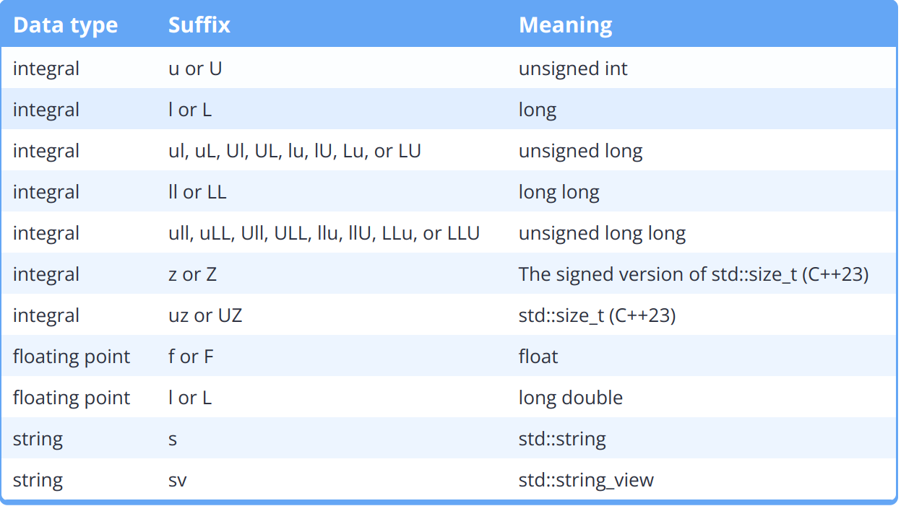

# 基本

## 注释

> 好的注释解释代码为什么这么做而不是这段代码是什么

Bad comment:

```cpp
// Calculate the cost of the items
cost = quantity * 2 * storePrice;
```

Reason: We can see that this is a cost calculation, but why is quantity multiplied by 2?

Good comment:

```cpp
// We need to multiply quantity by 2 here because they are bought in pairs
cost = quantity * 2 * storePrice;
```

## --a和a--

a++ 和++a 都是将a 加1，但是a++ 返回值为a，而++a 返回值为a+1。如果只是希望增加a 的值，而不需要返回值，则推荐使用++a，其运行速度会略快一些。

**因为先加1再输出的方式省去了对a复制一个新的copy，以及之后删除这个临时copy的时间和空间**


## main参数

> int argc:          英文名为arguments count(参数计数)
> char** argv:    英文名为arguments value/vector(参数值)
> argv[0] 指向程序运行时的全路径名
> argv[i] 指向程序在DOS命令中执行程序名后的第i个字符串
> argv[argc]数组越界.

```c++
int main(int argc,char** argv)
{
....
return 0; // 可以不写这句话，在main中若不写return则默认有return 0;
}
```

## 暂停程序

```c++
// 程序暂停一下，按任意键继续
system("pause");
```


# 变量

## 初始化

+ Brace initialization，也叫**uniform initialization**或**list initialization**
+ **Copy initialization**
+ 前者不允许narrowing conversions，例如从float转为int
+ 更倾向使用前者

```c++
int main()
{
// 三种方式
int x = 123;   // Copy initialization
int y{ 123 };  // Brace initialization
int z = { };   // 初始化为0

// 初始化多个变量
int a, b = 5; // wrong (a is not initialized!)
int a = 5, b = 5; // correct
int a, b( 5 );
int c, d{ 5 };
}
```

## 基本类型

> \_t代表这是一个类型，但是很多类型没有\_t
>
> C++ only guarantees that integers will have a certain minimum size, not that they will have a specific size.


```c++
char c = 'a';
int y = -256;
unsigned int u { 5u }; // 5u means the number 5 as an unsigned int
double d = 3.14;  // 浮点数默认是double类型
float e = 3.14f;  // 加上f以指定为float类型
float e = 3.14;  // 不加上f会导致3.14转为double再转为float，由此降低精度
std::string s = "123";
//常量，定义时必须先初始化
const int x =10
// 常量，在编译时初始化（也就是最开始）
constexpr int z = 20
constexpr int z1 = z
constexpr int z2 = y // 错误，编译时还不知道y的值
```

### NaN and Inf

+ Inf可正可负

```cpp
#include <iostream>

int main()
{
    double zero {0.0};
    double posinf { 5.0 / zero }; // positive infinity
    std::cout << posinf << '\n';

    double neginf { -5.0 / zero }; // negative infinity
    std::cout << neginf << '\n';

    double nan { zero / zero }; // not a number (mathematically invalid)
    std::cout << nan << '\n';

    return 0;
}
```

```
1.#INF
-1.#INF
1.#IND
```

### 常量

+ 分为运行时常量和编译时常量，运行时常量的值只在运行时才知道，而编译时常量在编译时就知道，因此编译时常量更节省时间。
+ constexpr常量表达式，只能赋予给编译时常量（代替const），否则报错。
+ ==全局常量必须初始化==（在函数之外无法对其赋值）

```cpp
#include <iostream>

int five()
{
    return 5;
}

int main()
{
    constexpr double gravity { 9.8 }; // ok: 9.8 is a constant expression
    constexpr int sum { 4 + 5 };      // ok: 4 + 5 is a constant expression
    constexpr int something { sum };  // ok: sum is a constant expression

    std::cout << "Enter your age: ";
    int age{};
    std::cin >> age;

    constexpr int myAge { age };      // compile error: age is not a constant expression
    constexpr int f { five() };       // compile error: return value of five() is not a constant expression

    return 0;
}
```


### 字面符

**Literals** are unnamed values inserted directly into the code. 

```cpp
return 5;                   // 5 is an integer literal
bool myNameIsAlex { true }; // true is a boolean literal
std::cout << 3.4;           // 3.4 is a double literal
```

通过后缀来指定字面符类型




### 自动类型推断

+ 使用常量赋值会丢掉topconst
+ 使用const auto来将推断的类型作为常量
+ 同const一样，引用赋值会丢掉引用，在前面加上&即可
+ 指针不会丢掉

```c++
auto c = 'a'
auto d = 1
auto& y = c
const int x { 5 }; // x has type const int
auto y { x };      // y will be type int (const is dropped)
const auto y { x };

auto ref1 { getRef() };  // std::string (reference dropped)
auto& ref2 { getRef() }; // std::string& (reference reapplied)

auto ptr1{ getPtr() }; // std::string*
auto* ptr1{ getPtr() }; // 带星号和上面的相同
```

+ 使用auto作为函数类型定义时，return的类型只能有一个。但是缺点是前向定义不会被编译器认可（需要有类型），因此只能在单文件中使用。

```cpp
auto someFcn(bool b)
{
    if (b)
        return 5; // return type int
    else
        return 6.7; // return type double
}
```

+ 用auto作为类型写在箭头后的标志：

```cpp
auto add(int x, int y) -> int
{
  return (x + y);
}
```

### implicit转换

```c++
int main()
{
    char mychar = 64;
    int myint = 123;
    double mydouble = 456.789;
    bool myboolean = true;
    myint = mychar;
    mydouble = myint;
    mychar = myboolean;
	
    // 可以字符相加
    char c1 = 10;
    char c2 = 20;
    auto result = c1 + c2; // result is of type int
    
    // 将一个指针转换为空指针
    int x = 123;
    int* pint = &x;
    void* pvoid = pint;
    
    // 将数组转为对第一个元素的指针
    int arr[5] = { 1, 2, 3, 4, 5 };
    int* p = arr; // pointer to the first array element
    std::cout << *p;
    
    // 函数中的数组传递的是第一个元素的指针
    // prefer std:vector and std::array containers to raw arrays and pointers.
    int arr[] = {1,1,1};
    arrfunc(arr);
    /* void arrfunc(const int arr[]){
    std::cout << *arr;
	}  */
}
```

### explicit转换

1. 使用函数`static_cast<type_to_convert_to>(value_to_convert_from)`
2. 更倾向于使用直接转换
3. c-style转换（最好不用）：`(double)x`

### typeid显示类型

```cpp
#include <iostream>
#include <typeinfo> // for typeid()

int main()
{
    int i{ 2 };
    double d{ 3.5 };
    std::cout << typeid(i + d).name() << ' ' << i + d << '\n'; // show us the type of i + d

    return 0;
}
```

## 类型别名

### using

+ In C++, **using** is a keyword that creates an alias for an existing data type.
+ 建议使用using而不是typedef

```cpp
#include <iostream>

int main()
{
    using Distance = double; // define Distance as an alias for type double

    Distance milesToDestination{ 3.4 }; // defines a variable of type double

    std::cout << milesToDestination << '\n'; // prints a double value

    return 0;
}
```

### typedef

```cpp
// The following aliases are identical
typedef long Miles;
using Miles = long;
```

## 类型转换

标准转换：C++标准的基本类型之间的转换，包括：

- Numeric promotions 
- Numeric conversions 
- Arithmetic conversions
- Other conversions

### numeric promotion

+ A **numeric promotion** is the type conversion of a narrower numeric type (such as a `char`) to a wider numeric type (typically `int` or `double`) that can be processed efficiently and is less likely to have a result that overflows.

+ Because such promotions are **safe**, the compiler will freely use numeric promotion as needed, and will not issue a warning when doing so.

### Numeric conversions 

+ C++ supports another category of numeric type conversions, called **numeric conversions**, that cover additional type conversions not covered by the numeric promotion rules.
+ In C++, a **narrowing conversion** is a numeric conversion that may result in the loss of data. Such narrowing conversions include:
  + From a floating point type to an integral type.
  + From a wider floating point type to a narrower floating point type, unless the value being converted is constexpr and is in range of the destination type (even if the narrower type doesn’t have the precision to store the whole number).
  + From an integral to a floating point type, unless the value being converted is constexpr and is in range of the destination type and can be converted back into the original type without data loss.
  + From a wider integral type to a narrower integral type, unless the value being converted is constexpr and after integral promotion will fit into the destination type.

### Arithmetic conversions

The following operators require their operands to be of the same type:

- The binary arithmetic operators: +, -, *, /, %
- The binary relational operators: <, >, <=, >=, ==, !=
- The binary bitwise arithmetic operators: &, ^, |
- The conditional operator ?: (excluding the condition, which is expected to be of type `bool`)

## utils

### sizeof

获取一个数据占用的字节数：

```cpp
std::cout << "char32_t:\t" << sizeof(char32_t) << " bytes\n";
```

### size_t

**std::size_t** is defined as an unsigned integral type, and it is typically used to represent the size or length of objects.

```
for(size_t i=0;i<10;i++){...}
```


## 数组

1. 基本

```c++
#include <iterator> // for std::size

// 初始化并赋值
int arr[5] = {1,2,3,4};
std::cout << arr[1];

// 获取一个数组的长度
int a[5] ={1,2,3,4,5};
std::cout << sizeof a/sizeof a[0];
// c++17的长度获取方式
int array[]{ 1, 1, 2, 3, 5, 8, 13, 21 };
std::cout << "The array has: " << std::size(array) << " elements\n";
```

2. 函数传递的数组实际上是数组第一个元素的指针，因此在函数中修改和遍历数组有影响，且函数中不能使用`std::size(array)`

   **但在结构体或class中的数组不会自动转换(decay)！！！**

> 在函数参数中，`int array[]`会自动转换为`int* array`，为了更易懂，最好在参数中直接写后者

```cpp
void passArray(int prime[5]) // prime is the actual array
// void passArray(const int prime[5]) 加上const解决
{
    prime[0] = 11; // so changing it here will change the original argument!
    prime[1] = 7;
    prime[2] = 5;
    prime[3] = 3;
    prime[4] = 2;
}
```

3. 多维数组

```cpp
int array[3][5]
{
  { 1, 2 }, // row 0 = 1, 2, 0, 0, 0
  { 6, 7, 8 }, // row 1 = 6, 7, 8, 0, 0
  { 11, 12, 13, 14 } // row 2 = 11, 12, 13, 14, 0
};
```

4. 动态分配数组的大小，删除数组时需要用`delete[]`

```cpp
#include <iostream>

int main()
{
    std::cout << "Enter a positive integer: ";
    int length{};
    std::cin >> length;

    int* array{ new int[length]{} }; // use array new.  Note that length does not need to be constant!

    std::cout << "I just allocated an array of integers of length " << length << '\n';

    array[0] = 5; // set element 0 to value 5

    delete[] array; // use array delete to deallocate array

    // we don't need to set array to nullptr/0 here because it's going out of scope immediately after this anyway

    return 0;
}
```

## 字符串

+ `std::string`的变量赋值会产生一个新的copy，开销很大，更倾向于使用`std::string_view`

```c++
std::string s= "asddasdad";

// 获取字符串长度
std::cout << s.length();  // 返回unsigned int
std::cout << std::ssize(s);  // In C++20

// 获取字符子串，从2开始的3个字符
std::cout << s.substr(2,3);

// 搜索一个子串
std::string s= "asddasdad";
// size_type是这个函数类型，若没找到就返回一个npos类型
std::string::size_type found = s.find("das1");
if (found != std::string::npos)
{
    std::cout << "Substring found at position: " << found;
}
else
{
    std::cout << "The substring is not found.";
}
```

### 字面符

使用std::string的字面符必须加上`using namespace std::literals;`

```cpp
#include <iostream>
#include <string>      // for std::string
#include <string_view> // for std::string_view

int main()
{
    using namespace std::literals; // easiest way to access the s and sv suffixes
	constexpr std::string name{ "Alex"s }; // compile error，只在C++20支持
	constexpr std::string_view name{ "Alex"s }; // 可用
    std::cout << "foo\n";   // no suffix is a C-style string literal
    std::cout << "goo\n"s;  // s suffix is a std::string literal
    std::cout << "moo\n"sv; // sv suffix is a std::string_view literal

    return 0;
};
```

### string_view

+ C++17支持
+ 只提供可读权限，不会产生新的copy，所以在字符串不需要修改时倾向于使用string_view
+ **Do not return a std::string_view**

```cpp
#include <iostream>
#include <string>
#include <string_view>

void printString(std::string str)
{
    std::cout << str << '\n';
}

int main()
{
  std::string_view sv{ "balloon" };

  std::string str{ sv }; // okay, we can create std::string using std::string_view initializer

  // printString(sv);   // compile error: won't implicitly convert std::string_view to a std::string

  printString(static_cast<std::string>(sv)); // okay, we can explicitly cast a std::string_view to a std::string

  return 0;
}
```


### 读取空格划分的字符串

```c++
#include <iostream>
#include <fstream>
#include <string>
#include <sstream>
#include <vector>

 	std::fstream fs{ argv[1] };
    std::string s;
    while (fs)
    {
        std::getline(fs, s);
        std::istringstream ss(s);
        std::string point;
        std::vector<std::string> points;
        // 读取每个空格分割字符串，放入列表
        while(ss >> point) {
            points.push_back(point);
        }
        // stod将字符转为double类型
        temp_point = {stof(points[0]),stof(points[1]),stof(points[2])};
        cloud->push_back(temp_point);//从点云最后面插入一点
    }
```


### 类型转换

```c++
// 将字符串转为float类型
stof("0.2121")
// 将字符串转为double类型
stod("0.2121")
// 将字符串转换为长整型整数long int
atoll("21")
// 将字符串转换为长整数long long int
atol("21")
```


## 指针

> 指针类型<type>\*，例如int* p
>
> 引用类型<type>&, 例如int& p
>
> 使用&获取一个变量的指针
>
> 使用\*获取一个指针指向的变量

+ 若一个变量名为x，则命名其指针为xptr
+ 指针的大小：The size of a pointer is dependent upon the architecture the executable is compiled for -- a 32-bit executable uses 32-bit memory addresses -- consequently, a pointer on a 32-bit machine is 32 bits (4 bytes). With a 64-bit executable, a pointer would be 64 bits (8 bytes).

```c++
int x = 123;
int* p = &x;
std::cout << *p;

// 改变指针的对象
*p = 456
    
// 初始化空指针
int* ptr1, ptr2;   // incorrect: ptr1 is a pointer to an int, but ptr2 is just a plain int!
int* ptr3, * ptr4; // correct: ptr3 and p4 are both pointers to an int
char* p{nullptr};
char* p{};  // 和上面效果一样
char* p{&x};
    
int x;
int * p1 = &x; // 指针可以被修改，值也可以被修改
const int * p2 = &x; // 指针可以被修改，值不可以被修改（const int）
int * const p3 = &x; // 指针不可以被修改（* const），值可以被修改
const int * const p4 = &x; // 指针不可以被修改，值也不可以被修改

// 使用逗号在一行赋值的时候，第一个以后的指针要加上*号
ListNode* slow = head , *fast = head;

// 指针可以转换为布尔值，空指针为0
if (ptr) // implicit conversion to Boolean
    std::cout << "ptr is non-null\n";
else
    std::cout << "ptr is null\n";
```

### 常数指针

#### 指向常数的指针(low-level)

+ 其指向的object值不能修改
+ 这个指针能修改（指向其他object）
+ 能够指向非常数，但是还是不能改变值

```cpp
int main()
{
    const int x{ 5 };
    const int* ptr { &x }; // ptr points to const int x

    const int y{ 6 };
    ptr = &y; // okay: ptr now points at const int y

    return 0;
}
```

#### 自身是常数的指针(high-level)

+ 指针的地址之后不能被修改
+ 同常数一样，必须在一开始初始化

```cpp
int main()
{
    int x{ 5 };
    int y{ 6 };

    int* const ptr { &x }; // okay: the const pointer is initialized to the address of x
    ptr = &y; // error: once initialized, a const pointer can not be changed.

    return 0;
}
```

#### 指向常数的常数指针(both)

```cpp
int main()
{
    int value { 5 };
    const int* const ptr { &value }; // a const pointer to a const value

    return 0;
}
```

### 聪明指针

> Smart pointers are pointers that own the object they point to and automatically destroy
> the object they point to and deallocate the memory once the pointers go out of scope.

#### unique指针

> A unique pointer called std::unique_ptr is a pointer that owns an object it points
> to. The pointer **can not be copied**. Unique pointer deletes the object and deallocates
> memory for it, once it goes out of scope.

使用方式：

```c++
#include <iostream>
#include <memory>    // 需要用到memory
int main()
{
std::unique_ptr<int> p(new int{ 123 });
std::cout << *p;
}
```

更好的初始化方式：

==The std::make_unique function was introduced in the C++14 standard. Make sure to compile with the` -std=c++14` flag to be able to use this function.==

```c++
#include <iostream>
#include <memory>
int main()
{
std::unique_ptr<int> p = std::make_unique<int>(123);
std::cout << *p;
}
```

使用类的属性

```c++
#include <iostream>
#include <memory>
class MyClass
{
public:
void printmessage()
{
std::cout << "Hello from a class.";
}
};
int main()
{
std::unique_ptr<MyClass> p = std::make_unique<MyClass>();
p->printmessage();
}
```


#### 共享指针

> 共享指针能够复制！
>
> 多个指针指向同一个对象，只有最后一个指针的scope结束时，才会在内存中删除对象

初始化共享指针并复制

```c++
#include <iostream>
#include <memory>
int main()
{
std::shared_ptr<int> p1 = std::make_shared<int>(123);
std::shared_ptr<int> p2 = p1;
std::shared_ptr<int> p3 = p1;
}
```

### 修改函数参数中的指针

+ 函数参数中的指针是地址的一个copy，不能够修改到实际的指针变量
+ 因此需要传递引用`int*& refptr`

```cpp
#include <iostream>

void nullify(int*& refptr) // refptr is now a reference to a pointer
{
    refptr = nullptr; // Make the function parameter a null pointer
}

int main()
{
    int x{ 5 };
    int* ptr{ &x }; // ptr points to x

    std::cout << "ptr is " << (ptr ? "non-null\n" : "null\n");

    nullify(ptr);

    std::cout << "ptr is " << (ptr ? "non-null\n" : "null\n");
    return 0;
}
```

### 指针算术

1. 指针+1等于其指向的地址加上其类型所占据的空间

```cpp
#include <iostream>

int main()
{
    int value{ 7 };
    int* ptr{ &value };

    std::cout << ptr << '\n';
    std::cout << ptr+1 << '\n';
    std::cout << ptr+2 << '\n';
    std::cout << ptr+3 << '\n';

    return 0;
}
#0012FF7C
0012FF80
0012FF84
0012FF88
```

### void指针

1. 能够指向任何类型的指针，但不能直接dereference，需要先转换成对应类型

```cpp
int value{ 5 };
void* voidPtr{ &value };

// std::cout << *voidPtr << '\n'; // illegal: dereference of void pointer

int* intPtr{ static_cast<int*>(voidPtr) }; // however, if we cast our void pointer to an int pointer...

std::cout << *intPtr << '\n'; // then we can dereference the result
```


## lvalue引用

> <type>\&表示引用类型，一般紧跟在类型之后，但放在变量名之前也可

+ 所有的引用都必须初始化
+ 引用类型必须和被引用的类型一致
+ 引用类型不能重新指向其他lvalue
+ 引用常量必须在类型前加上const  `const int& ref { x };`
+ 常量引用可以通过rvalue初始化  `const int& ref { 5 }; // okay: 5 is an rvalue`

```c++
int x = 123;
int& p1 = x;
int p2 = x;
// 引用和原变量的指针相同，直接赋值指针不同
std::cout << &x <<"\n" << &p1 << "\n" << &p2;

const int y { 5 };
int& invalidRef { y };  // invalid: can't bind to a non-modifiable lvalue
int& invalidRef2 { 0 }; // invalid: can't bind to an r-value
```

+ 使用常量引用 非常量lvalue时，起常量引用不能修改值

## 生命周期

> Normal variables are allocated from limited memory called the **stack**. Dynamically allocated variables are allocated from a general pool of memory called the **heap**.

1. 自动存储期间

所有local变量均以栈存储

2. 动态存储期间

堆存储，手动指定

3. 静态存储期间

以`static`开头的变量，生命周期是整个程序运行期间

### new和delete

1. new会从操作系统索取内存，delete将内存返还给操作系统，而非删除

2. 删除指针后最好将其设为`nullptr`
3. 使用`new`时避免多个指针指向同一个`Object`，因为删除时所有指针均需要改为`nullptr`
4. 使用new获取内存时可能会失败（例如当内存不足时），用`int* value { new (std::nothrow) int }`当失败时赋予空指针

```c++
#include <iostream>
int main()
{
int* p = new int;
int* ptr1{ new int (5) }; // use direct initialization
int* ptr2{ new int { 6 } }; // use uniform initialization
    
*p = 123;
std::cout << "The pointed-to value is: " << *p;
delete p;
    
}

// 对于数组变量
#include <iostream>
int main()
{
int* p = new int[3];
p[0] = 1;
p[1] = 2;
p[2] = 3;
std::cout << "The values are: " << p[0] << ' ' << p[1] << ' ' << p[2];
delete[] p;
}
```

5. 删除空指针没有影响，因此不需要判断是否为空指针：`delete ptr;`
6. 在给指针变量重新指定内存地址时，先`delete`以免内存泄漏

### 内存泄漏

> 一个变量的生命周期结束了但是没有将内存返还给操作系统

Consider the following function:

```cpp
void doSomething()
{
    int* ptr{ new int{} };
}
```

This function allocates an integer dynamically, but never frees it using delete. Because pointers variables are just normal variables, when the function ends, ptr will go out of scope. And because ptr is the only variable holding the address of the dynamically allocated integer, when ptr is destroyed there are no more references to the dynamically allocated memory. This means the program has now “lost” the address of the dynamically allocated memory. As a result, this dynamically allocated integer can not be deleted.

This is called a **memory leak**. Memory leaks happen when your program loses the address of some bit of dynamically allocated memory before giving it back to the operating system. When this happens, your program can’t delete the dynamically allocated memory, because it no longer knows where it is. The operating system also can’t use this memory, because that memory is considered to be still in use by your program.

### 临时变量

```c++
// name使用过后就会被删除
explicit Person(std::string name):name{std::move(name)}{}
```


## 静态变量

1. 静态变量只会进行一次初始化，后面的初始化会跳过（注意：跳过的是初始化而不是赋值！！）

```c++
#include <iostream>

void myfunction()
{
    static int x = 0; // defined only the first time, skipped every other
// time
    x++;
    std::cout << x << '\n';
}

int main()
{
    myfunction(); // x == 1
    myfunction(); // x == 2
    myfunction(); // x == 3
}
```

使用静态变量作为类的字段

```c++
#include <iostream>
class MyClass
{
public:
    static int x; // declare a static data member
};
int MyClass::x = 123; // define a static data member
int main()
{
    MyClass::x = 456; // access a static data member
    std::cout << "Static data member value is: " << MyClass::x;
}
```

静态类方法

```c++
#include <iostream>
class MyClass
{
public:
    static void myfunction(); // declare a static member function
};

// 类里声明的时候已经有static，所以这里不需要写
void MyClass::myfunction()
{
    std::cout << "Hello World from a static member function.";
}
int main()
{
    MyClass::myfunction(); // call a static member function
}
```


# 复合类型

## Lvalue and rvalue

1. lvalues expressions are those that evaluate to variables or other identifiable objects that persist beyond the end of the expression.
2. rvalues expressions are those that evaluate to literals or the returned value of functions and operators that are discarded at the end of the expression.

+ rvalue可理解为临时变量

```cpp
int main()
{
    int x{};

    // Assignment requires the left operand to be a modifiable lvalue expression and the right operand to be an rvalue expression
    x = 5; // valid: x is a modifiable lvalue expression and 5 is an rvalue expression
    5 = x; // error: 5 is an rvalue expression and x is a modifiable lvalue expression

    return 0;
}
```

## 类型定义

+ 使用程序定义的类型时，该文件中必须有该文件的完整定义
+ 因此一般在头文件中直接写好类型的完整定义，然后传入需要使用的文件（这里允许有多个定义）

## 枚举Enum

1. 是program-defined types，必须先定义

### unscoped

1. unscoped enumeration使用`enum`关键字定义
2. 可以通过其所在的scope获取enum变量，也可以通过命名空间获取：`Color::red`

```cpp
// Define a new unscoped enumeration named Color
enum Color
{
    // Here are the enumerators
    // These symbolic constants define all the possible values this type can hold
    // Each enumerator is separated by a comma, not a semicolon
    red,
    green,
    blue, // trailing comma optional but recommended
    max_num,  // 经常在最后加上以便获取整个枚举的数量
}; // the enum definition must end with a semicolon

int main()
{
    // Define a few variables of enumerated type Color
    Color apple { red };   // my apple is red
    Color shirt { green }; // my shirt is green
    Color cup { blue };    // my cup is blue

    Color socks { white }; // error: white is not an enumerator of Color
    Color hat { 2 };       // error: 2 is not an enumerator of Color

    return 0;
}
```

3. 在相同scope下的 enumerator name不能重复
4. 由于枚举会污染命名空间，一般将其放入namespace或者class中

```cpp
enum Color
{
    red,
    green,
    blue, // blue is put into the global namespace
};

enum Feeling
{
    happy,
    tired,
    blue, // error: naming collision with the above blue
};

int main()
{
    Color apple { red }; // my apple is red
    Feeling me { happy }; // I'm happy right now (even though my program doesn't compile)

    return 0;
}
```

5. 枚举实际以整型存储，会隐式转换为整型值，整型值不会隐式转换为枚举
6. 一半的存储类型时标准int，但可以指定类型

```cpp
// Use an 8-bit unsigned integer as the enum base
enum Color : std::uint8_t
{
    black,
    red,
    blue,
};
```

### scoped

+ 也叫枚举类(enum class)

+ strongly typed (they won’t implicitly convert to integers) 
+ strongly scoped (the enumerators are only placed into the scope region of the enumeration). 自带命名空间，以`Color::red`使用
+ 使用关键字`enum class`，用法和`enum`相同

```cpp
#include <iostream>
int main()
{
    enum class Color
    {
        red,
        blue,
    };

    Color color { Color::blue };

    std::cout << color << '\n'; // won't work, because there's no implicit conversion to int
    std::cout << static_cast<int>(color) << '\n'; // will print 1

    return 0;
}
```

## 结构体

1. 聚合数据类型及其初始化

>  结构体只有data member是聚合数据类型，array，class等也是聚合数据类型
>
> 结构体初始化是逐个成员进行的(memberwise)

```cpp
struct Employee
{
    int id;  // 无初始值，bad
    int age {2};
    double wage {};  // 有默认值
};

int main()
{
    Employee foo = {}  // 第一个id有值初始化
    Employee foo1 = {}  // 第一个id有值初始化，但更安全，会保证一定初始化
    Employee frank = { 1, 32, 60000.0 }; // copy-list initialization using braced list
    Employee robert ( 3, 45, 62500.0 );  // direct initialization using parenthesized list (C++20)
    Employee joe { 2, 28, 45000.0 };     // list initialization using braced list (preferred)
    // 可以使用常量
	const Employee frank;  
    // 修改值
    frank.id = 4;
    // 以brace修改值
    frank = { 1, 34, 60000.0 };
    // 使用箭头符号获取指针指向对象的值
    Employee* ptr_frank{&frank};
    ptr_frank->id=4;
    return 0;
}
```

2. 返回结构体

```cpp
Point3d getZeroPoint()
{
    // We already specified the type at the function declaration
    // so we don't need to do so here again
    return { 0.0, 0.0, 0.0 }; // return an unnamed Point3d
    return { }; // 使用值初始化
}
```


## 类型模板

1. 因为`struct Pair`的使用很广泛，所以有`<utility>`中的`std::pair`来简化
2. `std::pair`中实际上也是first和second

```cpp
#include <iostream>

template <typename T, typename U>
struct Pair
{
    T first{};
    U second{};
};

template <typename T, typename U>
void print(Pair<T, U> p)
{
    std::cout << '[' << p.first << ", " << p.second << ']';
}

int main()
{
    Pair<int, double> p1{ 1, 2.3 }; // a pair holding an int and a double
    Pair<double, int> p2{ 4.5, 6 }; // a pair holding a double and an int
    Pair<int, int> p3{ 7, 8 };      // a pair holding two ints

    print(p2);

    return 0;
}
```


```cpp
#include <iostream>
#include <utility>

template <typename T, typename U>
void print(std::pair<T, U> p)
{
    std::cout << '[' << p.first << ", " << p.second << ']';
}

int main()
{
    std::pair<int, double> p1{ 1, 2.3 }; // a pair holding an int and a double
    std::pair<double, int> p2{ 4.5, 6 }; // a pair holding a double and an int
    std::pair<int, int> p3{ 7, 8 };      // a pair holding two ints

    print(p2);

    return 0;
}
```

# 流程控制

+ 循环变量应该始终是signed（因为unsigned在等于0时再减一等于其上限值）

## 条件操作符


```cpp
larger = (x > y) ? x : y;

std::cout << (x > y) ? x : y << '\n';  // 可能出错
std::cout << ((x > y) ? x : y) << '\n';  //应该始终用括号包括条件操作符
```


## if

> 逻辑运算符：&&，||，!，^(异或操作)

> 条件表达式：`condition ? exp1 : exp2` 若条件符合则exp1，反之

```c++
std::string::size_type found = s.find("das1");
if (found != std::string::npos)
{
    std::cout << "Substring found at position: " << found;
}
else
{
    std::cout << "The substring is not found.";
}
```

在if else中定义的变量会在判断语句结束后销毁，因此以下代码编译失败。

```cpp
#include <iostream>

int main()
{
    constexpr bool inBigClassroom { false };

    if (inBigClassroom)
        constexpr int classSize { 30 };
    else
        constexpr int classSize { 20 };

    std::cout << "The class size is: " << classSize << '\n';

    return 0;
}
```

## switch

+ 条件变量必须是整型或者enumerated类型

```c++
    switch (animal)
    {
        case Animal::chicken:
        case Animal::duck:
            std::cout << 2;
            break;

        case Animal::pig:
        case Animal::goat:
        case Animal::cat:
        case Animal::dog:
            std::cout << 4;
            break;

        default:
            std::cout << "???";
            break;
    }
```

+ 若没有break或者return则匹配后会一直执行

```cpp
#include <iostream>

int main()
{
    switch (2)
    {
    case 1: // Does not match
        std::cout << 1 << '\n'; // Skipped
    case 2: // Match!
        std::cout << 2 << '\n'; // Execution begins here
    case 3:
        std::cout << 3 << '\n'; // This is also executed
    case 4:
        std::cout << 4 << '\n'; // This is also executed
    default:
        std::cout << 5 << '\n'; // This is also executed
    }

    return 0;
}
```

+ 在switch中声明变量

```cpp
switch (1)
{
    int a; // okay: definition is allowed before the case labels
    int b{ 5 }; // illegal: initialization is not allowed before the case labels

    case 1:
        int y; // okay but bad practice: definition is allowed within a case
        y = 4; // okay: assignment is allowed
        break;

    case 2:
        int z{ 4 }; // illegal: initialization is not allowed if subsequent cases exist
        y = 5; // okay: y was declared above, so we can use it here too
        break;

    case 3:
        break;
}
```

## for

```c++
    for (int i=0;i<10;i++) {
        std::cout << i<<"\n";
    }
```

在循环中使用多个计数变量

```cpp
#include <iostream>

int main()
{
    for (int x{ 0 }, y{ 9 }; x < 10; ++x, --y)
        std::cout << x << ' ' << y << '\n';

    return 0;
}
```

## foreach循环

1. 可以循环迭代 container/range的内容：`for (some_type element_name : container_name)`

2. ==element_name 实际上是元素的复制，若想使用实际元素，可以用引用类型==：

   ```c++
   #include <iostream>
   #include <vector>
   int main()
   {
       std::vector<int> v = { 1, 2, 3, 4, 5 };
       v.push_back(10);
       for (int& el : v)
       {
           el = 2;
       }
       for (int el : v)
       {
           std::cout << el;
       }
   }
   ```

   

## do... while

```cpp
#include <iostream>

int main()
{
    // selection must be declared outside of the do-while so we can use it later
    int selection{};

    do
    {
        std::cout << "Please make a selection: \n";
        std::cout << "1) Addition\n";
        std::cout << "2) Subtraction\n";
        std::cout << "3) Multiplication\n";
        std::cout << "4) Division\n";
        std::cin >> selection;
    }
    while (selection != 1 && selection != 2 &&
        selection != 3 && selection != 4);

    // do something with selection here
    // such as a switch statement

    std::cout << "You selected option #" << selection << '\n';

    return 0;
}
```

# 函数

1. 最好先声明，再定义后再使用

```c++
// 声明一个无返回值的函数
void myvoidfunction();

// 只声明函数的时候，可以忽略变量名
int mysum(int, int);

// 定义函数
int mysquarednumber(int x) {
return x * x;
}

// 传递变量的引用（最好避免传递引用，使用常量引用）
#include <iostream>
void myfunction(int& byreference)
{
byreference++; // we can modify the value of the argument
std::cout << "Argument passed by reference: " << byreference;
}
int main()
{
int x = 123;
myfunction(x);
}

// 使用常量引用
#include <iostream>
#include <string>
void myfunction(const std::string& byconstreference)
{
std::cout << "Arguments passed by const reference: " <<
byconstreference;
}
int main()
{
std::string s = "Hello World!";
myfunction(s);
}
```

2. 非常量引用的参数只能是非常量的lvalue

```cpp
#include <iostream>
#include <string>

void printValue(int& y) // y only accepts modifiable lvalues
{
    std::cout << y << '\n';
}

int main()
{
    int x { 5 };
    printValue(x); // ok: x is a modifiable lvalue

    const int z { 5 };
    printValue(z); // error: z is a non-modifiable lvalue

    printValue(5); // error: 5 is an rvalue

    return 0;
}
```

## 默认参数

1. 只能用等号声明，不能用括号初始化

```cpp
void foo(int x = 5);   // ok
void goo(int x ( 5 )); // compile error
void boo(int x { 5 }); // compile error
```

2. 默认参数只能放在最右边
3. 若一个函数有前向声明（在头文件中），最好在声明中定义默认参数

## 函数重载

> 在编译时实质上将重载的函数变成了不同的名字

1. 参数类型不一样即可，返回类型可以不一样

```c++
void myprint(char param);
void myprint(int param);
void myprint(double param);
```

2. 类型不一样的情况不包括typedefs, type aliases, and const qualifier on value parameters. 包括ellipses.

```cpp
void print(int);
void print(const int); // not differentiated from print(int)

void foo(int x, int y);
void foo(int x, ...); // differentiated from foo(int, int)
```


## 函数声明

> 函数声明用来表示函数存在，同时声明其类型

> 可以解决函数在编译时候的顺序问题，如下所示，add的定义在main之后，但是前面声明过，所以能找到。

```c++
#include <iostream>

int add(int x, int y); // forward declaration of add() (using a function declaration)

int main()
{
    std::cout << "The sum of 3 and 4 is: " << add(3, 4) << '\n'; // this works because we forward declared add() above
    return 0;
}

int add(int x, int y) // even though the body of add() isn't defined until here
{
    return x + y;
}
```

## 内联函数

+ 一般用在只有头文件的库
+ 与引入一个头文件类似，内联函数在编译时会将其调用换成实际的函数代码

```cpp
#include <iostream>

int main()
{
    std::cout << ((5 < 6) ? 5 : 6) << '\n';
    std::cout << ((3 < 2) ? 3 : 2) << '\n';
    return 0;
}
```

+ Some types of functions are implicitly treated as inline functions. These include:

  - Functions defined inside a class, struct, or union type definition.

  - Constexpr / consteval functions ([6.14 -- Constexpr and consteval functions](https://www.learncpp.com/cpp-tutorial/constexpr-and-consteval-functions/))

## 常量函数

+ consteval的函数必须在编译时evaluate(c++20)
+ consteval函数只在返回值是constexpr时起作用

```cpp
#include <iostream>

constexpr int greater(int x, int y)
{
    return (x > y ? x : y);
}

int main()
{
    constexpr int g { greater(5, 6) };            // case 1: evaluated at compile-time
    std::cout << g << " is greater!\n";

    int x{ 5 }; // not constexpr
    std::cout << greater(x, 6) << " is greater!\n"; // case 2: evaluated at runtime

    std::cout << greater(5, 6) << " is greater!\n"; // case 3: may be evaluated at either runtime or compile-time

    return 0;
}
```

+ 常量函数的返回值会在编译时就计算得出并且替换到调用函数的语句中
+ 常量函数经常在头文件中定义
+ 属于内联函数

```cpp
#include <iostream>

constexpr int greater(int x, int y) // now a constexpr function
{
    return (x > y ? x : y);
}

int main()
{
    constexpr int x{ 5 };
    constexpr int y{ 6 };

    // We'll explain why we use variable g here later in the lesson
    constexpr int g { greater(x, y) }; // will be evaluated at compile-time

    std::cout << g << " is greater!\n";

    return 0;
}
```

## 通过指针或引用返回

+ 被引用的object必须在函数在外时是有效的（其scope不能仅限于函数内），否则会出错
+ 只要指针指向的object在scope下live，则可以返回指针
+ 返回指针可以返回`nullptr`

```cpp
#include <iostream>
#include <string>

const std::string& getProgramName()
{
    const std::string programName { "Calculator" }; // now a local variable, destroyed when function ends

    return programName;
}

int main()
{
    std::cout << "This program is named " << getProgramName();

    return 0;
}
```

+ Avoid returning references to non-const local static variables.

```cpp
#include <iostream>
#include <string>

const int& getNextId()
{
    static int s_x{ 0 }; // note: variable is non-const
    ++s_x; // generate the next id
    return s_x; // and return a reference to it
}

int main()
{
    const int& id1 { getNextId() }; // id1 is a reference
    const int& id2 { getNextId() }; // id2 is a reference

    std::cout << id1 << id2 << '\n';

    return 0;
}
```

## 函数模板

1. 首先需要声明模板类型

2. 使用T, U, V等大写字母作为模板类型名
3. 通过`max<actual_type>(arg1, arg2)`进行**函数模板实例化**
4. 相同类型的函数实例化只会进行一次
5. 通常写在头文件中

```cpp
#include <iostream>

// a declaration for our function template (we don't need the definition any more)
template <typename T>
T max(T x, T y);

template<>
int max<int>(int x, int y) // the generated function max<int>(int, int)
{
    return (x > y) ? x : y;
}

template<>
double max<double>(double x, double y) // the generated function max<double>(double, double)
{
    return (x > y) ? x : y;
}

int main()
{
    std::cout << max<int>(1, 2) << '\n';    // instantiates and calls function max<int>(int, int)
    std::cout << max<int>(4, 3) << '\n';    // calls already instantiated function max<int>(int, int)
    std::cout << max<double>(1, 2) << '\n'; // instantiates and calls function max<double>(double, double)

    return 0;
}
```

6. 对于同一个类型的模板参数，其模板实例化时的参数类型必须一致（不加\<type\>时）

```cpp
#include <iostream>

template <typename T>
T max(T x, T y)
{
    return (x > y) ? x : y;
}

int main()
{
    std::cout << max(2, 3.5) << '\n';  // 编译失败，不是相同类型
    std::cout << max<double>(2, 3.5) << '\n'; // we've provided actual type double, so the compiler won't use template argument deduction

    return 0;
}
```

### 多模板参数

下面代码会出现类型narrow，即返回类型是int，而三目表达式返回的double类型。

**可以通过使用auto返回类型解决**

```cpp
#include <iostream>

template <typename T, typename U> // We're using two template type parameters named T and U
T max(T x, U y) // x can resolve to type T, and y can resolve to type U
{
    return (x > y) ? x : y; // uh oh, we have a narrowing conversion problem here
}

int main()
{
    std::cout << max(2, 3.5) << '\n';

    return 0;
}
```


```cpp
#include <iostream>

template <typename T, typename U>
auto max(T x, U y)
{
    return (x > y) ? x : y;
}

int main()
{
    std::cout << max(2, 3.5) << '\n';

    return 0;
}
```

# 面向对象

## 类

1. 不修改成员字段的类方法应该加上const前缀：`std::string getname() const { return name; }`

```c++
// 声明一个类
class MyClass{};
int main()
{
    
MyClass o;   // 新建一个类实例
}

// 也可以通过struct定义一个类
struct MyStruct
{
// everything in here
// is public by default
};

// 数据成员字段
class MyClass
{
char c;
int x;
double d;
};

//类方法
class MyClass
{
void dosomething()   // 也可以在类里声明，然后在类外面定义
{
std::cout << "Hello World from a class.";
}
};

// 在类外面定义类方法
class MyClass
{
void dosomething();
};

void MyClass::dosomething()
{
std::cout << "Hello World from a class.";
}

// new运算符返回的是一个指向所分配类型变量（对象）的指针。
// 类指针访问类属性使用箭头，使用n
MyBaseClass* o = new MyDerivedClass;
o->dowork();

// 初始化一个类
Person person{ "John Doe." };

// 类实例访问类属性
MyClass::x = 456;
```

## 权限指示符

```c++
class MyClass
{
public:
// everything in here
// has public access level
protected:
// everything in here
// has protected access level
private:
// everything in here
// has private access level
};
```

1. **private无法在类之外获取到**

```c++
#include <iostream>
class MyClass
{
private:
int x; // x now has private access
public:
void printx()
{
std::cout << "The value of x is:" << x; // x is accessible to
// printx()
}
};
int main()
{
MyClass o; // Create an object
o.x = 123; // Error, x has private access and is not accessible to
// object o
o.printx(); // printx() is accessible from object o
}
```

2. **protect**可以在子类获取到，但是在实例中（不管是自身的实例还是子类的实例）无法使用

```c++
class MyBaseClass
{
protected:
    char c;
    int x;
};


class MyDerivedClass : public MyBaseClass
{
// c and x also accessible here
};
int main()
{
    MyDerivedClass o;
    o.c = 'a'; // Error, not accessible to object
    o.x = 123; // error, not accessible to object
}
```


## 构造器

### 默认构造器

无参或者有默认参数的构造器是默认构造器

```c++
#include <iostream>
class MyClass
{
public:
MyClass()
{
std::cout << "Default constructor invoked." << '\n';
}
};
int main()
{
MyClass o; // invoke a default constructor
}
```

默认参数

```c++
#include <iostream>
class MyClass
{
public:
int x, y;
MyClass(int xx, int yy)
{
x = xx;
y = yy;
}
};
int main()
{
MyClass o{ 1, 2 }; // invoke a user-provided constructor
std::cout << "User-provided constructor invoked." << '\n';
std::cout << o.x << ' ' << o.y;
}
```

**更简洁的初始化**

```c++
#include <iostream>
class MyClass
{
public:
int x, y;
MyClass(int xx, int yy)
: x{ xx }, y{ yy } // member initializer list
{
}
};
int main()
{
MyClass o{ 1, 2 }; // invoke a user-defined constructor
std::cout << o.x << ' ' << o.y;
}
```

### 子类构造器

```c++
class Person{
    public:
        std::string name;

        void getName() const{
            std::cout << name;
        }

        explicit Person(std::string name):name{std::move(name)}{}
};

class Student : public Person{
    public:
        int semester;
    	// 使用了父类的构造器
        Student(std::string name,int semester): Person::Person(std::move(name)),semester{semester}{}
};
```


### 复制构造器

默认构造器只能进行浅拷贝

```c++
#include <iostream>
class MyClass
{
private:
int x, y;
public:
MyClass(int xx, int yy) : x{ xx }, y{ yy }
{
}
};
int main()
{
MyClass o1{ 1, 2 };
MyClass o2 = o1; // default copy constructor invoked
}
```

自定义复制构造器

```c++
#include <iostream>
class MyClass
{
private:
    int x, y;
public:
    MyClass(int xx, int yy) : x{ xx }, y{ yy }
    {
        std::cout << &x;
    }
// user defined copy constructor
    MyClass(const MyClass& rhs)
            : x{ rhs.x }, y{ rhs.y } // initialize members with other object's
// members
    {
        std::cout << "User defined copy constructor invoked.";
        std::cout << &x;
    }
};
int main()
{
    MyClass o1{ 1, 2 };
    MyClass o2 = o1; // user defined copy constructor invoked
}
```

### 移动构造器

```c++
#include <iostream>
#include <string>
class MyClass
{
private:
    double d;
    std::string s;
public:
    MyClass(double dd, std::string ss) // user-provided constructor
            : d{ dd }, s{ ss }{}

    MyClass(MyClass&& otherobject) // user-defined move constructor
            :
            d{ std::move(otherobject.d) }, s{ std::move(otherobject.s) }
    {
        std::cout << "Move constructor invoked." << '\n';
    }
    void printdata()
    {
        std::cout << "The value of doble is: " << d << ", the value of string is: " << s << '\n';
    }
};
int main()
{
    MyClass o1{ 3.14, "This was in object 1" };
    MyClass o2 = std::move(o1); // invokes the move constructor
    o2.printdata();
}
```

### 单参数构造器（防止自动类型转换）

```c++
explicit Person(const std::string& aname)
: name{ aname }
{}
```


## 继承和多态

继承

```c++
class MyBaseClass
{
};
class MyDerivedClass : public MyBaseClass
{
};
int main()
{
}
```

多态

```c++
#include <iostream>
class MyBaseClass
{
public:
    virtual void dowork()
    {
        std::cout << "Hello from a base class." << '\n';
    }
};
class MyDerivedClass : public MyBaseClass
{
public:
    void dowork() override
    {
        std::cout << "Hello from a derived class." << '\n';
    }
};
int main()
{
    MyBaseClass* o = new MyDerivedClass;
    o->dowork();
    delete o;
}
```

### 抽象类

抽象类有至少一个抽象方法（纯虚拟函数）

```c++
#include <iostream>
class MyAbstractClass
{
public:
    virtual void dowork() = 0;
};
class MyDerivedClass : public MyAbstractClass
{
public:
    void dowork()
    {
        std::cout << "Hello from a derived class." << '\n';
    }
};
int main()
{
    MyAbstractClass* o = new MyDerivedClass;
    o->dowork();
    delete o;
}
```

### 基类必须有一个虚拟destructor

This ensures the proper deallocation of objects accessed through a base class pointer via the inheritance chain:

```c++
class MyBaseClass
{
public:
    virtual void dowork() = 0;
    virtual ~MyBaseClass() {};
};
```


## 泛型

1. 定义：`template <typename T>`或`template <class T>`，两者效果一样。

```c++
#include <iostream>
template <typename T>
// 也可同时定义两个参数的泛型
// template <typename T, typename U>
void myfunction(T param)
{
    std::cout << "The value of a parameter is: " << param;
}
int main()
{
    myfunction<int>(123);
    myfunction<double>(123.456);
    myfunction<char>('A');
}
```

泛型作为类变量：

```c++
#include <iostream>
template <typename T>  // 同template <class T> 
class MyClass {
private:
    T x;
public:
    explicit MyClass(T xx)
            :x{ xx }
    {
    }
    T getvalue()
    {
        return x;
    }
};
int main()
{
    MyClass<int> o{ 123 };
    std::cout << "The value of x is: " << o.getvalue() << '\n';
    MyClass<double> o2{ 456.789 };
    std::cout << "The value of x is: " << o2.getvalue() << '\n';
}
```

## 使类实例能够像函数一样调用

```c++
#include <iostream>
class MyClass
{
public:
    // 需要覆盖这个函数
    void operator()(int x)
    {
        std::cout << "Function object with a parameter " << x << "called.";
    }
};
int main()
{
    MyClass myobject;
    myobject(123); // invoke the function object
}
```


# 代码组织

## 头文件

>  Header files usually have the .h (or .hpp) extension. Source files are files where we can store our definitions and the main program. They usually have the .cpp (or .cc) extension.

+ By convention, there are two kinds of files into which we can store our C++ source: ==**header files (headers) and source files**.==

+ 通常将声明放在头文件中，然后在需要时引入，这样可以减少代码
+ 编译时，首先会将引入头文件中的声明插入到引入指令的位置，这样才能在链接时找到其所需要的库代码


+ 头文件通常包含：header guard和声明内容
+ 引入头文件：`#include "add.h"`，其编译流程如下：	

### 不同的头文件命名规则

To include user-defined header files, we use the #include statement, followed by a full header name with extension enclosed in double-quotes. Example:

```c++
#ifndef "myheader.h"     // 头文件的保卫宏
#include "myheader.h"
#include "otherheader.h"
```

==We should put the declarations and constants into header files and put definitions and executable code in source files.==

### 有.h和没有的区别

> The header files with the *.h* extension define their names in the global namespace, and may optionally define them in the *std* namespace as well.
>
> The header files without the *.h* extension will define their names in the *std* namespace, and may optionally define them in the global namespace as well.

### 引入头文件的顺序

1. The paired header file
2. Other headers from your project
3. 3rd party library headers
4. Standard library headers

### Header guards

+ All of your header files should have header guards on them.
+ 用于保证在一个cpp文件中不引入同一个头文件两次以上

```cpp
#ifndef SQUARE_H
#define SQUARE_H

int getSquareSides()
{
    return 4;
}

#endif
```


## 命名空间

+ The :: symbol is an operator called the **scope resolution operator**.
+ ::左边是命名空间
+ 使用命名空间缩写：`using namespace std`（不建议使用）
+ 单独使用`::var`代表使用全局变量

```c++
#include <iostream>
namespace MyNameSpace
{
void myfunction();
}
void MyNameSpace::myfunction()
{
std::cout << "Hello World from a function inside a namespace.";
}
int main()
{
MyNameSpace::myfunction();
}
```


### 嵌套命名空间

```c++
#include <iostream>
namespace A
{
    namespace B
    {
        void myfunction();
    }
}
void A::B::myfunction()
{
    std::cout << "Hello World from a function inside a nested namespace."
              << '\n';
}
int main()
{
    A::B::myfunction();
    using namespace A::B;
    myfunction();
}
```

C++17可以这样嵌套命名空间：

```cpp
#include <iostream>

namespace foo::goo // goo is a namespace inside the foo namespace (C++17 style)
{
  int add(int x, int y)
  {
    return x + y;
  }
}

int main()
{
    std::cout << foo::goo::add(1, 2) << '\n';
    return 0;
}
```

### 命名空间别名

```cpp
#include <iostream>

namespace foo::goo
{
    int add(int x, int y)
    {
        return x + y;
    }
}

int main()
{
    namespace active = foo::goo; // active now refers to foo::goo

    std::cout << active::add(1, 2) << '\n'; // This is really foo::goo::add()

    return 0;
} // The active alias ends here
```

### **using**

1. **using declaration**：

```cpp
#include <iostream>

int main()
{
   using std::cout; // this using declaration tells the compiler that cout should resolve to std::cout
   cout << "Hello world!\n"; // so no std:: prefix is needed here!

   return 0;
} // the using declaration expires here
```

2. **using namespace**

```cpp
#include <iostream>

int main()
{
   using namespace std; // this using directive tells the compiler to import all names from namespace std into the current namespace without qualification
   cout << "Hello world!\n"; // so no std:: prefix is needed here
   return 0;
}
```

3. 若在块里使用，则只在块里有效。若在全局使用，则全局有效。
4. ==一旦using被声明，没有办法取消或者替换！！！==


## 链接linkage

+ 链接定义了该函数（变量等）能否从其他文件访问，若能访问则是外部链接，在本文件中所有地方都可访问到是内部链接。
+ 在外部文件使用函数需要在外部文件声明这个函数，因此经常通过引入头文件来声明。
+ 除了外部链接和内部链接，还有的变量没有链接，包括局部块级变量和本地变量。

```cpp
// Internal global variables definitions:
static int g_x;          // defines non-initialized internal global variable (zero initialized by default)
static int g_x{ 1 };     // defines initialized internal global variable

const int g_y { 2 };     // defines initialized internal global const variable
constexpr int g_y { 3 }; // defines initialized internal global constexpr variable

// Internal function definitions:
static int foo() {};     // defines internal function
```

### Variable scope, duration, and linkage summary


# 异常

```c++
#include <iostream>
int main()
{
    try
    {
        std::cout << "Let's assume some error occurred in our program." << '\n';
        std::cout << "We throw an exception of type int, for example." << '\n';
        std::cout << "This signals that something went wrong." << '\n';
        throw 123; // throw an exception if there is an error
    }
    catch (int e)
    {
        // catch and handle the exception
        std::cout << "Exception raised!." << '\n';
        std::cout << "The exception has a value of " << e << '\n';
    }
}
```


# I/O流

## 命令行输入和输出

> 调试异常时最好使用std::cerr来立即获得输出

```CPP
#include <iostream> 

int x =0;
char y;
// 分两次输入
std::cin >>x >>y;  
// 两者不同的是endl会flush输出，即让输出结果立即显示（不会滚动）
std::cout << x <<"\n"<<y;  // 使用\n换行，推荐使用
std::cout << x <<std::endl<<y;  // 使用endl换行

// 使用cin获取字符串
int x{ }; // define variable x to hold user input (and zero-initialize it)
std::cin >> x; // get number from keyboard and store it in variable x

// 使用getline来获取有空格的输入（直接使用cin只会获取到空格之前的字符串）
// 使用std::ws来控制输入的前缀不包含空格（换行等），若没有std::ws，可能会错误识别到上一次输入结束时的换行
std::string s;
std::getline(std::cin >> std::ws, s);
std::cout << s;
```

### 设置输出精度

```cpp
#include <iostream>
#include <iomanip> // for output manipulator std::setprecision()

int main()
{
    std::cout << std::setprecision(16); // show 16 digits of precision
    std::cout << 3.33333333333333333333333333333333333333f <<'\n'; // f suffix means float
    std::cout << 3.33333333333333333333333333333333333333 << '\n'; // no suffix means double

    return 0;
}
```

### std::cind的原理

When the user enters input in response to an extraction operation, that data is placed in a buffer inside of std::cin. A **buffer** (also called a data buffer) is simply a piece of memory set aside for storing data temporarily while it’s moved from one place to another. In this case, the buffer is used to hold user input while it’s waiting to be extracted to variables.

When the extraction operator is used, the following procedure happens:

- If there is data already in the input buffer, that data is used for extraction.
- If the input buffer contains no data, the user is asked to input data for extraction (this is the case most of the time). When the user hits enter, a ‘\n’ character will be placed in the input buffer.
- operator>> extracts as much data from the input buffer as it can into the variable (ignoring any leading whitespace characters, such as spaces, tabs, or ‘\n’).
- Any data that can not be extracted is left in the input buffer for the next extraction.

## 文件流

1. std::ifstream – read from a file
2. std::ofstream – write to a file
3. std::fstream – read from and write to a file


#### **读取文件**

```c++
#include <iostream>
#include <fstream>
#include <string>
int main()
{
    std::fstream fs{ "myfile.txt" };
    std::string s;
    while (fs)
    {
        std::getline(fs, s); // read each line into a string
        std::cout << s << '\n';
    }
}
```

使用>>读取一个字符

```c++
#include <iostream>
#include <fstream>
int main()
{
    std::fstream fs{ "myfile.txt" };
    char c;
    // 默认不会读取空格，使用std::noskipws读取
    while (fs >> std::noskipws >> c)
    {
        std::cout << c;
    }
}
```

#### **写入文件**

`std::ios::out`表示会覆盖写入

```c++
#include <fstream>
int main()
{
    std::fstream fs{ "myfile.txt", std::ios::out };
    fs << "First line of text." << '\n';
    fs << "Second line of text" << '\n';
    fs << "Third line of text" << '\n';
}
```

`std::ios::app`追加写入

```c++
#include <fstream>
int main()
{
    std::fstream fs{ "myfile.txt", std::ios::app };
    fs << "This is appended text" << '\n';
    fs << "This is also an appended text." << '\n';
}
```


## 字符串流

1. std::stringstream - the stream to read from a string
2. std::otringstream - the stream to write to a string
3. std::stringstream - the stream to both read from and write to a
   string


```c++
#include <iostream>
#include <sstream>
int main()
{
    // std::stringstream ss{ "Hello world." };
    std::stringstream ss;
    ss << "Hello World.";
    std::cout << ss.str(); << "xu"
}
```


## 文件路径处理

### 分离路径和文件名

```c++
std::string path = "D:\\mydoc\\VS-proj\\SMTDetector\\x64\\Release\\0001.bmp";
int index = path.find_last_of("\\");
std::cout << path.substr(index+1);
std::cout << path.substr(0,index);
```

### 文件名后缀替换

```c++
#include <string>
#include <iostream>

int main(){
    std::string path = "/home/pcl/docker_dir/example_project/data/test/1.pcd";
    path.replace(path.size()-3,path.size()-1,std::string("txt"));
    std::cout << path;
}
```

### 使用系统指令创建文件夹

```c++
// 使用系统指令创建文件夹
std::string command = "mkdir -p " + path.substr(0,index)+"/out";
system(command.c_str());
```

### 获取某目录下所有文件名

> 法1：使用系统指令，将结果保存到一个临时文件中，使用后删除即可

```c++

#include <iostream>
#include <fstream>
#include <vector>

int main(int argc, const char *argv[])
{
    // 使用系统指令将其保存
    system("touch temp.txt && ls>temp.txt");
    // 读取
    std::fstream fs{ "temp.txt" };
    // 将文件名保存到列表v中
    std::vector<std::string> v;
    std::string s;
    while (fs)
    {
        // 将每一行读入s
        std::getline(fs, s);
        // 将s放入列表中
        v.push_back(s);
    }
    // 删除临时文件
    system("rm temp.txt");
}
```


# 标准库

## 常用

### 程序退出

#### std::exit

+ 使程序立即正常退出
+ The `std::exit()` function does not clean up local variables in the current function or up the call stack.

```cpp
#include <cstdlib> // for std::exit()
#include <iostream>

void cleanup()
{
    // code here to do any kind of cleanup required
    std::cout << "cleanup!\n";
}

int main()
{
    std::cout << 1 << '\n';
    cleanup();

    std::exit(0); // terminate and return status code 0 to operating system

    // The following statements never execute
    std::cout << 2 << '\n';

    return 0;
}
```

#### **std::atexit**

+ 退出时可以指定一个清理函数来销毁变量等

```cpp
#include <cstdlib> // for std::exit()
#include <iostream>

void cleanup()
{
    // code here to do any kind of cleanup required
    std::cout << "cleanup!\n";
}

int main()
{
    // register cleanup() to be called automatically when std::exit() is called
    std::atexit(cleanup); // note: we use cleanup rather than cleanup() since we're not making a function call to cleanup() right now

    std::cout << 1 << '\n';

    std::exit(0); // terminate and return status code 0 to operating system

    // The following statements never execute
    std::cout << 2 << '\n';

    return 0;
}
```

#### std::abort

异常退出

```cpp
#include <cstdlib> // for std::abort()
#include <iostream>

int main()
{
    std::cout << 1 << '\n';
    std::abort();

    // The following statements never execute
    std::cout << 2 << '\n';

    return 0;
}
```


#### std::terminate

通常和exceptions结合使用，默认调用std::abort()


## 容器


### std::vector

> 对标于动态数组，不需要在初始化时指定数组长度，vector的长度会随着删除和插入自动变化
>
> 一旦out of scope，会自动归还内存，不会有内存泄漏问题


+ `resize(len)`: 修改数组的长度

```c++
#include <vector>
#include <iostream>

int main()
{
    std::vector<int> v = { 1, 2, 3, 4, 5 };
    // 初始化四个相同的值（1）
    std::vector<int> color(4, 1);
    // 初始化到默认值(0)
    std::vector<int> color2(4);
    // 二维数组初始化
    std::vector<std::vector<int>> graph(10,std::vector<int>());
    // 入栈操作
    v.push_back(10);
    // 两种获取元素的方法
    std::cout << v[2] << v.at(3) << "\n";
    // 获取向量的长度
    std::cout << "The vector's size is: " << v.size();
}
```

### std::array, std::to_array

> The std::array is a thin wrapper around a C-style array.
>
> `std::array` provides fixed array functionality that won’t decay when passed into a function.
>
> To create an array with a specific type and deduced size, we use the `std::to_array` function
>
> Unfortunately, `std::to_array` is more expensive than creating a `std::array` directly, because it actually copies all elements from a C-style array to a `std::array`. For this reason, `std::to_array` should be avoided when the array is created many times (e.g. in a loop).

1. 基本使用

```c++
#include <iostream>
#include <array>
int main()
{
    std::array<int, 5> arr = { 1, 2, 3, 4, 5 };
    for (auto el : arr)
    {
        std::cout << el << '\n';
    }
    auto myArray1 { std::to_array<int, 5>({ 9, 7, 5, 3, 1 }) }; // Specify type and size
    auto myArray2 { std::to_array<int>({ 9, 7, 5, 3, 1 }) }; // Specify type only, deduce size
    auto myArray3 { std::to_array({ 9, 7, 5, 3, 1 }) }; // Deduce type and size
}
```

2. 可使用`array.at(index)`取值，虽然比`[]`取值慢，但会提前进行边界检查，因此更安全

3. 使用`array.size()`获取数组大小

4. 手动使用index遍历数组需要使用`size_t`，因为array.size()返回的时`unsignal`整型

   **std::array::size_type is just an alias for std::size_t**

```cpp
#include <array>
#include <iostream>

int main()
{
    std::array myArray { 7, 3, 1, 9, 5 };

    // std::array<int, 5>::size_type is the return type of size()!
    for (std::array<int, 5>::size_type i{ 0 }; i < myArray.size(); ++i)
        std::cout << myArray[i] << ' ';

    std::cout << '\n';

    return 0;
}
```

5. 结构体数组的初始化需要多一个括号：

```cpp
#include <array>
#include <iostream>

struct House
{
    int number{};
    int stories{};
    int roomsPerStory{};
};

int main()
{
    std::array<House, 3> houses{};

    std::array<House, 3> houses { // initializer for houses
        { // extra set of braces to initialize the C-style array member inside the std::array struct
            { 13, 4, 30 }, // initializer for array element 0
            { 14, 3, 10 }, // initializer for array element 1
            { 15, 3, 40 }, // initializer for array element 2
         }
    };

    for (const auto& house : houses)
    {
        std::cout << "House number " << house.number
                  << " has " << (house.stories * house.roomsPerStory)
                  << " rooms\n";
    }

    return 0;
}
```

### std::queue

```c++
int main() {
    std::queue<int> q;
    // 插入数据
    q.push(1);
    q.push(2);
    // 访问第一个元素
    std::cout <<q.front();
    // 访问最后一个元素
    std::cout<<q.back();
    // 判断是否为空
    std::cout<<q.empty();
    // 弹出数据
    q.pop();
    std::cout<<q.front();
}
```

### std::stack

empty() 堆栈为空则返回真

pop() 移除栈顶元素

push() 在栈顶增加元素

size() 返回栈中元素数目

top() 返回栈顶元素，不会删除栈顶元素


### std::set

与其类似还有unordered_set

> Set is a container that holds unique, sorted objects. It is a binary tree of sorted objects.

```c++
#include <iostream>
#include <set>

int main() {
    std::set<int> myset = {1, 2, 3, 4, 5};
    // 插入一个值
    myset.insert(10);
    for (auto el: myset) {
        std::cout << el << '\n';
    }
    // 判断一个值是否在set中，若不在则返回0
    std::cout << myset.count(15);
    
    // 通过迭代器初始化一个容器
    std::set<int> dict(to_delete.begin(),to_delete.end());
}
```

### std::unordered_set

> 与set不同，unordered_set是哈希表

```c++
#include <iostream>
#include <unordered_set>

int main() {
    std::unordered_set<int> myset = {1, 2, 3, 4, 5};
    std::cout << myset.count(15);
}
```

### std::unordered_map

> 同unordered_set一样，也是哈希表

Key: .first(->first)
Value: .second(->second)
插入数据：.emplace .insert
判断内部是否为空：.empty（返回bool）
返回容器大小：.size(返回unsigned integral)
返回最大的数据:max_size
交换全部key和value:first.swap(second)
全部清零：clear
查找x是否在map中：unordered_map<int, int> mp;（若存在 mp.find(x)!=mp.end()）（若存在 mp.count(x)!=0）
初始元素：.begin
结尾元素：.end
删除元素：.erase(“”)
存在某元素：count(“”)存在返回1否则返回0
查找某元素：find()

```c++
#include <iostream>
#include <unordered_map>

int main() {
    std::unordered_map<int,int> myset;
    myset.insert({1, 1});
    std::cout << myset[1];
}
```


### std::map

```c++
#include <iostream>
#include <map>
int main()
{
    std::map<int, char> mymap = { {1, 'a'}, {2, 'b'}, {3,'z'} };
    // 插入键值对
    mymap[4] = 'h';
    mymap.insert({ 20, 'c' });
    for (auto el : mymap)
    {
        std::cout << el.first << ' ' << el.second << '\n';
    }
}
```

查找一个键值对，若无结果则返回mymap.end()

```c++
#include <iostream>
#include <map>
int main()
{
    std::map<int, char> mymap = { {1, 'a'}, {2, 'b'}, {3,'z'} };
    auto it = mymap.find(2);
    if (it != mymap.end())
    {
        std::cout << "Found: " << it->first << " " << it->second << '\n';
    }
    else
    {
        std::cout << "Not found.";
    }
}
```

### std::pair

表示一对值

```c++
#include <iostream>
#include <utility>
int main()
{
std::pair<int, double> mypair = { 123, 3.14 };
auto [r, c] = mypair
std::cout << "The first element is: " << mypair.first << '\n';
std::cout << "The second element is: " << mypair.second << '\n';
}
```


## 迭代器

1. 迭代器是容器元素的指针，通过++指向下一个元素，使用*获取指针元素

2. 可以通过`array.end() array.begin()`来获得，也可以通过`std::begin(array)`和`std::end(array)`获得

   ```c++
   #include <iostream>
   #include <vector>
   int main()
   {
       std::vector<int> v = { 1, 2, 3, 4, 5 };
       for (auto it = v.begin(); it!=v.end(); it++)
       {
           std::cout << *it << '\n';
       }
   }
   ```

   

3. 使用迭代的erase()来删除一个元素

   ```c++
   #include <iostream>
   #include <vector>
   int main()
   {
       std::vector<int> v = { 1, 2, 3, 4, 5 };
       auto it = v.begin() + 3;
       v.erase(it);
       for (auto el : v)
       {
           std::cout << el << '\n';
       }
   }
   ```

4. 通过迭代器初始化一个容器

   ```c++
   std::set<int> dict(to_delete.begin(),to_delete.end());
   ```

   

## 算法工具

### utils

```cpp
#include <algorithm> // std::max
#include <cmath> // std::abs
```

#### std::reduce, std::accumulate, std::shuffle

+ std::reduce对所有元素累计运算，默认是累加
+ std::accumulate累加运算
+ std::shuffle打乱一个列表的顺序

```cpp
#include <algorithm> // std::shuffle
#include <array>
#include <ctime>
#include <iostream>
#include <numeric> // std::reduce
#include <random>

int main()
{
  std::array arr{ 1, 2, 3, 4 };

  std::cout << std::reduce(arr.begin(), arr.end()) << '\n'; // 10

  // If you can't use std::reduce, use std::accumulate. The 0 is the initial value
  // of the result: (((0 + 1) + 2) + 3) + 4
  std::cout << std::accumulate(arr.begin(), arr.end(), 0) << '\n'; // 10

  std::mt19937 mt{ static_cast<std::mt19937::result_type>(std::time(nullptr)) };
  std::shuffle(arr.begin(), arr.end(), mt);

  for (int i : arr)
  {
    std::cout << i << ' ';
  }

  std::cout << '\n';

  return 0;
}
```

### std::sort

```c++
#include <iostream>
#include <vector>
#include <algorithm>
int main()
{
    std::vector<int> v = { 1, 5, 2, 15, 3, 10 };
    // 默认从小到大
    std::sort(v.begin(), v.end());
    for (auto el : v)
    {
        std::cout << el << '\n';
    }
    // 从大到小，C++17之后不需要指定类型
    std::sort(v.begin(), v.end(), std::greater<>());
    // C11需要指定类型
    // 使用{}是因为这不是一个可调用函数，是一个匿名object
    std::sort(v.begin(), v.end(), std::greater<int>{});
    for (auto el : v)
    {
        std::cout << el << '\n';
    }
}
```

### std::find  std::find_if

> `std::find`成功找到时会返回其iterator指针，若未找到则返回iterator的end指针
>
> `std::find_if`会在找到时返回True

```c++
#include <iostream>
#include <vector>
#include <algorithm>
int main()
{
    std::vector<int> v = { 1, 5, 2, 15, 3, 10 };
    auto result = std::find(v.begin(), v.end(), 5);
    if (result!=v.end())
    {
        std::cout << "Element found: " << *result;
    }
    else
    {
        std::cout << "Element not found.";
    }
}

```


```cpp
#include <algorithm>
#include <array>
#include <iostream>
#include <string_view>

// Our function will return true if the element matches
bool containsNut(std::string_view str)
{
    // std::string_view::find returns std::string_view::npos if it doesn't find
    // the substring. Otherwise it returns the index where the substring occurs
    // in str.
    return (str.find("nut") != std::string_view::npos);
}

int main()
{
    std::array<std::string_view, 4> arr{ "apple", "banana", "walnut", "lemon" };

    // Scan our array to see if any elements contain the "nut" substring
    auto found{ std::find_if(arr.begin(), arr.end(), containsNut) };

    if (found == arr.end())
    {
        std::cout << "No nuts\n";
    }
    else
    {
        std::cout << "Found " << *found << '\n';
    }

    return 0;
}
```

### std::count and std::count_if

> 计算了出现了多少次

```cpp
#include <algorithm>
#include <array>
#include <iostream>
#include <string_view>

bool containsNut(std::string_view str)
{
	return (str.find("nut") != std::string_view::npos);
}

int main()
{
	std::array<std::string_view, 5> arr{ "apple", "banana", "walnut", "lemon", "peanut" };

	auto nuts{ std::count_if(arr.begin(), arr.end(), containsNut) };

	std::cout << "Counted " << nuts << " nut(s)\n";

	return 0;
}
```

### std::next

跳到下一个元素的指针

```cpp
std::for_each(std::next(arr.begin()), arr.end(), doubleNumber);
// Now arr is [1, 4, 6, 8]. The first element wasn't doubled.
```

### std::for_each

```cpp
#include <algorithm>
#include <array>
#include <iostream>

void doubleNumber(int& i)
{
    i *= 2;
}

int main()
{
    std::array arr{ 1, 2, 3, 4 };

    std::for_each(arr.begin(), arr.end(), doubleNumber);
    std::ranges::for_each(arr, doubleNumber); // Since C++20, we don't have to use begin() and end().

    for (int i : arr)
    {
        std::cout << i << ' ';
    }

    std::cout << '\n';

    return 0;
}
```

### std::copy

将容器的元素拷贝到另一个元素

```c++
#include <iostream>
#include <vector>
#include <algorithm>
int main()
{
    std::vector<int> copy_from_v = { 1, 2, 3, 4, 5 };
    std::vector<int> copy_to_v(5); // reserve the space for 5 elements
    std::copy(copy_from_v.begin(), copy_from_v.end(), copy_to_v.begin());
    for (auto el : copy_to_v)
    {
        std::cout << el << '\n';
    }
}
```

### 最大最小元素

返回一个迭代器指针

```c++
#include <iostream>
#include <vector>
#include <algorithm>
int main()
{
    std::vector<int> v = { 1, 2, 3, 4, 5 };
    auto it = std::max_element(std::begin(v), std::end(v));
    std::cout << "The max element in the vector is: " << *it;
}
```

### 求和std::accumulate

```c++
accumulate(num.begin(), num.end(), 0)
```


## Lambda函数

1. `[captures](parameters){lambda_body};`

2. `captures`表示需要使用到的变量

   ```c++
   #include <iostream>
   int main()
   {
       int x = 123;
       int y = 456;
       auto mylambda = [x, y]() {std::cout << "X is: " << x << ", y is:" << y; };
           mylambda();
       }
   ```

3. 使用lambda作为算法函数

   ```c++
   #include <iostream>
   #include <vector>
   #include <algorithm>
   int main()
   {
       std::vector<int> v = { 1, 2, 3, 4, 5, 6, 7, 8, 9, 10, 20, 30 };
       auto counteven = std::count_if(std::begin(v), std::end(v),
       [](int x) {return x % 2 == 0; });
       std::cout << "The number of even vector elements is: " << counteven;
   }
   ```


# 编译

## 预处理器：Preprocessor

+ 预处理指令以#开头

+ 宏定义：第一个没有替换文本，identifier一般是大写

  > 替换文本的宏定义已经不必要了，可以用常量替换

  ```
  #define identifier
  #define identifier substitution_text
  ```

+ 预处理的宏定义只在单个文件生效，即scope只在单文件内

### 条件编译

> #ifdef让预处理器检查这个标志符是否预定义，若定义，则到#endif之前的代码会被编译，反之。

```c++
#include <iostream>

#define PRINT_JOE

int main()
{
#ifdef PRINT_JOE
    std::cout << "Joe\n"; // will be compiled since PRINT_JOE is defined
#endif

#ifdef PRINT_BOB
    std::cout << "Bob\n"; // will be ignored since PRINT_BOB is not defined
#endif

    return 0;
}
```

使用`#if 0`也可用来控制一些代码块不编译（类似于多行注释，或者注释有多行注释的代码块，因为多行注释不能嵌套）

```c++
#include <iostream>

int main()
{
    std::cout << "Joe\n";

#if 0 // Don't compile anything starting here
    std::cout << "Bob\n";
    /* Some
     * multi-line
     * comment here
     */
    std::cout << "Steve\n";
#endif // until this point

    return 0;
}
```


## g++

+ 使用`g++ main.cpp add.cpp -o main`编译
+ 在main.cpp中声明add以使用其他文件的定义

main.cpp

```c++
#include <iostream>

int add(int x, int y); // needed so main.cpp knows that add() is a function defined elsewhere

int main()
{
    std::cout << "The sum of 3 and 4 is: " << add(3, 4) << '\n';
    return 0;
}
```

add.cpp

```c++
int add(int x, int y)
{
    return x + y;
}
```

## 参数

### -o

> 表示转为可执行文件的名字

### -l

> use the -I option to specify an alternate include directory.

```cpp
g++ -o main -I/source/includes main.cpp
```

## CMake

> 只有带main函数的文件会生成可执行程序，其余代码打包成库。
>
> 库分为静态库和共享库两种，前者以.a为后缀，后者以.so结尾。静态库每次调用会生成一个副本，动态库中有一个副本。

基本使用：

```cmake
mkdir build && cd build
cmake ../
make
```

CMakeLists.txt

```cmake
# 声明要求的 cmake 最低版本
cmake_minimum_required(VERSION 2.8)

# 声明一个 cmake 工程
project(HelloSLAM)

# 设置为发布模式
set(CMAKE_BUILD_TYPE "Release")
# 制定使用版本
set(CMAKE_CXX_FLAGS "-std=c++14 -O3")

# 设置编译模式
set(CMAKE_BUILD_TYPE "Debug")

# 寻找所需要的库
# [COMPONENTS] [components…]：表示查找的包中必须要找到的组件(components），REQUIRED表示必须要找到的包
find_package(catkin REQUIRED COMPONENTS
  roscpp
  rospy
  std_msgs
  message_generation
)

# 添加一个可执行程序
# 语法：add_executable( 程序名 源代码文件 ）
add_executable(helloSLAM helloSLAM.cpp)

# 添加hello库
add_library(hello libHelloSLAM.cpp)
# 共享库
add_library(hello_shared SHARED libHelloSLAM.cpp)

# 添加可执行程序调用hello库中函数
add_executable(useHello useHello.cpp)
# 将库文件链接到可执行程序上(需要有头文件)
target_link_libraries(useHello hello_shared)
# 或者将库文件链接到整个项目上
target_link_libraries($(CMAKE_PROJECT_NAME) hello_shared)
# 表示编译顺序（即listener的编译需要beginner_tutorials_generate_messages_cpp的依赖，因此先生成依赖项）
add_dependencies(listener beginner_tutorials_generate_messages_cpp)
```


# 错误处理

## assertion

+ 是预处理宏
+ 可通过&&来输出额外的信息，如下所示
+ 在宏定义NDEBUG时不会生效

```cpp
#include <cassert> // for assert()
#include <cmath> // for std::sqrt
#include <iostream>

double calculateTimeUntilObjectHitsGround(double initialHeight, double gravity)
{
  assert(gravity > 0.0); // The object won't reach the ground unless there is positive gravity.
  assert(（gravity > 0.0） && "Car could not be found in database");
  if (initialHeight <= 0.0)
  {
    // The object is already on the ground. Or buried.
    return 0.0;
  }

  return std::sqrt((2.0 * initialHeight) / gravity);
}

int main()
{
  std::cout << "Took " << calculateTimeUntilObjectHitsGround(100.0, -9.8) << " second(s)\n";

  return 0;
}
```

## static_assert

+ 在编译时运行检查
+ 条件必须在编译时能够evaluate

```cpp
static_assert(sizeof(long) == 8, "long must be 8 bytes");
static_assert(sizeof(int) == 4, "int must be 4 bytes");

int main()
{
	return 0;
}
```


# 测试

代码覆盖率：在测试时有多少代码被执行

**statement coverage**：the percentage of statements in your code that have been exercised by your testing routines.

**Branch coverage**：the percentage of branches that have been executed, each possible branch counted separately.（例如if语句的true和false）
