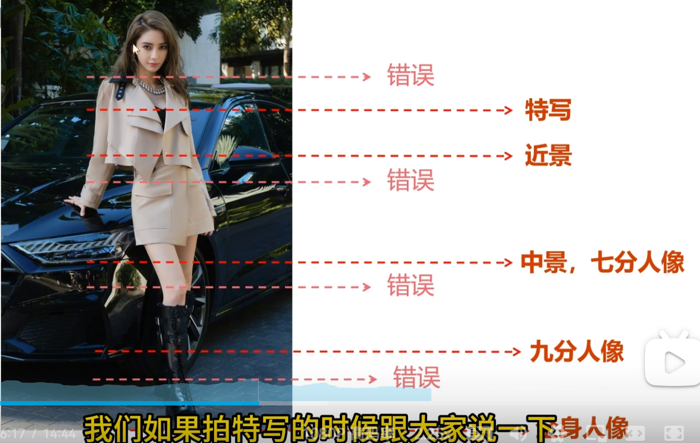
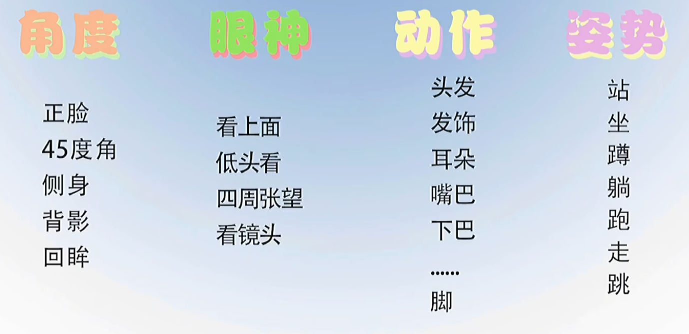

## 基础

三条**基本原则**：

1. 要有鲜明的主题，传递普遍性的寓意——如何传递主题？
2. 有一个吸引注意力的主体——如何突出主体？
   + 通过布局：三分线、虚化等
   + 通过大小：大或小
   + 通过搭画框的方式
   + 通过光突出主体
   + 通过动作
3. 必须画面简洁

M档：

光圈+闪光灯=主体

快门：环境

ISO：画面整体（主体+环境）

人像**光位**

顺光（平光）：利用光影提高层次

前侧光：光线和拍摄方向呈锐角，亮暗不能太大

正测光：光线和拍摄方向呈直角

逆光：光比不能太大，否则人脸欠曝

顶光、底光

与人物交谈，发现其**兴趣**。人在展现兴趣时轻松且自然

**姿势**：首要是放松

+ 姿势是辅助，主要是表现人物情绪
+ 通过倚靠卸掉重心以放松身体
+ 先正面确认表情再转头瞬间拍摄
+ 通过肢体展现出**空间感**：插兜、斜抬起一只脚、仰头歪头、手心空一点撑脸

人像机位：

高度-平视机位、高机位、低机位 

角度-正面、侧面、背面

距离（景别）—取景范围—**远全中近特**

## 人像拍摄引导

1. 不要给动作（跑过来挡镜头）太多的复杂附加条件，会限制发挥。
2. 模特紧张时可能会不知道把手怎么放置，因此需要引导和使用**道具**。
3. 道具不是摆拍的道具，需要发挥其功用。
4. 如果没有道具，身体就是道具。用手摸身体上可以摸的地方。
5. 模特一直放不开，可以尝试休息或者互动，在其中寻找契机。

**言语：**

1. 夸！
2. 多使用形容词，比如惊讶，开心，偷感等
3. 看重过程而不是结果，务必强调动作过程而非固定姿势。不需要假装做动作，而是真实地去做这件事。

**公式：**

## 《街头摄影手册》

**定义：**

>街头摄影也可称为“迷路摄影”——街头摄影师必须迷路。
>
>许多人视街头摄影为心灵升华过程，因为这是一种极私密的体验，或许可称之为“摄影的顿悟”。街头摄影帮助我了解我身处的社会，以及我在其中的位置；我更像是为自己而拍，而不是为广大观众而拍。
>
>街头摄影的核心价值在于绝未经过事先安排。

**观点：**

> 若你对路人的反应感到焦虑，就不适合当摄影师。
>
> 摄影集能为你提供方向和灵感。
>
> 一般来说，街头摄影的首要任务是找出令人愉悦的**秩序**。
>
> 活动是街头摄影的沃土，但应该**避免直接记录活动**，去追求自己的作品，而不是为别人记录这场活动。
>
> 街头摄影的特质是无需对任何人负责。

**拍摄计划：**

1. **连续镜头**：有时，**展示**多张照片比一张好，因为可以显示接下来发生什么事。意料之外的事或许可以成为精彩的故事。
2. **等待与跟踪**：背景是一个出发点，选择一个有趣的背景，接下来就是等待。
   + 将有趣的背景记下来，有时可以回来再拍。
   + 不要显露你的意图。
   + 与等待相反，跟踪则是确定了主体，需要找到合适的背景板。
3. 模糊：可以是主体模糊，也可以是背景模糊，但主体必须醒目突出。
4. 隔层：透过玻璃或其他材质拍摄，能增添一种自然的艺术层次。
5. 阴影、倒影与对影：拍摄较为少见的反射表面、雨水、镜子等。水面或反光墙面的对称感。
6. 空荡：要特别去拍夜里的空荡感和白天阴影中的光，做构图实验：将人或物摆在空旷画面的角落。
7. 物体：街头的物体也有人的个性。
   1. 想想哪些物体具有功能性，却被视而不见。
   2. 拍摄被遗弃的物品，作为人类存在的迹象。
8. 拍摄计划：对于摄影而言，拍摄计划是他们每天必须带出去遛的狗——你需要一个动机或借口出去走走。
   + 计划是否完成不要紧，仍有机会拍到更多不错的照片。
   + 有的点子不要因为别人用过就放弃，自己的肯定不同。
   + 看看别人的拍摄计划或有主题设定的比赛。

同感：

>拍完这组照片后，我有一种肾上腺素上升的快感，而那种感觉、那种笃定，这辈子可能只发生过三四次。

感触：

> 街头摄影本身就是对“世界性故事”的一种探寻，摄影师找寻隐藏的偶发事件并记录，将其作为自己的收获。

## Lightroom

基本参数：

**高光**更适用于降低过曝白，白色色阶更适用于增强白色。因此要增强白色细节和通透可以加白色色阶，降高光。

如果需要降低暗部的时候，**黑色**比**阴影**有更大的范围。

如果需要提亮暗部的时候，阴影比黑色有更大的范围。提阴影降黑色

**鲜艳度**优先增加饱和度低的颜色，**饱和度**则是整体拉升，所以一般增鲜艳，降饱和

色调曲线：

1. 分清需要调整的是亮部（右上）还是暗部（左下）
2. 根据需要调整的颜色去拉曲线
3. 总体拉了过后，需要对局部不需要太高的部分降低
