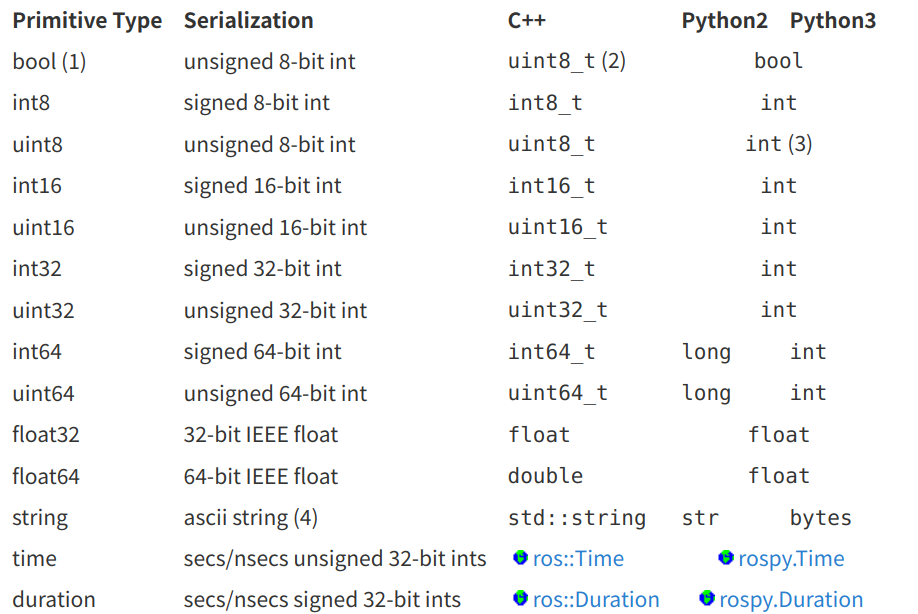
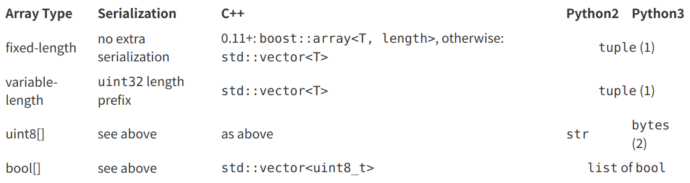
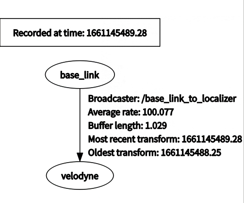

教程
1. https://www.ncnynl.com/category/autoware/2/
2. http://wiki.ros.org/cn/ROS/Tutorials

# ROS安装和配置

## 安装Trick

1. 手册中的链接直接复制会少一个-，导致网址错误
2. 依赖冲突使用aptitude解决
3. 安装后需要配置ros的环境变量

autoware:

1. 对cv的引用错误：cmakelists没写好，主要是没添加library

2. 编译指令：AUTOWARE_COMPILE_WITH_CUDA=1 colcon build --cmake-args -DCMAKE_BUILD_TYPE=Release

   > 只有加上AUTOWARE_COMPILE_WITH_CUDA才有显卡支持

## 创建ROS工作空间

```bash
 mkdir -p ~/catkin_ws/src
 cd ~/catkin_ws/
 catkin_make
 //更新变量
 source devel/setup.bash
 //确定ROS_PACKAGE_PATH环境变量包含你当前的工作空间目录：
echo $ROS_PACKAGE_PATH
```

# ROS文件系统

## 相关命令
rospack允许你获取软件包的有关信息。

+ rospack find [package_name]  返回软件包的所在路径 例如：rospack find roscpp
+ roscd [package_name]   跳转到软件包的所在路径，也可以跳转到子路径
+ rosls roscpp_tutorials   列出某包内当前目录的文件
+ roscd log   进入存储ROS日志文件的目录
+ rosed [package_name] [filename]  编辑某个文件

# ROS软件包

一个ROS软件包应该有1. 自己的目录  2. package.xml文件  3. catkin版本的CMakeLists.txt文件

## 创建catkin软件包
1. 创建命令： catkin_create_pkg <package_name> [depend1] [depend2] [依赖3]

```bash
//切换到工作空间的src目录
cd ~/catkin_ws/src
catkin_create_pkg beginner_tutorials std_msgs rospy roscpp
```

## 构建一个catkin工作区并生效配置文件
+ catkin_make相当于
```
# 在CMake工作空间下
$ mkdir build
$ cd build
$ cmake ..
$ make
$ make install  # （可选）
```

```bash
cd ~/catkin_ws
catkin_make
//将这个工作空间添加到ROS环境中，source一下生成的配置文件
. ~/catkin_ws/devel/setup.bash
```

## 软件包依赖关系

1. 查看直接依赖  rospack depends1 beginner_tutorials
2. 递归查看依赖（可以找到依赖包的依赖）  rospack depends beginner_tutorials

## 自定义软件包

### 自定义package.xml
```xml
1. 描述标签：<description>The beginner_tutorials package</description>
2. 维护者标签：<maintainer email="you@yourdomain.tld">Your Name</maintainer>
3. 许可证标签： <license>BSD</license>
4. 依赖项标签： 依赖项分为build_depend、buildtool_depend、run_depend、test_depend
5. 编译和运行的依赖包：<run_depend>roscpp</run_depend>
```
完整示例：
```xml
<?xml version="1.0"?>
<package format="2">
  <name>beginner_tutorials</name>
  <version>0.1.0</version>
  <description>The beginner_tutorials package</description>

  <maintainer email="you@yourdomain.tld">Your Name</maintainer>
  <license>BSD</license>
  <url type="website">http://wiki.ros.org/beginner_tutorials</url>
  <author email="you@yourdomain.tld">Jane Doe</author>

  <buildtool_depend>catkin</buildtool_depend>
  <!--   以下三种depend的合集shortcut：<depend>roscpp</depend> -->
  <build_depend>roscpp</build_depend>
  <build_depend>rospy</build_depend>
  <build_depend>std_msgs</build_depend>
  <build_export_depend>roscpp</build_export_depend>
  <build_export_depend>rospy</build_export_depend>
  <build_export_depend>std_msgs</build_export_depend>
  <exec_depend>roscpp</exec_depend>
  <exec_depend>rospy</exec_depend>
  <exec_depend>std_msgs</exec_depend>

</package>
```

## 安装package所需依赖项

ROS packages有时会需要操作系统提供一些外部函数库，这些函数库就是所谓的“系统依赖项”。在一些情况下，这些依赖项并没有被系统默认安装，因此，ROS提供了一个工具`rosdep`来下载并安装所需系统依赖项。

```
rosdep install turtlesim
```

# 节点，话题，服务与动作

计算图（Computation Graph）是一个由ROS进程组成的点对点网络，它们能够共同处理数据。ROS的基本计算图概念有节点（Nodes）、主节点（Master）、参数服务器（Parameter Server）、消息（Messages）、服务（Services）、话题（Topics）和袋（Bags），它们都以不同的方式向图（Graph）提供数据。

+ 节点（Nodes）：节点是一个可执行文件，它可以通过ROS来与其他节点进行通信。

+ 消息（Messages）：订阅或发布话题时所使用的ROS数据类型。

+ 话题（Topics）：节点可以将消息发布到话题，或通过订阅话题来接收消息。

+ 主节点（Master）：ROS的命名服务，例如帮助节点发现彼此。

+ rosout：在ROS中相当于stdout/stderr（标准输出/标准错误）。

+ roscore：主节点 + rosout + 参数服务器（会在以后介绍）。

## 节点命令：rosnode,rosrun
1. 查看所有活跃节点 rosnode list
2. 结束节点  rosnode kill
3. 运行节点   rosrun [package_name] [node_name]  例：rosrun turtlesim turtlesim_node
4. 运行节点并指定节点名：最后加上__name:=my_turtle
5. 查看节点间的关系：rosrun rqt_graph rqt_graph或直接使用rqt或rqt_graph

## 话题： rostopic


### 常用命令
1. 显示在某个话题上发布的数据：rostopic echo [topic]
2. 列出当前已被订阅和发布的所有话题：rostopic list
3. 把数据发布到当前某个正在广播的话题上：rostopic pub [topic] [msg_type] [args]  例如：
> rostopic pub -1 /turtle1/cmd_vel geometry_msgs/Twist -- '[2.0, 0.0, 0.0]' '[0.0, 0.0, 1.8]'
+ -1表示rostopic只发布一条消息，然后退出
+ /turtle1/cmd_vel指定话题名，geometry_msgs/Twist指定话题的消息类型
+ 两个破折号用来告诉选项解析器，表明之后的参数都不是选项
4. 报告数据发布的速率：rostopic hz [topic]

### 消息
话题的通信是通过节点间发送ROS消息实现的。为了使发布者（turtle_teleop_key）和订阅者（turtulesim_node）进行通信，发布者和订阅者必须发送和接收相同类型的消息。这意味着话题的类型是由发布在它上面消息的类型决定的。
1. 查看所发布话题的消息类型：rostopic type [topic]
2. 用动态图表查看消息数据：rosrun rqt_plot rqt_plot

## 服务
服务（Services）是节点之间通讯的另一种方式。服务允许节点发送一个请求（request）并获得一个响应（response）。

### 常用命令  rosservice
+ rosservice list         输出活跃服务的信息
+ rosservice call [service] [args]         用给定的参数调用服务

+ rosservice find         按服务的类型查找服务
+ rosservice uri          输出服务的ROSRPC uri
+ rosservice type         输出服务的类型
+ rosservice type /spawn | rossrv show  输出服务的参数

### rosparam服务器
rosparam能让我们在ROS参数服务器（Parameter Server）上存储和操作数据。
+ rosparam set [param_name]   设置参数
> 设置之后使用rosservice call /clear生效
+ rosparam get [param_name]   获取参数
+ rosparam load           从文件中加载参数
+ rosparam dump [file_name] [namespace]           向文件中存储参数
+ rosparam delete         删除参数
+ rosparam list           列出参数名

## 调试：rqt_console和rqt_logger_level

+ rqt_console显示logger产生的日志信息

> rosrun rqt_console rqt_console

> rosrun rqt_logger_level rqt_logger_level

## 启用文件中的节点：roslaunch
>roslaunch [package] [filename.launch]

```xml
<launch>
    //创建两个命名不同的节点
  <group ns="turtlesim1">
    <node pkg="turtlesim" name="sim" type="turtlesim_node"/>
  </group>

  <group ns="turtlesim2">
    <node pkg="turtlesim" name="sim" type="turtlesim_node"/>
  </group>
    // 启动模仿节点，话题的输入和输出分别重命名为turtlesim1和turtlesim2，这样就可以让turtlesim2模仿turtlesim1了。
  <node pkg="turtlesim" name="mimic" type="mimic">
    <remap from="input" to="turtlesim1/turtle1"/>
    <remap from="output" to="turtlesim2/turtle1"/>
  </node>

</launch>
```

+ msg（消息）：msg文件就是文本文件，用于描述ROS消息的字段。它们用于为不同编程语言编写的消息生成源代码。
+ srv（服务）：一个srv文件描述一个服务。它由两部分组成：请求（request）和响应（response）。
+ msg文件存放在软件包的msg目录下，srv文件则存放在srv目录下。

## 消息msg

### 消息定义

1. 包括类型和变量名

```
int32 x
int32 y
```

2. 内置类型和对应关系





3. ROS中还有一个特殊的数据类型：Header，它含有时间戳和ROS中广泛使用的坐标帧信息。

```msg
    Header header
```

Header不是内置类型，被定义在`std_msgs/msg/Header.msg`：

```
#Standard metadata for higher-level flow data types
#sequence ID: consecutively increasing ID
uint32 seq
#Two-integer timestamp that is expressed as:
# * stamp.secs: seconds (stamp_secs) since epoch
# * stamp.nsecs: nanoseconds since stamp_secs
# time-handling sugar is provided by the client library
time stamp
#Frame this data is associated with
string frame_id
```

4. 常量

​	常量在定义时还会指定一个值：

```
int32 X=123
int32 Y=-123
string FOO=foo
string EXAMPLE="#comments" are ignored, and leading and trailing whitespace removed
```


### 创建msg

1. mkdir srv
2. echo "int64 num" > msg/Num.msg
1. 确保msg文件能被转换为C++、Python和其他语言的源代码:
```
  <build_depend>message_generation</build_depend>
  <exec_depend>message_runtime</exec_depend>
```
2. 在CMakeLists.txt文件中，为已经存在里面的find_package调用添加message_generation依赖项，这样就能生成消息了。直接将message_generation添加到COMPONENTS列表中即可
3. 还要确保导出消息的运行时依赖关系：
```
catkin_package(
  ...
  CATKIN_DEPENDS message_runtime ...
  ...)
```
4. 加入消息文件
  ```
  add_message_files(
  FILES
  Num.msg
)
  ```
5. 确保generate_messages()函数被调用
```
generate_messages(
  DEPENDENCIES
  std_msgs
)
```
6. catkin_make

### 使用rosmsg查看消息

## 服务srv
```
int64 A
int64 B
---
int64 Sum
```

### 创建srv
1. mkdir srv
2. 复制一个服务：roscp rospy_tutorials AddTwoInts.srv srv/AddTwoInts.srv
3. 上述创建消息的第三，四步
4. 添加服务文件
```
add_service_files(
  FILES
  AddTwoInts.srv
)
```
5. catkin_make

### 使用rossrv查看
1. rossrv show beginner_tutorials/AddTwoInts

# 编写简单的发布者和订阅者

## 编写发布者节点
1. 
```bash
mkdir scripts
cd scripts
wget https://raw.github.com/ros/ros_tutorials/noetic-devel/rospy_tutorials/001_talker_listener/talker.py
chmod +x talker.py
```
2. 将以下内容添加到CMakeLists.txt文件。这样可以确保正确安装Python脚本，并使用合适的Python解释器。**一定要放在最下面，不然路径找不到**

```bash
catkin_install_python(PROGRAMS scripts/talker.py
  DESTINATION ${CATKIN_PACKAGE_BIN_DESTINATION}
)
```

	3. CPP方式：创建talker.cpp

```c++
#include "ros/ros.h"
#include "std_msgs/String.h"

#include <sstream>

/**
 * This tutorial demonstrates simple sending of messages over the ROS system.
 */
int main(int argc, char **argv)
{
  /**
   * The ros::init() function needs to see argc and argv so that it can perform
   * any ROS arguments and name remapping that were provided at the command line.
   * For programmatic remappings you can use a different version of init() which takes
   * remappings directly, but for most command-line programs, passing argc and argv is
   * the easiest way to do it.  The third argument to init() is the name of the node.
   *
   * You must call one of the versions of ros::init() before using any other
   * part of the ROS system.
   */
    // 声明节点节点,argc和argv保证了在命令行中可进行话题重映射
  ros::init(argc, argv, "talker");

  /**
   * NodeHandle is the main access point to communications with the ROS system.
   * The first NodeHandle constructed will fully initialize this node, and the last
   * NodeHandle destructed will close down the node.
   */
    // 为这个进程的节点创建句柄。创建的第一个NodeHandle实际上将执行节点的初始化，而最后一个被销毁的NodeHandle将清除节点所使用的任何资源。
  ros::NodeHandle n;

  /**
   * The advertise() function is how you tell ROS that you want to
   * publish on a given topic name. This invokes a call to the ROS
   * master node, which keeps a registry of who is publishing and who
   * is subscribing. After this advertise() call is made, the master
   * node will notify anyone who is trying to subscribe to this topic name,
   * and they will in turn negotiate a peer-to-peer connection with this
   * node.  advertise() returns a Publisher object which allows you to
   * publish messages on that topic through a call to publish().  Once
   * all copies of the returned Publisher object are destroyed, the topic
   * will be automatically unadvertised.
   *
   * The second parameter to advertise() is the size of the message queue
   * used for publishing messages.  If messages are published more quickly
   * than we can send them, the number here specifies how many messages to
   * buffer up before throwing some away.
   */
    // 告诉主节点我们将要在chatter话题上发布一个类型为std_msgs/String的消息。这会让主节点告诉任何正在监听chatter的节点，我们将在这一话题上发布数据。第二个参数是发布队列的大小。在本例中，如果我们发布得太快，它将最多缓存1000条消息，不然就会丢弃旧消息。
    // 第三个参数是latch，当为true的时候会将最后一条发布的信息传输给新的订阅者
  ros::Publisher chatter_pub = n.advertise<std_msgs::String>("chatter", 1000, true);
	// ros::Rate对象能让你指定循环的频率。它会记录从上次调用Rate::sleep()到现在已经有多长时间，并休眠正确的时间。在本例中，我们告诉它希望以10Hz运行。
  ros::Rate loop_rate(10);
  /**
   * A count of how many messages we have sent. This is used to create
   * a unique string for each message.
   */
  int count = 0;
    // ros::ok()会在ctrl+c或节点销毁时返回false
  while (ros::ok())
  {
    /**
     * This is a message object. You stuff it with data, and then publish it.
     */
    std_msgs::String msg;

    std::stringstream ss;
    ss << "hello world " << count;
    msg.data = ss.str();
	// ROS_INFO和它的朋友们可用来取代printf/cout。
    ROS_INFO("%s", msg.data.c_str());

    /**
     * The publish() function is how you send messages. The parameter
     * is the message object. The type of this object must agree with the type
     * given as a template parameter to the advertise<>() call, as was done
     * in the constructor above.
     */
    chatter_pub.publish(msg);
	// 执行回调函数
    ros::spinOnce();

    loop_rate.sleep();
    ++count;
  }


  return 0;
}
```


3. Python


```python
#!/usr/bin/env python
# 第一行确保脚本作为Python脚本执行。
import rospy
from std_msgs.msg import String

def talker():
    # 声明该节点正在使用String消息类型发布到chatter话题
    # 更复杂的类型：一般的经验法则是构造函数参数的顺序与.msg文件中的顺序相同
    pub = rospy.Publisher('chatter', String, queue_size=10)
    
    # 初始化节点，名称为talker
    # anonymous = True会让名称末尾添加随机数，来确保节点具有唯一的名称。
    rospy.init_node('talker', anonymous=True)
    # 每秒循环十次
    rate = rospy.Rate(10) # 10hz
    while not rospy.is_shutdown(): # 检查程序是否退出
        hello_str = "hello world %s" % rospy.get_time()
        rospy.loginfo(hello_str)
        pub.publish(hello_str)
        # 调用了rate.sleep()，它在循环中可以用刚刚好的睡眠时间维持期望的速率。
        rate.sleep()

if __name__ == '__main__':
    try:
        talker()
    except rospy.ROSInterruptException:
        pass
```

## 编写订阅者节点
1. 
```bash
mkdir scripts
cd scripts
wget https://raw.github.com/ros/ros_tutorials/noetic-devel/rospy_tutorials/001_talker_listener/listener.py
chmod +x talker.py
```
2. 将以下内容添加到CMakeLists.txt文件。这样可以确保正确安装Python脚本，并使用合适的Python解释器。**一定要放在最下面，不然路径找不到**

```bash
catkin_install_python(PROGRAMS scripts/talker.py scripts/listener.py
  DESTINATION ${CATKIN_PACKAGE_BIN_DESTINATION}
)
```


 	3.  CPP：listener.cpp

```c++
#include "ros/ros.h"
#include "std_msgs/String.h"

// 这是一个回调函数，当有新消息到达chatter话题时它就会被调用。该消息是用boost shared_ptr智能指针传递的，这意味着你可以根据需要存储它，即不用担心它在下面被删除，又不必复制底层（underlying）数据。
void chatterCallback(const std_msgs::String::ConstPtr& msg)
{
  ROS_INFO("I heard: [%s]", msg->data.c_str());
}

int main(int argc, char **argv)
{
  /**
   * The ros::init() function needs to see argc and argv so that it can perform
   * any ROS arguments and name remapping that were provided at the command line.
   * For programmatic remappings you can use a different version of init() which takes
   * remappings directly, but for most command-line programs, passing argc and argv is
   * the easiest way to do it.  The third argument to init() is the name of the node.
   *
   * You must call one of the versions of ros::init() before using any other
   * part of the ROS system.
   */
  ros::init(argc, argv, "listener");

  /**
   * NodeHandle is the main access point to communications with the ROS system.
   * The first NodeHandle constructed will fully initialize this node, and the last
   * NodeHandle destructed will close down the node.
   */
  ros::NodeHandle n;

  /**
   * The subscribe() call is how you tell ROS that you want to receive messages
   * on a given topic.  This invokes a call to the ROS
   * master node, which keeps a registry of who is publishing and who
   * is subscribing.  Messages are passed to a callback function, here
   * called chatterCallback.  subscribe() returns a Subscriber object that you
   * must hold on to until you want to unsubscribe.  When all copies of the Subscriber
   * object go out of scope, this callback will automatically be unsubscribed from
   * this topic.
   *
   * The second parameter to the subscribe() function is the size of the message
   * queue.  If messages are arriving faster than they are being processed, this
   * is the number of messages that will be buffered up before beginning to throw
   * away the oldest ones.
   */
  // 通过主节点订阅chatter话题。每当有新消息到达时，ROS将调用chatterCallback()函数。第二个参数是队列大小，以防我们处理消息的速度不够快。在本例中，如果队列达到1000条，再有新消息到达时旧消息会被丢弃。
  ros::Subscriber sub = n.subscribe("chatter", 1000, chatterCallback);

  /**
   * ros::spin() will enter a loop, pumping callbacks.  With this version, all
   * callbacks will be called from within this thread (the main one).  ros::spin()
   * will exit when Ctrl-C is pressed, or the node is shutdown by the master.
   */
  // ros::spin()启动了一个自循环，它会尽可能快地调用消息回调函数。不过不要担心，如果没有什么事情，它就不会占用太多CPU。另外，一旦ros::ok()返回false，ros::spin()就会退出，这意味着ros::shutdown()被调用了，主节点让我们关闭（或是因为按下Ctrl+C，它被手动调用）。
  // 和ros::spinOnce()不同的是，他是一个死循环（接收到消息并调用回调函数），除非关闭。而spinOnce只会循环一次。
  ros::spin();

  return 0;
}
```

添加到`CMakeLists.txt`文件的底部：

```
add_executable(talker src/talker.cpp)
target_link_libraries(talker ${catkin_LIBRARIES})
add_executable(listener src/listener.cpp)
target_link_libraries(listener ${catkin_LIBRARIES})
```


	1.  Python


```python
#!/usr/bin/env python
import rospy
from std_msgs.msg import String

# 收到数据的回调函数
def callback(data):
    rospy.loginfo(rospy.get_caller_id() + "I heard %s", data.data)
    
def listener():

    # In ROS, nodes are uniquely named. If two nodes with the same
    # name are launched, the previous one is kicked off. The
    # anonymous=True flag means that rospy will choose a unique
    # name for our 'listener' node so that multiple listeners can
    # run simultaneously.
    rospy.init_node('listener', anonymous=True)

    rospy.Subscriber("chatter", String, callback)

    # rospy.spin()不让你的节点退出，直到节点被明确关闭。
    rospy.spin()

if __name__ == '__main__':
    listener()
```

## 运行发布者和订阅者
```
roscore
cd ~/catkin_ws
source ./devel/setup.bash
rosrun beginner_tutorials talker.py
rosrun beginner_tutorials listener.py
```

# 编写服务和客户端

## 服务端
1. 创建scripts/add_two_ints_server.py文件

```python 
from __future__ import print_function

from beginner_tutorials.srv import AddTwoInts,AddTwoIntsResponse
import rospy

def handle_add_two_ints(req):
    print("Returning [%s + %s = %s]"%(req.a, req.b, (req.a + req.b)))
    return AddTwoIntsResponse(req.a + req.b)

def add_two_ints_server():
    rospy.init_node('add_two_ints_server')
    # 声明了一个名为add_two_ints的新服务，其服务类型为AddTwoInts。
    # 请求回调函数为handle_add_two_ints
    s = rospy.Service('add_two_ints', AddTwoInts, handle_add_two_ints)
    print("Ready to add two ints.")
    rospy.spin()

if __name__ == "__main__":
    add_two_ints_server()
```
2. CPP文件：src/add_two_ints_server.cpp

   ```c++
   #include "ros/ros.h"
   #include "beginnner/AddTwoInts.h"
   // beginner_tutorials/AddTwoInts.h是从我们之前创建的srv文件中生成的头文件。
   
   bool add(beginnner::AddTwoInts::Request  &req,
            beginnner::AddTwoInts::Response &res)
     res.sum = req.a + req.b; //这里的返回信息已经给到了response里
     ROS_INFO("request: x=%ld, y=%ld", (long int)req.a, (long int)req.b);
     ROS_INFO("sending back response: [%ld]", (long int)res.sum);
     return true;
   }
   
   int main(int argc, char **argv)
   {
     // 创建节点
     ros::init(argc, argv, "add_two_ints_server");
     ros::NodeHandle n;
     // 创建服务
     ros::ServiceServer service = n.advertiseService("add_two_ints", add);
     ROS_INFO("Ready to add two ints.");
     ros::spin();
   
     return 0;
   }
   ```

   

3. 添加执行权限：chmod +x scripts/add_two_ints_server.py

4. 将以下内容添加到CMakeLists.txt文件。这样可以确保正确安装Python脚本，并使用合适的Python解释器。

```
catkin_install_python(PROGRAMS scripts/add_two_ints_server.py
  DESTINATION ${CATKIN_PACKAGE_BIN_DESTINATION}
)
```

## 客户端
1. 创建scripts/add_two_ints_client.py文件
```python
from __future__ import print_function
import sys
import rospy
from beginner_tutorials.srv import *
def add_two_ints_client(x, y):
    # 在add_two_ints服务可用之前一直阻塞。
    rospy.wait_for_service('add_two_ints')
    try:
        # 服务可用时创建处理函数，其类型为AddTwoInts
        add_two_ints = rospy.ServiceProxy('add_two_ints', AddTwoInts)
        resp1 = add_two_ints(x, y)
        return resp1.sum
    except rospy.ServiceException as e:
        print("Service call failed: %s"%e)
def usage():
    return "%s [x y]"%sys.argv[0]
if __name__ == "__main__":
    if len(sys.argv) == 3:
        x = int(sys.argv[1])
        y = int(sys.argv[2])
    else:
        print(usage())
        sys.exit(1)
    print("Requesting %s+%s"%(x, y))
    print("%s + %s = %s"%(x, y, add_two_ints_client(x, y)))
```
2. CPP文件: add_two_ints_client.cpp

```c++
#include "ros/ros.h"
#include "beginnner/AddTwoInts.h"
#include <cstdlib>

int main(int argc, char **argv)
{
  ros::init(argc, argv, "add_two_ints_client");
  if (argc != 3)
  {
    ROS_INFO("usage: add_two_ints_client X Y");
    return 1;
  }

  ros::NodeHandle n;
  // 创建客户端
  ros::ServiceClient client = n.serviceClient<beginnner::AddTwoInts>("add_two_ints");
  // 实例化一个自动生成的服务类，并为它的request成员赋值。一个服务类包括2个成员变量：request和response，以及2个类定义：Request和Response。
  beginnner::AddTwoInts srv;
  srv.request.a = atoll(argv[1]);
  srv.request.b = atoll(argv[2]);
  // 此处实际上调用了服务。由于服务调用被阻塞，它将在调用完成后返回。如果服务调用成功，call()将返回true，并且srv.response中的值将是有效的。如果调用不成功，则call()将返回false且srv.response的值将不可用。
  if (client.call(srv))
  {
    ROS_INFO("Sum: %ld", (long int)srv.response.sum);
  }
  else
  {
    ROS_ERROR("Failed to call service add_two_ints");
    return 1;
  }

  return 0;
}
```

添加依赖项：

```
add_executable(add_two_ints_server src/add_two_ints_server.cpp)
target_link_libraries(add_two_ints_server ${catkin_LIBRARIES})
add_executable(add_two_ints_client src/add_two_ints_client.cpp)
target_link_libraries(add_two_ints_client ${catkin_LIBRARIES})
```


2. 添加执行权限：chmod +x scripts/add_two_ints_server.py
3. 将以下内容添加到CMakeLists.txt文件。这样可以确保正确安装Python脚本，并使用合适的Python解释器。
```
catkin_install_python(PROGRAMS scripts/add_two_ints_server.py scripts/add_two_ints_client.py
  DESTINATION ${CATKIN_PACKAGE_BIN_DESTINATION}
)
```
4. 构建节点
```
# 在你的catkin工作空间中
$ cd ~/catkin_ws
$ catkin_make
```

## 运行
```
$ rosrun beginner_tutorials add_two_ints_server     # (C++)
$ rosrun beginner_tutorials add_two_ints_server.py  # (Python)

$ rosrun beginner_tutorials add_two_ints_client 1 3     # (C++)
$ rosrun beginner_tutorials add_two_ints_client.py 1 3  # (Python)
```

# ROSlaunch

参考：http://wiki.ros.org/roslaunch/XML

1. 运行launch文件：

```
roslaunch package_name file.launch
```

2. A roslaunch will automatically start roscore if it detects that it is not already running.

3. 替换变量，将第一个参数的值替换为第二个环境变量参数，第三个为默认参数，在未设置环境变量时生效

```
<param name="foo" value="$(optenv CONFIG_PATH /home/marvin/ros_workspace)" />
<param name="foo" value="$(optenv VARIABLE ros rocks)" />
```

4. `(find pkg)`指定相对于当前包的路径，例如$`(find rospy)/manifest.xml`
5. 变量可通过`<arg>`指定或者通过命令行指定，使用`$(arg foo)`来赋值

```
// 直接赋值
<arg name="foo" default="1" />
// 通过命令行赋值
<node name="add_two_ints_client" pkg="beginner_tutorials" type="add_two_ints_client" args="$(arg a) $(arg b)" />
roslaunch beginner_tutorials launch_file.launch a:=1 b:=5
```

6. `$(dirname)`返回当前launch文件的绝对路径

```
<include file="$(dirname)/other.launch" />
```

7. if和unless来指定是否使用某一标签

```
<group if="$(arg foo)">
  <!-- stuff that will only be evaluated if foo is true -->
</group>

<param name="foo" value="bar" unless="$(arg foo)" />  <!-- Tstuff that will only be evaluated if foo is false -->
```

## TAG

### node

控制节点的启动和关闭

```
<node name="listener1" pkg="rospy_tutorials" type="listener.py" args="--test" respawn="true" />
```

**参数：**

`pkg="mypackage"`

- Package of node.

`type="nodetype"`

- Node type. There must be a corresponding executable with the same name.必须是可执行文件！

`name="nodename"`

- Node name. NOTE: name cannot contain a namespace. Use the `ns` attribute instead.

`args="arg1 arg2 arg3"`*(optional)*

- Pass arguments to node.

`respawn="true"`*(optional, default: False)*

- Restart the node automatically if it quits.

`respawn_delay="30"` *(optional, default 0)* **New in ROS indigo**

- If `respawn` is `true`, wait `respawn_delay` seconds after the node failure is detected before attempting restart.

`required="true"`*(optional)*

- **ROS 0.10**: If node dies, kill entire roslaunch.

`ns="foo"`*(optional)*

- Start the node in the 'foo' namespace.

`clear_params="true|false"`*(optional)*

- Delete all parameters in the node's private namespace before launch.

`output="log|screen"`*(optional)*

- If 'screen', stdout/stderr from the node will be sent to the screen. If 'log', the stdout/stderr output will be sent to a log file in $ROS_HOME/log, and stderr will continue to be sent to screen. The default is 'log'.

`cwd="ROS_HOME|node"`*(optional)*

- If 'node', the working directory of the node will be set to the same directory as the node's executable. In C Turtle, the default is 'ROS_HOME'. In Box Turtle (ROS 1.0.x), the default is 'ros-root'. The use of 'ros-root' is deprecated in C Turtle.

`launch-prefix="prefix arguments"`*(optional)*

- Command/arguments to prepend to node's launch arguments. This is a powerful feature that enables you to enable `gdb`, `valgrind`, `xterm`, `nice`, or other handy tools. See [Roslaunch Nodes in Valgrind or GDB](http://wiki.ros.org/roslaunch/Tutorials/Roslaunch Nodes in Valgrind or GDB) for examples.

`if="true|false"`*(optional)*

- If 'true' the node will be launched as usual. If 'false' the node will not be launched. Can be used to evaluate arguments/parameters and run based on the outcome without modifying the launch file every time.

### include

`<include>` 将另一个roslaunch XML文件导入到当前文件中。

**Attributes**：

`file="$(find pkg-name)/path/filename.xml"`

- Name of file to include.

`ns="foo"` *(optional)*

- Import the file relative to the 'foo' namespace.

`clear_params="true|false"` *(optional Default: false)*

- Delete all parameters in the `<include>`'s namespace before launch. This feature is very dangerous and should be used with caution. `ns` must be specified. Default: `false`.

`pass_all_args="true|false"` *(optional Default: false)* *(New in Indigo and Jade as of `roslaunch` version 1.11.17)*

- If true, then all args set in the current context are added to the child context that is created for processing the included file. You can do this instead of explicitly listing each argument that you want to pass down.

### remap

将话题映射到指定的地方：

```xml
<remap from="/different_topic" to="/needed_topic"/>
```

### env

设置节点的环境变量，只能在 `<launch>, <include>, <node> or <machine> tag`中使用

**Attributes**：

`name="environment-variable-name"`

- Environment variable you are setting.

`value="environment-variable-value"`

- Value to set the environment variable to.

### param

```xml
<launch>
  <param name="somestring1" value="bar" />
  <!-- force to string instead of integer -->
  <param name="somestring2" value="10" type="str" />

  <param name="someinteger1" value="1" type="int" />
  <param name="someinteger2" value="2" />

  <param name="somefloat1" value="3.14159" type="double" />
  <param name="somefloat2" value="3.0" />

  <!-- you can set parameters in child namespaces -->
  <param name="wg/childparam" value="a child namespace parameter" />

  <!-- upload the contents of a file to the server -->
  <param name="configfile" textfile="$(find roslaunch)/example.xml" />
  <!-- upload the contents of a file as base64 binary to the server -->
  <param name="binaryfile" binfile="$(find roslaunch)/example.xml" />

</launch>
```

1. 定义参数服务器上的参数，可以指定`textfile`, `binfile` or `command` attribute作为参数的值。
2. 位于`<node>`内的`<param>`标签是私有参数

**Attributes：**

`name="namespace/name"`

- Parameter name. Namespaces can be included in the parameter name, but globally specified names should be avoided.

`value="value"`*(optional)*

- Defines the value of the parameter. If this attribute is omitted, `binfile`, `textfile` or `command` must be specified.

`type="str|int|double|bool|yaml"`*(optional)*

- Specifies the type of the parameter. If you don't specify the type, roslaunch will attempt to automatically determine the type. These rules are very basic:
  - numbers with '.'s are floating point, integers otherwise;
  - "true" and "false" are boolean (not case-sensitive).
  - all other values are strings

`textfile="$(find pkg-name)/path/file.txt"`*(optional)*

- The contents of the file will be read and stored as a string. The file must be locally accessible, though it is strongly recommended that you use the package-relative `$(find)/file.txt` syntax to specify the location.

`binfile="$(find pkg-name)/path/file"`*(optional)*

- The contents of the file will be read and stored as a base64-encoded XML-RPC binary object. The file must be locally accessible, though it is strongly recommended that you use the package-relative `$(find)/file.txt` syntax to specify the location.

`command="$(find pkg-name)/exe '$(find pkg-name)/arg.txt'"`*(optional)*

- The output of the command will be read and stored as a string. It is strongly recommended that you use the package-relative `$(find)/file.txt` syntax to specify file arguments. You should also quote file arguments using single quotes due to XML escaping requirements.

### rosparam

使用YAML文件从参数服务器移除，载入和导出参数：

```
<rosparam command="load" file="$(find rosparam)/example.yaml" />
<rosparam command="delete" param="my/param" />
```

替换参数值：

```
<rosparam param="a_list">[1, 2, 3, 4]</rosparam>
<rosparam>
  a: 1
  b: 2
</rosparam>
<rosparam param="whitelist" subst_value="True">$(arg whitelist)</rosparam>
```

**Attributes**:

`command="load|dump|delete"` *(optional, default=load)*

- [rosparam](http://wiki.ros.org/rosparam) command.

`file="$(find pkg-name)/path/foo.yaml"` *(`load` or `dump` commands)*

- Name of rosparam file.

`param="param-name"`

- Name of parameter.

`ns="namespace"` *(optional)*

- Scope the parameters to the specified namespace.

`subst_value=true|false` *(optional)*

- Allows use of [substitution args](http://wiki.ros.org/roslaunch/XML#substitution_args) in the YAML text.

### group

Apply settings to a group of nodes.

**Attributes**:

`ns="namespace"` *(optional)*

- Assign the group of nodes to the specified namespace. The namespace can be global or relative, though global namespaces are discouraged.

`clear_params="true|false"` *(optional)*

- Delete all parameters in the group's namespace before launch. This feature is very dangerous and should be used with caution. `ns` must be specified.


## 实例

```xml
<launch>
    <!-- a basic listener node -->
    <node name="listener-1" pkg="rospy_tutorials" type="listener"/>
    <!-- pass args to the listener node -->
    <node name="listener-2" pkg="rospy_tutorials" type="listener" args="-foo arg2"/>
    <!-- a respawn-able listener node -->
    <node name="listener-3" pkg="rospy_tutorials" type="listener" respawn="true"/>
    <!-- start listener node in the 'wg1' namespace -->
    <node ns="wg1" name="listener-wg1" pkg="rospy_tutorials" type="listener" respawn="true"/>
    <!-- start a group of nodes in the 'wg2' namespace -->
    <group ns="wg2">
        <!-- remap applies to all future statements in this scope. -->
        <remap from="chatter" to="hello"/>
        <node pkg="rospy_tutorials" type="listener" name="listener" args="--test" respawn="true"/>
        <node pkg="rospy_tutorials" type="talker" name="talker">
            <!-- set a private parameter for the node -->
            <param name="talker_1_param" value="a value"/>
            <!-- nodes can have their own remap args -->
            <remap from="chatter" to="hello-1"/>
            <!-- you can set environment variables for a node -->
            <env name="ENV_EXAMPLE" value="some value"/>
        </node>
    </group>
</launch>

```

# 记录和回放数据

1. 记录发布的所有数据
```bash
rosbag record -a
```
2. 记录指定的话题
```
//-O参数告诉rosbag record将数据记录到名为subset.bag的文件中
//topic参数告诉rosbag record只能订阅这两个指定的话题。
rosbag record -O subset /turtle1/cmd_vel /turtle1/pose
```
2. 包信息
```bash
rosbag info <your bagfile>
```
3. 回放数据
```
// -r表示播放速率
rosbag play -r 2 <your bagfile>
```
4. 从bag文件中读取消息
```
//订阅/obs1/gps/fix话题并复读该话题上发布的所有内容，同时用tee命令转储到一个yaml格式的文件中以便之后查看
rostopic echo /obs1/gps/fix | tee topic1.yaml
```


# ROS中的TF

## 基本定义

+ ROS中的TF(transform)是一个可以让用户随时记录多个坐标系的软件包
+ TF本质是树状的数据结构
+ ROS中机器人模型包含大量的部件，这些部件统称之为link,每一个link上面对应着一个frame, 即一个坐标系。link和frame概念是绑定在一起的
+ TF tree负责维护各个坐标系之间的关系

查看TF树：`rqt`

> 每一个圆圈代表一个frame,对应着机器人上的一个link，任意的两个frame之间都必须是联通的，如果出现某一环节的断裂，就会引发error。
>
> 为了使得两个frame之间能够正确连通，中间都会有一个Node来发布消息来broadcaster.如
> 果缺少Node来发布消息维护连通，那么这两个frame之间的连接就会断掉．broadcaster就是
> 一个publisher,如果两个frame之间发生了相对运动，broadcaster就会发布相关消息。



## tf tutorial

1. 安装依赖

```
declare ROS_DISTRO=melodic
sudo apt-get install ros-${ROS_DISTRO}-turtle-tf2 ros-${ROS_DISTRO}-tf2-tools ros-${ROS_DISTRO}-tf
```

2. 运行demo

```
roslaunch turtle_tf2 turtle_tf2_demo.launch
// 有可能出错，可能需要
// 1. 退出conda环境： conda deactivate
// 2. 切换Python2的优先级：
sudo update-alternatives --install /usr/bin/python python /usr/bin/python2 150
sudo update-alternatives --install /usr/bin/python python /usr/bin/python3 100
```

3. ***tf_echo可以打印出两个坐标系之间的相对变换***

```
rosrun tf tf_echo [reference_frame] [target_frame]
```

4. 可使用rviz中的TFTrajectory显示运动轨迹（需要将固定坐标系设置为世界坐标系）

## tf2 static broadcaster

两种使用方式：

1.  使用launch文件

```
<launch>
<node pkg="tf2_ros" type="static_transform_publisher" name="link1_broadcaster" args="1 0 0 0 0 0 1 link1_parent link1" />
</launch>
```

2. 使用命令

```
static_transform_publisher x y z yaw pitch roll frame_id child_frame_id
```

教程步骤：

```
catkin_create_pkg learning_tf2 tf2 tf2_ros roscpp rospy turtlesim
roscd learning_tf2
```

1. `vim src/static_turtle_tf2_broadcaster.cpp`

```cpp
#include <ros/ros.h>
#include <tf2_ros/static_transform_broadcaster.h>
#include <geometry_msgs/TransformStamped.h>
#include <cstdio>
#include <tf2/LinearMath/Quaternion.h>


std::string static_turtle_name;

int main(int argc, char **argv)
{
  ros::init(argc,argv, "my_static_tf2_broadcaster");
  if(argc != 8)
  {
    ROS_ERROR("Invalid number of parameters\nusage: static_turtle_tf2_broadcaster child_frame_name x y z roll pitch yaw");
    return -1;
  }
  if(strcmp(argv[1],"world")==0)
  {
    ROS_ERROR("Your static turtle name cannot be 'world'");
    return -1;

  }
  static_turtle_name = argv[1];
  // static_broadcaster是广播器，static_transformStamped是广播的消息
  static tf2_ros::StaticTransformBroadcaster static_broadcaster;
  geometry_msgs::TransformStamped static_transformStamped;

  static_transformStamped.header.stamp = ros::Time::now();
  static_transformStamped.header.frame_id = "world";
  static_transformStamped.child_frame_id = static_turtle_name;
  static_transformStamped.transform.translation.x = atof(argv[2]);
  static_transformStamped.transform.translation.y = atof(argv[3]);
  static_transformStamped.transform.translation.z = atof(argv[4]);
  tf2::Quaternion quat;
  quat.setRPY(atof(argv[5]), atof(argv[6]), atof(argv[7]));
  static_transformStamped.transform.rotation.x = quat.x();
  static_transformStamped.transform.rotation.y = quat.y();
  static_transformStamped.transform.rotation.z = quat.z();
  static_transformStamped.transform.rotation.w = quat.w();
  static_broadcaster.sendTransform(static_transformStamped);
  ROS_INFO("Spinning until killed publishing %s to world", static_turtle_name.c_str());
  ros::spin();
  return 0;
};
```

2. CMakeLists

```
add_executable(static_turtle_tf2_broadcaster src/static_turtle_tf2_broadcaster.cpp)
target_link_libraries(static_turtle_tf2_broadcaster  ${catkin_LIBRARIES} )
```

3. 结果

```
roscore
rosrun learning_tf2 static_turtle_tf2_broadcaster mystaticturtle 0 0 1 0 0 0
rostopic echo /tf_static
```

## tf2 broadcaster

1. ```
   catkin_create_pkg learning_tf2 tf2 tf2_ros roscpp rospy turtlesim
   roscd learning_tf2
   ```

2. `vim src/turtle_tf2_broadcaster.cpp`

```cpp
#include <ros/ros.h>
#include <tf2/LinearMath/Quaternion.h>
#include <tf2_ros/transform_broadcaster.h>
#include <geometry_msgs/TransformStamped.h>
#include <turtlesim/Pose.h>

std::string turtle_name;

void poseCallback(const turtlesim::PoseConstPtr& msg){
  static tf2_ros::TransformBroadcaster br;
  geometry_msgs::TransformStamped transformStamped;
  
  transformStamped.header.stamp = ros::Time::now();
  transformStamped.header.frame_id = "world";
  transformStamped.child_frame_id = turtle_name;
  transformStamped.transform.translation.x = msg->x;
  transformStamped.transform.translation.y = msg->y;
  transformStamped.transform.translation.z = 0.0;
  tf2::Quaternion q;
  q.setRPY(0, 0, msg->theta);
  transformStamped.transform.rotation.x = q.x();
  transformStamped.transform.rotation.y = q.y();
  transformStamped.transform.rotation.z = q.z();
  transformStamped.transform.rotation.w = q.w();

  br.sendTransform(transformStamped);
}

int main(int argc, char** argv){
  ros::init(argc, argv, "my_tf2_broadcaster");

  ros::NodeHandle private_node("~");
  if (! private_node.hasParam("turtle"))
  {
    if (argc != 2){ROS_ERROR("need turtle name as argument"); return -1;};
    turtle_name = argv[1];
  }
  else
  {
    private_node.getParam("turtle", turtle_name);
  }
    
  ros::NodeHandle node;
  // 接受到消息后，使用回调函数计算世界坐标系和该乌龟的变换关系
  ros::Subscriber sub = node.subscribe(turtle_name+"/pose", 10, &poseCallback);

  ros::spin();
  return 0;
};
```

3. `vim CMakeLists.txt`

```
add_executable(turtle_tf2_broadcaster src/turtle_tf2_broadcaster.cpp)
target_link_libraries(turtle_tf2_broadcaster
 ${catkin_LIBRARIES}
)
```

4. ```
   catkin_make
   ```

5. `vim start_demo.launch`

```xml
  <launch>
     <!-- Turtlesim Node-->
    <node pkg="turtlesim" type="turtlesim_node" name="sim"/>

    <node pkg="turtlesim" type="turtle_teleop_key" name="teleop" output="screen"/>
    <!-- Axes -->
    <param name="scale_linear" value="2" type="double"/>
    <param name="scale_angular" value="2" type="double"/>

    <node pkg="learning_tf2" type="turtle_tf2_broadcaster"
          args="/turtle1" name="turtle1_tf2_broadcaster" />
    <node pkg="learning_tf2" type="turtle_tf2_broadcaster"
          args="/turtle2" name="turtle2_tf2_broadcaster" />

  </launch>
```

`vim CMakeLists.txt`

```
## Mark other files for installation (e.g. launch and bag files, etc.)
install(FILES
 start_demo.launch
 # myfile2
 DESTINATION ${CATKIN_PACKAGE_SHARE_DESTINATION}
)
```

6. 运行文件并检查结果

```
roslaunch learning_tf2 start_demo.launch
rosrun tf tf_echo /world /turtle1
```

## tf2 listener

1. `vim src/turtle_tf2_listener.cpp`

```CPP
#include <ros/ros.h>
#include <tf2_ros/transform_listener.h>
#include <geometry_msgs/TransformStamped.h>
#include <geometry_msgs/Twist.h>
#include <turtlesim/Spawn.h>

int main(int argc, char** argv){
  ros::init(argc, argv, "my_tf2_listener");

  ros::NodeHandle node;

  ros::service::waitForService("spawn");
  ros::ServiceClient spawner =
    node.serviceClient<turtlesim::Spawn>("spawn");
  turtlesim::Spawn turtle;
  turtle.request.x = 4;
  turtle.request.y = 2;
  turtle.request.theta = 0;
  turtle.request.name = "turtle2";
  spawner.call(turtle);

  ros::Publisher turtle_vel =
    node.advertise<geometry_msgs::Twist>("turtle2/cmd_vel", 10);

  tf2_ros::Buffer tfBuffer;
  tf2_ros::TransformListener tfListener(tfBuffer);

  ros::Rate rate(10.0);
  while (node.ok()){
    geometry_msgs::TransformStamped transformStamped;
    try{
      transformStamped = tfBuffer.lookupTransform("turtle2", "turtle1", ros::Time(0));
    }
    catch (tf2::TransformException &ex) {
      ROS_WARN("%s",ex.what());
      ros::Duration(1.0).sleep();
      continue;
    }

    geometry_msgs::Twist vel_msg;

    vel_msg.angular.z = 4.0 * atan2(transformStamped.transform.translation.y,
                                    transformStamped.transform.translation.x);
    vel_msg.linear.x = 0.5 * sqrt(pow(transformStamped.transform.translation.x, 2) +
                                  pow(transformStamped.transform.translation.y, 2));
    turtle_vel.publish(vel_msg);

    rate.sleep();
  }
  return 0;
};
```

2. CMakeLists.txt

```
add_executable(turtle_tf2_listener src/turtle_tf2_listener.cpp)
target_link_libraries(turtle_tf2_listener
 ${catkin_LIBRARIES}
)
```

3. 加上

```
  <launch>
    ...
    <node pkg="learning_tf2" type="turtle_tf2_listener"
          name="listener" />
  </launch>
```

4. ```
   catkin_make
   roslaunch learning_tf2 start_demo.launch
   ```

   

# Rviz

## 使用基本的形状marker

1. 创建包

```
catkin_create_pkg using_markers roscpp visualization_msgs
```

2. src/basic_shapes.cpp

```
#include <ros/ros.h>
#include <visualization_msgs/Marker.h>

int main( int argc, char** argv )
{
  ros::init(argc, argv, "basic_shapes");
  ros::NodeHandle n;
  ros::Rate r(1);
  ros::Publisher marker_pub = n.advertise<visualization_msgs::Marker>("visualization_marker", 1);

  // 设置将要发布的形状
  uint32_t shape = visualization_msgs::Marker::CUBE;

  while (ros::ok())
  {
    visualization_msgs::Marker marker;
    // Set the frame ID and timestamp.  See the TF tutorials for information on these.
    marker.header.frame_id = "/my_frame";
    marker.header.stamp = ros::Time::now();

    // Set the namespace and id for this marker.  This serves to create a unique ID
    // Any marker sent with the same namespace and id will overwrite the old one
    marker.ns = "basic_shapes";
    marker.id = 0;

    // Set the marker type.  Initially this is CUBE, and cycles between that and SPHERE, ARROW, and CYLINDER
    marker.type = shape;

    // Set the marker action.  Options are ADD, DELETE, and new in ROS Indigo: 3 (DELETEALL)
    marker.action = visualization_msgs::Marker::ADD;

    // Set the pose of the marker.  This is a full 6DOF pose relative to the frame/time specified in the header
    marker.pose.position.x = 0;
    marker.pose.position.y = 0;
    marker.pose.position.z = 0;
    marker.pose.orientation.x = 0.0;
    marker.pose.orientation.y = 0.0;
    marker.pose.orientation.z = 0.0;
    marker.pose.orientation.w = 1.0;

    // Set the scale of the marker -- 1x1x1 here means 1m on a side
    marker.scale.x = 1.0;
    marker.scale.y = 1.0;
    marker.scale.z = 1.0;

    // Set the color -- be sure to set alpha to something non-zero!
    marker.color.r = 0.0f;
    marker.color.g = 1.0f;
    marker.color.b = 0.0f;
    marker.color.a = 1.0;
    // 生命周期永久，不会自动删除
    marker.lifetime = ros::Duration();

    // Publish the marker
    while (marker_pub.getNumSubscribers() < 1)
    {
      if (!ros::ok())
      {
        return 0;
      }
      ROS_WARN_ONCE("Please create a subscriber to the marker");
      sleep(1);
    }
    marker_pub.publish(marker);

    // Cycle between different shapes
    switch (shape)
    {
    case visualization_msgs::Marker::CUBE:
      shape = visualization_msgs::Marker::SPHERE;
      break;
    case visualization_msgs::Marker::SPHERE:
      shape = visualization_msgs::Marker::ARROW;
      break;
    case visualization_msgs::Marker::ARROW:
      shape = visualization_msgs::Marker::CYLINDER;
      break;
    case visualization_msgs::Marker::CYLINDER:
      shape = visualization_msgs::Marker::CUBE;
      break;
    }
    // 调整休眠时间，考虑循环中其他任务占用的时间，确保让整个循环的频率是 10hz 
    r.sleep();
  }
}
```

3. 加入依赖

```
add_executable(basic_shapes src/basic_shapes.cpp)
target_link_libraries(basic_shapes ${catkin_LIBRARIES})
```


