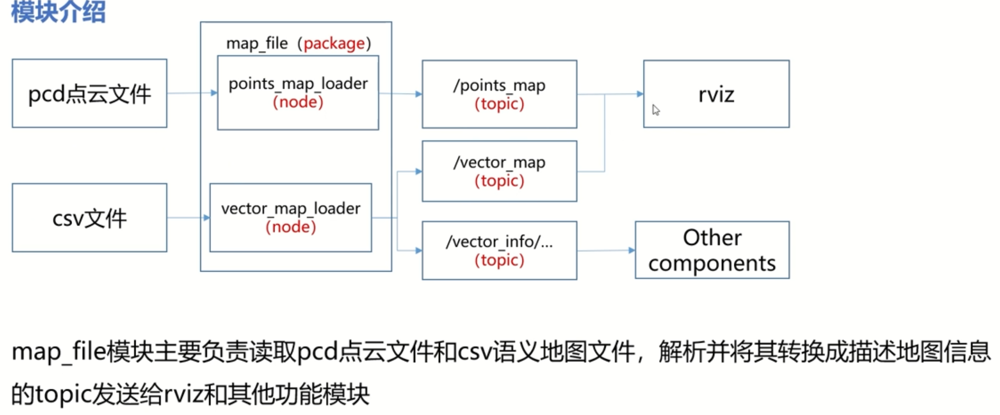

# autoware

## trick

### launch文件的错误输出

将output改为screen即可输出到命令行中

```
<node pkg="lidar_localizer" type="ndt_matching" name="ndt_matching" output="screen">
```

## 环境配置

> 参考autoware.test.2的md

编译整个项目：`AUTOWARE_COMPILE_WITH_CUDA=1 colcon build --cmake-args -DCMAKE_BUILD_TYPE=Release`

编译单个package：`AUTOWARE_COMPILE_WITH_CUDA=1 colcon build --cmake-args -DCMAKE_BUILD_TYPE=Release --package-select way_planner`

```
colcon build --cmake-args -DCMAKE_BUILD_TYPE=Release --package-select lidar_localizer
```

命令行暂停：`ctrl + s`暂停，输入`ctrl + q`继续

删除lanelet相关包：

```
B
```


## map_file




```bash
cd autoware.test.2/
source install/setup.bash
roslaunch autoware_quickstart_examples new_map.launch 
```

## ndt_mapping

>src/autoware/core_perception/lidar_localizer/nodes/ndt_mapping/ndt_mapping.cpp

输入：/points_raw

输出：/ndt_map

**将imu和里程计的推测位置作为初始位置进行ndt计算**

启动建图模块：

```
roslaunch autoware_quickstart_examples my_mapping.launch
rviz
```

播放数据包：小车的frame是/rslidar

```
rosbag play ./bag/20220815test3.bag /rslidar_points:=/points_raw
```

在点云包快结束时使用：

```
rosbag record -O map.bag /ndt_map
```

将bag包转换为pcd文件：

```
rosrun pcl_ros bag_to_pcd map.bag /bdt_map xxx.pcd
```


## 定位

### ndt_matching

使用建好的图和`/filtered_points`话题的点云进行匹配

初始值是`/initialpose`，使用gnss设置或者手动设置

### gnss_localize


### 实践

```bash
roslaunch autoware_quickstart_examples my_map.launch
roslaunch autoware_quickstart_examples my_localization.launch
rviz
rosbag play sample_moriyama_150324.bag
```

使用rviz上面版的2D Pose Estimate可以给小车一个模拟位姿，有GNSS可以纠正回来

ndt_matching.launch文件中的下面代码可以设置GNSS的介入阈值，越大则越不会介入

```
<arg name="gnss_reinit_fitness" default="500.0" />
```


## gazebo

### 主要launch文件

> /home/xu/autoware.test.2/src/autoware/simulation/vehicle_gazebo_simulation_launcher/launch/world_test.launch

```xml
<?xml version="1.0" encoding="UTF-8"?>
<launch>
  <!-- 加载车辆模型 -->
  <arg name="model" default="$(find vehicle_model)/urdf/2lidars_vehicle.xacro"/>
  <arg name="ns" default="/autoware_gazebo"/>
  <arg name="gpu" default="false"/>
  <param name="robot_description" command="$(find xacro)/xacro.py --inorder $(arg model) gpu:=$(arg gpu)" />

  <include file="$(find gazebo_ros)/launch/empty_world.launch">
    <!-- 加载世界模型 -->
    <arg name="world_name" default="$(find gazebo_world_description)/worlds/actor_collisions.world"/> 
    <arg name="paused" value="false"/>
    <arg name="use_sim_time" value="true"/>
    <arg name="gui" value="true"/>
    <arg name="headless" value="false"/>
    <arg name="debug" value="false"/>
  </include>
<!-- 解析车辆模型的urdf插件 -->
  <node name="spawn_urdf" pkg="gazebo_ros" type="spawn_model" args="-param robot_description -urdf -model autoware_gazebo" />

  <node name="rqt_robot_steering" pkg="rqt_robot_steering" type="rqt_robot_steering" />

  <group ns="$(arg ns)">
    <!-- Load joint controller configurations from YAML file to parameter server -->
    <rosparam file="$(find vehicle_model)/config/controller.yaml" command="load"/>
    <!-- load the controllers -->
    <node name="controller_spawner" pkg="controller_manager" type="spawner" respawn="false"
          output="screen" 
          args="wheel_left_rear_velocity_controller wheel_right_rear_velocity_controller steering_left_front_position_controller steering_right_front_position_controller joint_state_controller"/>
    <!-- tf publisher -->
    <node name="robot_state_publisher" pkg="robot_state_publisher" type="robot_state_publisher" />
    <!--  车辆基本信息  -->
    <rosparam file="$(find vehicle_model)/config/vehicle_info.yaml" command="load"/>
    <!--  控制车辆  -->
    <node name="vehicle_gazebo_input_subscriber" pkg="vehicle_gazebo_simulation_interface" type="vehicle_gazebo_input_subscriber" respawn="false"
          output="screen">
      <param name="twist_sub" value="true" />
      <param name="twiststamped_sub" value="true" />
      <param name="ctrl_cmd" value="true" />
    </node>
    <node name="vehicle_gazebo_info_publisher" pkg="vehicle_gazebo_simulation_interface" type="vehicle_gazebo_info_publisher" respawn="false"
          output="screen">
    </node>
  </group>

</launch>
```

### 车辆模型

/home/xu/autoware.test.2/src/autoware/visualization/vehicle_model/urdf

### demo环境

```bash
# 启动仿真环境
roslaunch autoware_quickstart_examples mini_sil_env.launch
# 定位功能
roslaunch autoware_quickstart_examples mini_localization.launch
# 加载地图
roslaunch autoware_quickstart_examples mini_map.launch
rviz
```

需要给定一个初始位姿才能获取到定位


```
roslaunch autoware_quickstart_examples new_map.launch
# 需要给一个姿态才能看到车道线
roslaunch autoware_quickstart_examples new_localization.launch
# 分成两个，因为有先后顺序
roslaunch vehicle_gazebo_simulation_launcher world_test_citysim_a.launch
roslaunch vehicle_gazebo_simulation_launcher world_test_citysim_b.launch
# 感知
roslaunch autoware_quickstart_examples new_detection.launch
```


## 决策规划

完整的仿真启动：

1、roslaunch autoware_quickstart_examples new_map.launch

> 矢量和点云地图可能没刷新出来，关闭对应节点的显示再打开即可

2、roslaunch autoware_quickstart_examples new_localization.launch

3、rviz

4、手动给定一个初始位姿；

5、roslaunch vehicle_gazebo_simulation_launcher world_test_citysim_a.launch

(多等一会，3-5mins都有可能)

6、roslaunch vehicle_gazebo_simulation_launcher world_test_citysim_b.launch

(等到前面的gazebo world启动成功且定位成功后再启动)

7、roslaunch autoware_quickstart_examples new_detection.launch

8、roslaunch autoware_quickstart_examples new_mission_planning.launch

roslaunch autoware_quickstart_examples new_motion_planning.launch

显示lane的语义信息

出现问题：不显示路径规划

1. /traffic_waypoints_array虽然已经发布但没有信息
